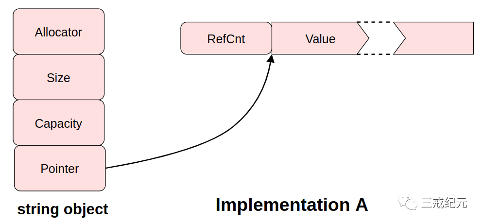
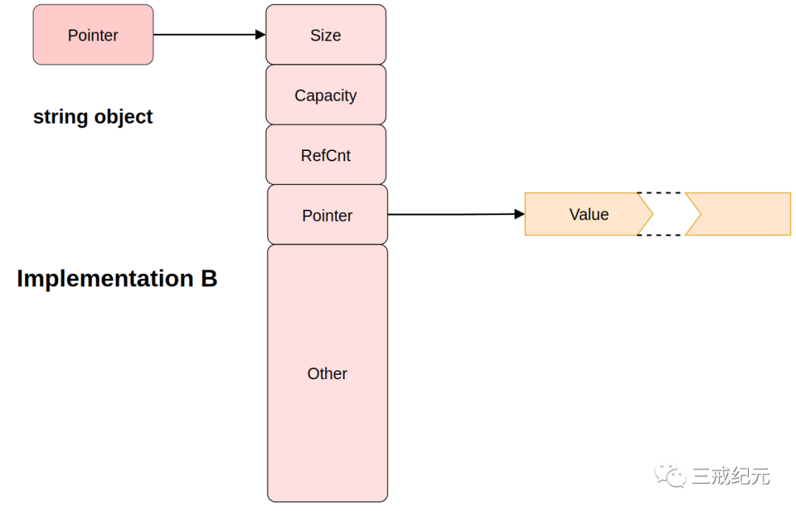
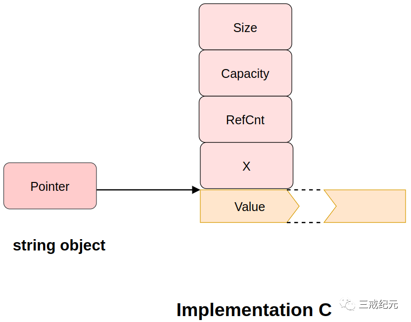
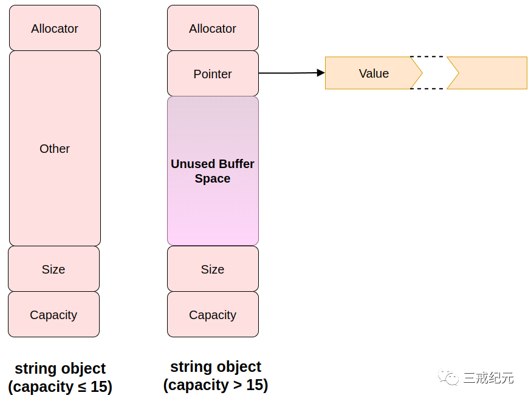

## sizeof(string)的值

如果想知道`sizeof(string)`的值是多少，答案不一定。

`string`和`char*`指针一样大的实现很常见，也很容易找到`string`是`char`*7 倍大小的`string`实现。

所以得了解一下`string`的实现

## string的实现

**基本实现**
- 字符串的大小，也就是包含的字符的数目。
- 容纳字符串字符的内存容量。
- 字符串的值，也就是，构成这个字符串的字符。
**可能实现**
- 配置器的拷贝
**依赖引用计数的string实现**s
- 包含这个值的引用计数

## 4种不同的string实现数据结构

以下是原作者看到的4个源码的string的实现

**A**
每个string对象包含一个**配置器的拷贝**，**字符串的大小(size)**，**容量(capacity)**，**一个指向包含引用计数（“RefCnt”）**和**字符串值的动态分配的缓冲区的指针**。

在这个实现中，一个使用默认配置器的字符串对象是指针大小的4倍。对于一个自定义的配置器，string对象会随配置器对象的增大而变大：



**B**
B的**string对象和指针一样大**，因为在结构体中只包含一个指针。再次，这里假设使用默认配置器。正如实现A，如果使用自定义配置器，这个string对象的大小会增加大约配置器对象的大小。

在这个实现中，**使用默认配置器不占用空间，这归功于这里用了一个在实现A中没有的使用优化**。

B的string指向的对象包含**字符串的大小**、**容量**和**引用计数**，以及**容纳字符串值的动态分配缓冲区的指**针及"**其他**"。“其他”指对象包含在多线程系统中与并发控制有关的一些附加数据。


在实现B中，**用于并发控制的数据是一个指针大小的6倍**。

**C**
**C的string对象总是等于指针的大小**，但是**这个指针指向一个包含所有与string相关的东西的动态分配缓冲器**：大小、容量、引用计数和值。没有每物体配置器（per-object allocator）的支持。缓冲区也容纳一些关于值可共享性的数据，标记为“**X**”。


**D**
D的**string对象是一个指针大小的7倍**（仍然假设使用了默认配置器）。这个实现**没有使用引用计数**，但每个string包含了一个足以**表现最多15个字符的字符串值的内部缓冲区**。

因此小的字符串可以被整个保存在string对象中，一个有时被称为“**小字符串优化**”的特性。

当一个string的容量超过15时，**缓冲器的第一部分被用作指向动态分配内存的一个指针，而字符串的值存放在那块内存**中：



**g++ 9.4.0中的实现**
```C++
  template<typename _CharT, typename _Traits, typename _Alloc>
    class basic_string
    {
      typedef typename __gnu_cxx::__alloc_traits<_Alloc>::template
 rebind<_CharT>::other _Char_alloc_type;
      typedef __gnu_cxx::__alloc_traits<_Char_alloc_type> _Alloc_traits;

      // Types:
    public:
      typedef _Traits     traits_type;
      typedef typename _Traits::char_type  value_type;
      typedef _Char_alloc_type    allocator_type;
      typedef typename _Alloc_traits::size_type  size_type;
      typedef typename _Alloc_traits::difference_type difference_type;
      typedef typename _Alloc_traits::reference  reference;
      typedef typename _Alloc_traits::const_reference const_reference;
      typedef typename _Alloc_traits::pointer  pointer;
      typedef typename _Alloc_traits::const_pointer const_pointer;
      typedef __gnu_cxx::__normal_iterator<pointer, basic_string>  iterator;
      typedef __gnu_cxx::__normal_iterator<const_pointer, basic_string>
       const_iterator;
      typedef std::reverse_iterator<const_iterator> const_reverse_iterator;
      typedef std::reverse_iterator<iterator>  reverse_iterator;

      ///  Value returned by various member functions when they fail.
      static const size_type npos = static_cast<size_type>(-1);
    }
```

**sizeof(string)**

举例：
```C++
string s("Randy"); // 5个字符
```

1. 实现A有32个字符的最小分配大小，所以虽然s的大小是5，在实现A下容量是31。（第32个字符大概被保留作**尾部的null**，因此可以容易地实现c_str成员函数。）

2. 实现C最小量16，而且没有为尾部null保留空间。所以在实现C下，s的容量是16。

3. 实现D的最小缓冲区大小也是16，包括尾部null的空间。当然，在这里区别出实现D是因为容量小于16的字符串使用的内存包含在本身字符串对象中。

4. 实现B没有最小分配，在实现B下，s的容量是7。

**动态分配**

在实现D下**将会没有动态分配**，在**实现A和C 1次**，而在**实现B 2次**（一次是string对象指向的对象，一次是那个对象指向的字符缓冲区）。

如果关心动态分配和回收内存的次数，或如果关心经常伴随这样分配的内存开销，你可能想要避开实现B。

另一方面， 实**现B的数据结构包括了对多线程系统并发控制的特殊支持的事实意味着它比实现A或C更能满足你的需要，尽管动态分配次数较多**。

实现D不需要对多线程的特殊支持，因为它不使用引用计数。

在基于**引用计数的设计**中，**字符串对象之外的每个东西都可以被多个字符串共享**（如果它们有相同的值），所以我们可以从图中观察到的其他东西是**实现A比B或C提供更少的共享性**。

特别是，**实现B和C能共享一个字符串的大小和容量，因此潜在地减少了每物体分摊的的储存数据的开销**。

有趣的是，**实现C不能支持每对象配置器的事实意味着它是唯一可以共享配置器的实现：所有字符串必须使用同一个**！

**实现D在字符串对象间没有共享数据。**

## 总结

不同的实现以不同的方式从它们的设计灵活性中得到好处：

 1. **字符串值可能是或可能不是引用计数的**。默认情况下，很多实现的确是用了引用计数，但它们通常提供了关闭的方法，一般是通过预处理器宏。比如，**引用计数只对频繁拷贝的字符串有帮助，而有些程序不经常拷贝字符串，所以没有那个开销**

 2. string对象的大小可能从1到至少7倍char*指针的大小

 3. **新字符串值的建立可能需要0、1或2次动态分配**

 4. **string对象可能是或可能不共享字符串的大小和容量信息**

 5. **string可能是或可能不支持每对象配置器**

 6. **不同实现对于最小化字符缓冲区的配置器有不同策略**

string是标准库中的最重要的组件之一，鼓励应该要多用。

如果要**有效使用STL**，**需要小心string实现的多样性**，特别是如果你正在写必须在不同STL平台上运行的代码并且你面临严格的性能需求。