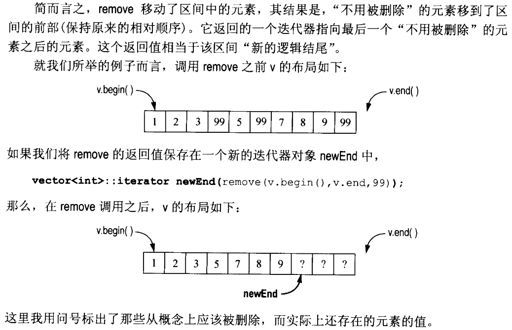
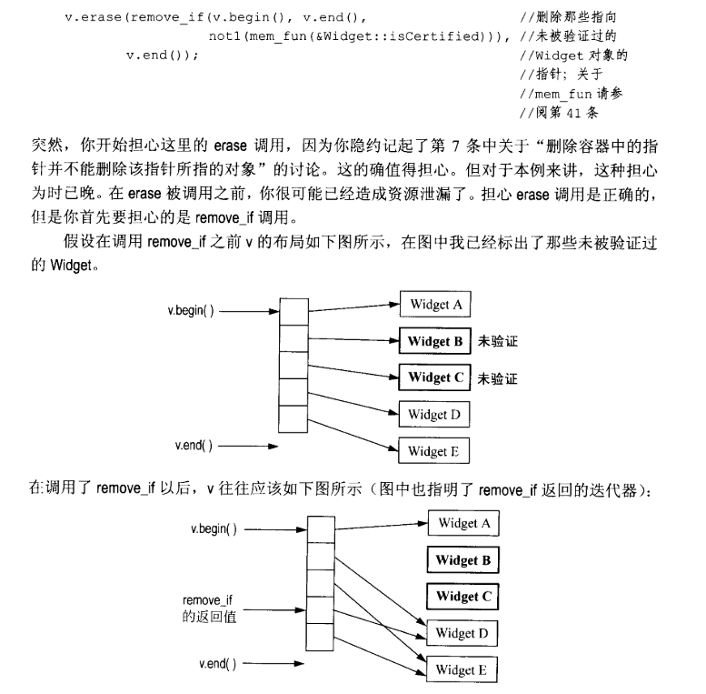
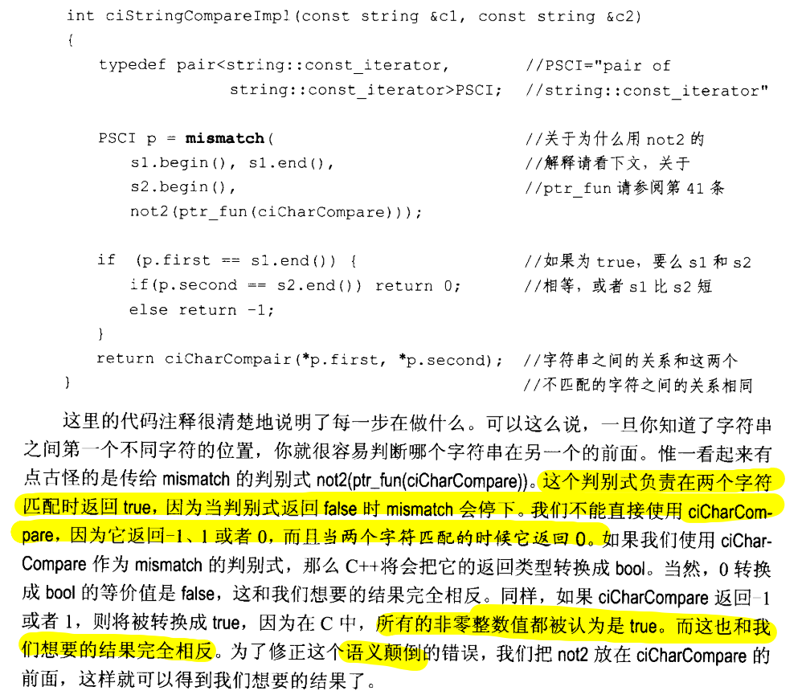

# 前言

> Effective-STL总结系列分为七部分，本文为第五部分，涉及原书第五章，内容范围Rule30~37。为方便书写，Rule30简写为R30。


本博客站点系列内容如下：</br>
💡 [Effective STL(第3版)精读总结(一)](https://jianye0428.github.io/posts/partone/)</br>
💡 [Effective STL(第3版)精读总结(二)](https://jianye0428.github.io/posts/parttwo/)</br>
💡 [Effective STL(第3版)精读总结(三)](https://jianye0428.github.io/posts/partthree/)</br>
💡 [Effective STL(第3版)精读总结(四)](https://jianye0428.github.io/posts/partfour/)</br>


<!-- 由于原书在C++11之前写成，有些现代C++特性不会提及，所以会根据本人`开发经验`新增一些个人感悟👉`By the way`环节。 -->

## R30 确保目标区间足够大。(inserter)

**transform 算法**：使用 front_inserter 将导致算法将结果插入到容器的头部，使用 back_inserter 将导致算法将结果插入到容器的尾部。

  1. 向容器末尾添加新的对象(S使用 back_inserter，适用于所有提供了 push_back 方法的容器(vector,string,deque,list)):
     ```c++
     int transmogrify(int x)							// 该函数根据x生成一个新的值
     vector<int> results;
     transform(values.begin(), values.end(),			// 将     transmogrify作用在values的每个对象上
         back_inserter(results), 				// 并将返回值插入到resultes的末尾。
         transmogrify);
     ```
  2. 向容器前面添加新的对象(使用 front_inserter，适用于所有提供了 push_front 方法的容器):
     ```c++
     int transmogrify(int x)							// 该函数根据x生成一个新的值
     list<int> results;
     transform(values.begin(), values.end(),			// 将transmogrify作用在values的每个对象上
        front_inserter(results), 				// 并将返回值以逆向顺序
         transmogrify);							// 插入到resultes的头部，
     ```
  3. 将 transform 的输出结果存放在 results 的前端，同时保留它们在 values 中原有的顺序，只需按照相反方向遍历 values 即可:
     ```c++
      int transmogrify(int x)							// 该函数根据x生成一个新的值
      list<int> results;
      transform(values.rbegin(), values.rend(),		// 将transform的结果插入到容器头部，
        front_inserter(results), 				// 并保持相对顺序。
         transmogrify);
     ```
  4. 将 transform 的结果插入到容器中特定位置上:
     ```c++
     int transmogrify(int x)							// 该函数根据x生成一个新的值
     list<int> results;
     transform(values.rbegin(), values.rend(),
        inserter(results, results.begin()+results.size()/2),
         transmogrify);							// 将transform的结果插入到容器中间的位置
     ```
  5. 如果使用 transform 要覆盖原来的元素，第三个参数可以使用迭代器。

要在算法执行过程中增大目标区间，请使用**插入型迭代器**，比如 `ostream_interator`、`back_inserter`、`front_inserter`。

## R31 与排序有关的的选择。(sort相关)

1. 如果需要对 `vector`、`string`、`deque` 或者数组中的元素执行一次完全排序，可以使用 `sort` 或 `stable_sort`。

2. 如果有一个 `vector`、`string`、`deque` 或者数组，并且只需要对等价性最前面的 n 个元素进行排序，那么可以使用 **partial_sort**。

3. 如果有一个 `vector`、`string`、`deque` 或者数组，并且需要找到第 n 个位置上的元素，或者，需要找到等价性最前面的 n 个元素但又不必对这 n 个元素进行排序，可以使用 `nth_element`。

4. 将一个标准序列容器中的元素按照是否满足某个条件区分开来，使用 `partition` 和 `stable_partition`。

5. `sort`、`stable_sort`、`partial_sort`、`nth_element` 算法都要求随机访问迭代器，所以这些算法只能用于 `vector`、`string`、`deque` 和数组。

6. 对于 `list`，可以使用 `partition` 和 `stable_partition`，可以用 `list::sort` 来替代 `sort` 和 `stable_sort` 算法。

7. 实现 `partial_sort` 和 `nth_element`，需要通过间接途径。

8. 性能排序：`partition` > `stable_partion` > `nth_element` > `partial_sort` > `sort` > `stable_sort`


## R32 如果确实需要删除元素，则需要在 remove 这一类算法之后调用 erase。

remove 是泛型算法，不接受容器作为参数，它不知道元素被存放在哪个容器中，也不可能推断出是什么容器(因为无法从迭代器推知对应的容器类型)。只有容器的成员函数才可以删除容器中的元素。

> 因为删除元素的唯一办法是调用容器的成员函数，而remove并不知道它操作的元素所在的容器，所以remove不可能从容器中删除元素。所以使用remove从容器删除元素，容器中的元素数目并不会因此减少。所以remove不是真正意义上的删除，因为它做不到。
> remove真正做的工作就是将不用被删除的元素移到容器的前部，返回的迭代器位置是第一个应该被删除的元素。而且应该被删除的元素此时是出于容器的尾部，但是它们的值已经不是应该被删除的值了，这是因为remove在遍历整个区间的时候，用后一个需要保留的元素覆盖了前面应该被删除的元素的值。



erase-remove 删除方式:

```c++
vector<int> v;
...
v.erase(remove(v.begin(), v.end(), 99), v.end());
```

例外：list的remove成员函数是唯一一个名为remove并且真正删除了容器中元素的函数。因此，list 中的 remove 也应该被称为 erase，它可以真正删除元素。

两个 remove 类算法: 除了remove，remove_if和unique同样属于这种情况，unique是删除容器中的相邻重复元素，如果想真正的删除，同样需要配合调用erase。

## R33 对包含指针的容器使用 remove 这一类算法时要特别小心。

对包含指针的容器使用 remove 这一类算法时要特别警惕，否则就是资源泄露。

使用智能指针(RSCP，Reference Counting Smart Pointer)就无需考虑这些问题。但智能指针类型(RCSP<Widget>)必须能够隐式地转换为内置指针类型(Widget*)。



## R34 了解哪些算法要求使用排序的区间作为参数

**要求排序区间的算法**
  - binary_search、lower_bound、upper_bound、equal_range：只有当这些算法接收随机访问迭代器时，才保证对数时间的查找效率。否则，尽管比较次数依然是区间元素个数的对数，执行过程需要线性时间。
  - set_union、set_intersection、set_difference、set_symmetric_difference：需要排序的区间，这样能够保证线性时间内完成工作。
  - merge 和 inplace_merge：实现了合并和排序的联合操作，源区间已经排过序则可以线性时间内完成。
  - includes：判断一个区间中的所有对象是否都在另一个区间中，如果这两个区间排序则承诺线性时间的效率。

**不一定要求排序区间，但通常情况下会与排序区间一起使用**
  - unique 通常用于删除一个区间的所有重复值，但并非真正意义上的删除。
  - 必须为 STL 提供一致的排序信息：如果你为一个算法提供了一个排序的区间，而这个算法也带一个比较函数作为参数，那么，你一定要保证你传递的比较函数与这个排序区间所用的比较函数有一致的行为。
  - 所有要求排序区间的算法(除了 unique 和 unique_copy)均使用等价性来判断两个对象是否“相同”，这与标准的关联容器一致。与此相反的是，unique 和 unique_copy 在默认情况下使用“相等”来判断两个对象是否“相同”。

## R35 通过 mismatch 或 lexicographical_compare 实现简单的忽略大小写的字符串比较。

**判断两个字符是否相同，而不去管它们的大小写(ciCharCompare)**

```c++
int ciCharCompare(char c1, char c2)
{
    int lc1 = tolower(static_cast<unsigned char>(c1));
    int lc2 = tolower(static_cast<unsigned char>(c2));

    if (lc1 < lc2) return -1;
    if (lc1 > lc2) return 1;
    return 0;
}
```
在 C 和 C++ 中，char 可能是有符号的，可能是无符号的。tolower 的参数和返回值都是 int，但是，除非该 int 值是 EOF，否则它的值必须可以用 unsigned char 表示。

**ciStringCompare**

```c++
int ciStringCompareImpl(const string &s1, const string &s2);

int ciStringCompare(const string &s1, const string &s2)
{
	if (s1.size() < s2.size()) return ciStringCompareImpl(s1, s2);
    else return -ciStringCompare(s2, s1);
}
```

- 第一种实现: mismatch

```c++
//std::not2
template <class Predicate>
  binary_negate<Predicate> not2 (const Predicate& pred);
//Return negation of binary function object
//Constructs a binary function object (of a binary_negate type) that returns the //opposite of pred (as returned by operator !).

// It is defined with the same behavior as:
template <class Predicate> binary_negate<Predicate> not2 (const Predicate& pred)
{
  return binary_negate<Predicate>(pred);
// 二元比较后再取非。
```
- 第二种实现: lexicographical

```c++
int ciCharCompare(char c1, char c2)
{
    return tolower(static_cast<unsigned char>(c1)) <
    	tolower(static_cast<unsigned char>(c2));
}

bool ciStringCompare(const string &s1, const string &s2)
{
    return lexicographical_compare(s1.begin(), s1.end(),
                                  s2.begin(), s2.end(),
                                  ciCharLess);
}
```
lexicographical_compare 是 strcmp 的一个泛化版本，可以允许用户自定义两个值的比较准则。
如果在找到不同的值之前，第一个区间已经结束了，返回 true：一个前缀比任何一个以他为前缀的区间更靠前。

## R36 理解 copy_if 算法的正确实现

copy_if的正确实现:

```c++
template<typename InputIterator,
		typename OutputIterator,
		typename Predicate>
OutputIterator copy_if(InputIterator begin,
                      InputIterator end,
                      OutputIterator destBegin
                      Predicate p)
        {
            while (begin != end) {
                if (p(*begin)) *destBegin++ = *begin;
                ++begin;
            }
            return destBegin;
        }
```

## R37 使用 accumulate 或者 for_each 进行区间统计

**accumulate(计算出一个区间的统计信息)**

1. std::accumulate

    |  sum (1)  | `template <class InputIterator, class T> T accumulate (InputIterator first, InputIterator last, T init)`|
    |  ----  | :----  |
    | custom (2) | `template <class InputIterator, class T, class BinaryOperation> T accumulate (InputIterator first, InputIterator last, T init, BinaryOperation binary_op)` |
2. sum
   第一种形式：有两个迭代器和一个初始值。计算 double 的总和时，初始值应该设为 0.0，否则 sum 的值不正确(每次加法的结果转换成整数后再运算)
   第二种形式：使用 istream_iterator 和 istreambuf_interator(数值算法，numeric algorithm)
    ```c++
    cout << accumulate(istream_iterator<int>(cin),
                    istream_iterator<int>(),
                    0);
    ```
   accumulate 直接返回统计结果。
3. 用法custom
   1. 计算一个容器中字符串的长度总和。
    ```c++
    string::size_type
    stringLengthSum(string::size_type sumSofFar, 		//size_type:中的技术类型
                  const string &s)
    {
        return sumSoFar + s.size();
    }

    set<string> ss;
    ...
    // 对ss中的每个元素调用stringLengthSum，然后把结果付给lengthSum，初始值为0
    string::size_type lengthSum =
        accumulate(ss.begin(), ss.end().
                  static_cast<string::size_type>(0),
                  stringLengthSum);
    ```
   2. 计算一个区间中数值的乘积。
    ```c++
    vector<float> vf;
    ...
    // 对vf中的每个元素调用multipies<float>，并把结果赋给product
    float product = accumulate(vf.begin(), vf.end(), 1.0f, multiplies<float>());
    //初始值必须为1.0f，保证是浮点数的1。
    ```

**for_each(对一个区间的每个元素做一个操作)**
  - for_each 接受两个参数：一个是区间，另一个是函数(通常是函数对象)，对区间中的每个元素都要调用这个函数。但这个函数只接受一个实参(即当前区间的元素)。
  - for_each 的函数参数允许有副作用。
  - for_each 返回的是一个函数对象。

ref: https://blog.csdn.net/zhuikefeng/article/details/108164117