reference:</br>
[1]. [The Transformer Family ](https://lilianweng.github.io/posts/2020-04-07-the-transformer-family/)
[2]. [Attention](https://lilianweng.github.io/posts/2018-06-24-attention/)
[3]. [细节考究](https://zhuanlan.zhihu.com/p/60821628)


## Transformer Family
### Notations
|Symbol|Meaning|
|---|---|
|$d$|The model size / hidden state dimension / positional encoding size.|
|$h$|The number of heads in multi-head attention layer.|
|$L$|The segment length of input sequence.|
|$X \in \mathbb R ^ {L \times d}$|The input sequence where each element has been mapped into an embedding vector of shape , same as the model size.|
|$W^k \in \mathbb R ^ {d \times d^k}$|The key weight matrix.|
|$W^q \in \mathbb R ^ {d \times d^k}$|The query weight matrix.|
|$W^v \in \mathbb R ^ {d \times d^k}$|The value weight matrix.Often we have $d_k = d_v = d$.|
|$W^K_i, W^q_i \in \mathbb R ^ {d \times d^k / h}; W^v_i \in \mathbb R^{d x d_v / h}$|The weight matrices per head.|
|$W^o \in \mathbb d_v \times d$|The output weight matrix.|
|$Q = XW^q \in \mathbb R^{L \times d_q}$|The query embedding inputs.|
|$K = XW^k \in \mathbb R^{L \times d_k}$|The key embedding inputs.|
|$V = XW^v \in \mathbb R^{L \times d_v}$|The value embedding inputs.|
|$S_i$|A collection of key positions for the -th query to attend to.|
|$A \in \mathbb R ^ {L \times L}$|The self-attention matrix between a input sequence of lenght $L$ and itself. $A = softmax (Q K^T/\sqrt{(d_k)} )$|
|$a_ij \ in A $|The scalar attention score between query $q_i$ and key $k_j$.|
|$P \in \mathbb R ^ {L \times d}$|position encoding matrix, where the $i-th$ row is the positional encoding for input $x_i$.|

### Attention and Self-Attention

Attention is a mechanism in the neural network that a model can learn to make predictions by **selectively attending to a given set of data**. The amount of attention is quantified by learned weights and thus the output is usually formed as a weighted average.

Self-attention is a type of attention mechanism where the model makes prediction for one part of a data sample using other parts of the observation about the same sample. Conceptually, it feels quite similar to non-local means. Also note that self-attention is permutation-invariant; in other words, it is an operation on sets.

There are various forms of attention / self-attention, Transformer ([Vaswani et al., 2017](https://arxiv.org/abs/1706.03762)) relies on the scaled dot-product attention: given a query matrix $Q$, a key matrix $K$ and a value matrix $V$, the output is a weighted sum of the value vectors, where the weight assigned to each value slot is determined by the dot-product of the query with the corresponding key:

$$\text{Attention}(Q, K, V) = softmax(\frac{QK^T}{\sqrt{d_k}})V$$

And for a query and a key vector $q_i, k_j \in \mathbb R ^ d$ (row vectors in query and key matrices), we have a scalar score:

$$a_{ij} = softmax(\frac{q_i k_j^T}{\sqrt{d_k}}) = \frac{\exp(q_i k_j^T)}{\sqrt{d_k}\sum_{r \in S_i}(q_i k_j^T)}$$

where $S_i$ is a collection of key positions for the $i$-th query to attend to.

See my old [post](https://lilianweng.github.io/posts/2018-06-24-attention/#a-family-of-attention-mechanisms) for other types of attention if interested.

### Multi-Head Self-Attention

The multi-head self-attention module is a key component in Transformer. Rather than only computing the attention once, the multi-head mechanism splits the inputs into smaller chunks and then computes the scaled dot-product attention over each subspace in parallel. The independent attention outputs are simply concatenated and linearly transformed into expected dimensions.

$$\text{MulitHeadAttention}(X_q, X_k, X_v) = [\text{head}_1,;...; \text{head}_h] W^o, where \text{head}_i = \text{Attention}(X_qW_i^q, X_kW_i^k, X_vW_i^v)$$

where $[.;.]$ is a concatenation operation. $W_i^q, W_i^k \in \mathbb R^{d \times d_{k} / h}$, $W_i^v \in \mathbb R^{d \times d_{v} / h}$ are weight matrices to map input embeddings of size $L \times d$ into query, key and value matrices. And $W^o \in \mathbb R ^ {d_v \times d}$ is the output linear transformation. All the weights should be learned during training.


### Transformer

The Transformer (which will be referred to as “vanilla Transformer” to distinguish it from other enhanced versions; [Vaswani, et al., 2017](https://arxiv.org/abs/1706.03762)) model has an encoder-decoder architecture, as commonly used in many [NMT](https://lilianweng.github.io/posts/2018-06-24-attention/#born-for-translation) models. Later decoder-only Transformer was shown to achieve great performance in language modeling tasks, like in [GPT and BERT](https://lilianweng.github.io/posts/2019-01-31-lm/#openai-gpt).

**Encoder-Decoder Architecture**

The encoder generates an attention-based representation with capability to locate a specific piece of information from a large context. It consists of a stack of 6 identity modules, each containing two submodules, a multi-head self-attention layer and a point-wise fully connected feed-forward network. By point-wise, it means that it applies the same linear transformation (with same weights) to each element in the sequence. This can also be viewed as a convolutional layer with filter size 1. Each submodule has a residual connection and layer normalization. All the submodules output data of the same dimension $d$.

The function of Transformer decoder is to retrieve information from the encoded representation. The architecture is quite similar to the encoder, except that the decoder contains two multi-head attention submodules instead of one in each identical repeating module. The first multi-head attention submodule is masked to prevent positions from attending to the future.


**Positional Encoding**

Because self-attention operation is permutation invariant, it is important to use proper **positional encoding** to provide order information to the model. The positional encoding $P \in \mathbb R ^ {L \times d}$ has the same dimension as the input embedding, so it can be added on the input directly. The vanilla Transformer considered two types of encodings:

(1). Sinusoidal positional encoding is defined as follows, given the token $i = 1, ..., L$ position and the dimension $\delta = 1, ..., d$:

$$ \text{PE}(i, \delta)  = \left\{
    \begin{aligned}
\sin\big(\frac{i}{10000^{2\delta'/d}}\big) , if \delta&=2\delta'\\
\cos\big(\frac{i}{10000^{2\delta'/d}}\big) , if \delta&=2\delta'+1 \\
\end{aligned}
\right.$$

In this way each dimension of the positional encoding corresponds to a sinusoid of different wavelengths in different dimensions, from $2\pi$ to 10000 * $2\pi$.


(2). Learned positional encoding, as its name suggested, assigns each element with a learned column vector which encodes its absolute position ([Gehring, et al. 2017](https://arxiv.org/abs/1705.03122)).

## 视觉Transformer入门

### 0 摘要
transformer结构是google在17年的Attention Is All You Need论文中提出，在NLP的多个任务上取得了非常好的效果，可以说目前NLP发展都离不开transformer。最大特点是抛弃了传统的CNN和RNN，整个网络结构完全是由Attention机制组成。由于其出色性能以及对下游任务的友好性或者说下游任务仅仅微调即可得到不错效果，在计算机视觉领域不断有人尝试将transformer引入，近期也出现了一些效果不错的尝试，典型的如目标检测领域的detr和可变形detr，分类领域的vision transformer等等。本文从transformer结构出发，结合视觉中的transformer成果(具体是vision transformer和detr)进行分析，希望能够帮助cv领域想了解transformer的初学者快速入门。由于本人接触transformer时间也不长，也算初学者，故如果有描述或者理解错误的地方欢迎指正。

### 1 transformer介绍

一般讲解transformer都会以机器翻译任务为例子讲解，机器翻译任务是指将一种语言转换得到另一种语言，例如英语翻译为中文任务。从最上层来看，如下所示：


#### 1.1 早期seq2seq

机器翻译是一个历史悠久的问题，本质可以理解为**序列转序列**问题，也就是我们常说的**seq2seq结构**，也可以称为**encoder-decoder结构**，如下所示：

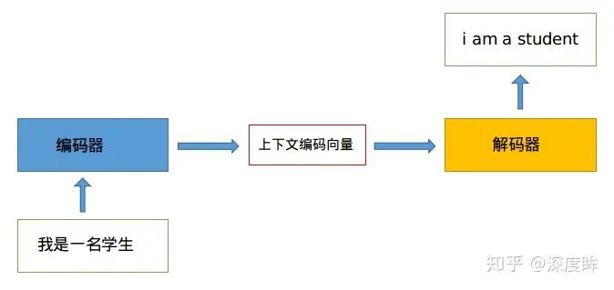

encoder和decoder在早期一般是RNN模块(因为其可以==捕获时序信息==)，后来引入了LSTM或者GRU模块，不管内部组件是啥，其核心思想都是<font color=red>通过Encoder编码成一个表示向量，即上下文编码向量，然后交给Decoder来进行解码，翻译成目标语言</font>。一个采用典型RNN进行编码翻译的可视化图如下：

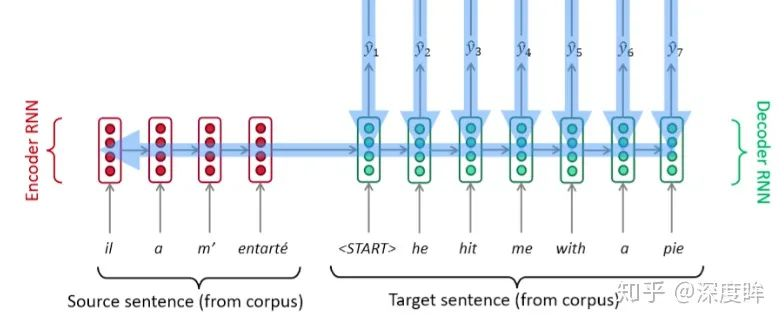

可以看出，其解码过程是<mark>顺序进行</mark>，每次仅解码出一个单词。对于CV领域初学者来说，RNN模块构建的seq2seq算法，理解到这个程度就可以了，不需要深入探讨如何进行训练。但是上述结构其实有**缺陷**，具体来说是：<font color=red>(缺陷)</font>

- 不论输入和输出的语句长度是什么，中间的上下文向量长度都是固定的，一旦长度过长，仅仅靠一个<font color=red>固定长度的上下文向量明显不合理</font>
- 仅仅利用上下文向量解码，会有<font color=red>信息瓶颈</font>，长度过长时候信息可能会丢失

<font color=red>**通俗理解是编码器与解码器的连接点仅仅是编码单元输出的<mark>隐含向量</mark>，其包含的信息有限**</font>，对于一些复杂任务可能信息不够，<u>如要翻译的句子较长时，一个上下文向量可能存不下那么多信息，就会造成翻译精度的下降</u>。

#### 1.2 基于attention的seq2seq

基于上述缺陷进而提出带有注意力机制Attention的seq2seq，同样可以应用于RNN、LSTM或者GRU模块中。注意力机制Attention对人类来说非常好理解，假设给定一张图片，我们会自动聚焦到一些关键信息位置，而不需要逐行扫描全图。此处的attention也是同一个意思，其**本质是对输入的自适应加权**，结合cv领域的senet中的se模块就能够理解了。


se模块最终是学习出一个$1 \times 1 \times c$的向量，然后逐通道乘以原始输入，从而对特征图的每个通道进行加权即通道注意力，对attention进行抽象，不管啥领域其机制都可以归纳为下图：


**将Query(通常是向量)和4个Key(和Q长度相同的向量)分别计算相似性，然后经过softmax得到q和4个key相似性的概率权重分布，然后对应权重乘以Value(和Q长度相同的向量)，最后相加即可得到包含注意力的attention值输出**，理解上应该不难。举个简单例子说明：
- 假设世界上所有小吃都可以被标签化，例如微辣、特辣、变态辣、微甜、有嚼劲....，总共有1000个标签，现在我想要吃的小吃是[微辣、微甜、有嚼劲]，这三个单词就是我的Query
- 来到东门老街一共100家小吃店，每个店铺卖的东西不一样，但是肯定可以被标签化，例如第一家小吃被标签化后是[微辣、微咸],第二家小吃被标签化后是[特辣、微臭、特咸]，第三家小吃被标签化后是[特辣、微甜、特咸、有嚼劲]，其余店铺都可以被标签化，每个店铺的标签就是Keys,但是每家店铺由于卖的东西不一样，单品种类也不一样，所以被标签化后每一家的标签List不一样长
- Values就是每家店铺对应的单品，例如第一家小吃的Values是[烤羊肉串、炒花生]
- 将Query和所有的Keys进行一一比对，相当于计算相似性，此时就可以知道我想买的小吃和每一家店铺的匹配情况，最后有了匹配列表，就可以去店铺里面买东西了(Values和相似性加权求和)。最终的情况可能是，我在第一家店铺买了烤羊肉串，然后在第10家店铺买了个玉米，最后在第15家店铺买了个烤面筋

以上就是完整的注意力机制，采用我心中的标准Query去和被标签化的所有店铺Keys一一比对，此时就可以得到我的Query在每个店铺中的匹配情况，最终去不同店铺买不同东西的过程就是权重和Values加权求和过程。简要代码如下：

```python
# 假设q是(1,N,512),N就是最大标签化后的list长度，k是(1,M,512),M可以等于N，也可以不相等
# (1,N,512) x (1,512,M)-->(1,N,M)
attn = torch.matmul(q, k.transpose(2, 3)) # query compare with keys
# softmax转化为概率，输出(1,N,M)，表示q中每个n和每个m的相关性
attn=F.softmax(attn, dim=-1)
# (1,N,M) x (1,M,512)-->(1,N,512)，V和k的shape相同
output = torch.matmul(attn, v)
```

带有attention的RNN模块组成的ser2seq,解码时候可视化如下：
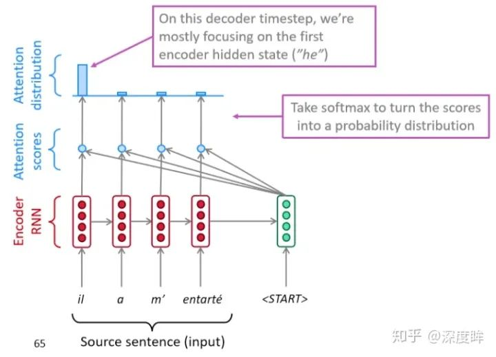


**在没有attention时候，不同解码阶段都仅仅利用了同一个编码层的最后一个隐含输出，加入attention后可以通过在每个解码时间步输入的都是不同的上下文向量**，以上图为例，解码阶段会将第一个开启解码标志<START>(也就是Q)与编码器的每一个时间步的隐含状态(一系列Key和Value)进行<u>点乘计算相似性</u>得到每一时间步的相似性分数，然后通过<u>softmax转化为概率分布</u>，然后将概率分布和对应位置向量进行加权求和得到新的上下文向量，最后输入解码器中进行解码输出，其详细解码可视化如下：

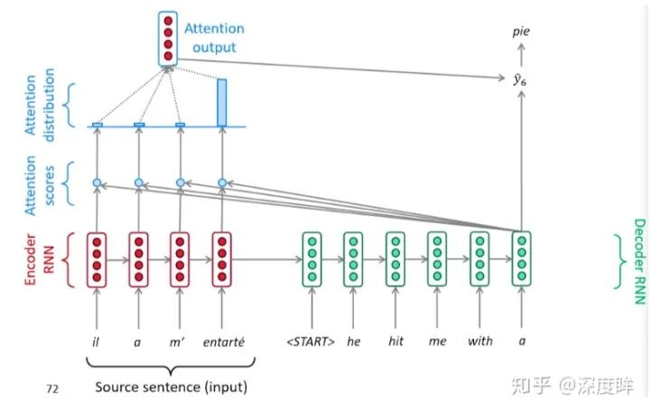

通过上述简单的attention引入，可以将机器翻译性能大幅提升，<font color=red>**引入attention有以下几个好处**</font>：

- 注意力显著提高了机器翻译性能
- 注意力允许解码器以不同程度的权重利用到编码器的所有信息，可以绕过瓶颈
- 通过检查注意力分布，可以看到解码器在关注什么，可解释性强

#### 1.3 基于transformer的seq2seq

基于attention的seq2seq的结构虽然说解决了很多问题，但是其依然存在<font color=red>不足</font>：
- 不管是采用RNN、LSTM还是GRU都不利于并行训练和推理，因为相关算法只能从左向右依次计算或者从右向左依次计算
- 长依赖信息丢失问题，顺序计算过程中信息会丢失，虽然LSTM号称有缓解，但是无法彻底解决

<font color=red>**最大问题应该是无法并行训练**</font>，不利于大规模快速训练和部署，也不利于整个算法领域发展，故在Attention Is All You Need论文中抛弃了传统的CNN和RNN，<font color=green>**将attention机制发挥到底，整个网络结构完全是由Attention机制组成，这是一个比较大的进步**</font>.

google所提基于transformer的seq2seq整体结构如下所示：

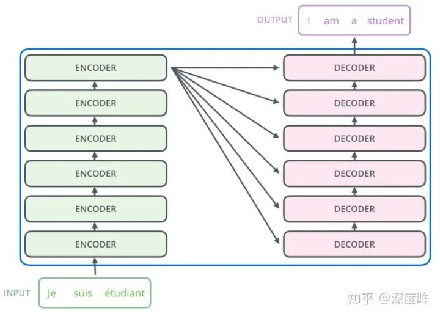

其包括6个结构完全相同的编码器，和6个结构完全相同的解码器，其中每个编码器和解码器设计思想完全相同，只不过由于任务不同而有些许区别，整体详细结构如下所示：

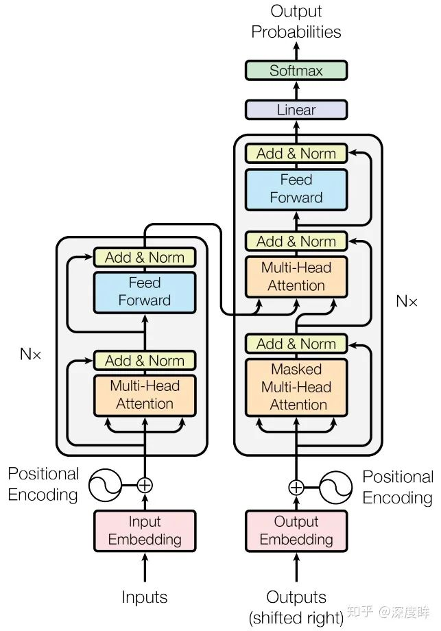

第一眼看有点复杂，其中N=6，由于基于transformer的翻译任务已经转化为分类任务(目标翻译句子有多长，那么就有多少个分类样本)，故在解码器最后会引入fc+softmax层进行概率输出，训练也比较简单，直接采用ce loss即可，对于采用大量数据训练好的预训练模型，下游任务仅仅需要训练fc层即可。上述结构看起来有点复杂，一个稍微抽象点的图示如下：


看起来比基于RNN或者其余结构构建的seq2seq简单很多。下面结合代码和原理进行深入分析。

#### 1.4 transformer深入分析

前面写了一大堆，没有理解没有关系，对于cv初学者来说其实只需要理解QKV的含义和注意力机制的三个计算步骤:
1. Q和所有K计算相似性；
2. 对相似性采用softmax转化为概率分布；
3. 将概率分布和V进行一一对应相乘，最后相加得到新的和Q一样长的向量输出即可.

重点是下面要讲的transformer结构。

下面按照 **编码器输入数据处理**->**编码器运行**->**解码器输入数据处理**->**解码器运行**->**分类head** 的实际运行流程进行讲解。


##### 1.4.1 编码器输入数据处理

(1). 源单词嵌入

以上面翻译任务为例，原始待翻译输入是三个单词:


输入是三个单词，为了能够将文本内容输入到网络中肯定需要进行向量化(不然单词如何计算？)，具体是采用nlp领域的embedding算法进行词嵌入，也就是常说的Word2Vec。对于cv来说知道是干嘛的就行，不必了解细节。假设每个单词都可以嵌入成512个长度的向量，故此时输入即为3x512，<u>**注意Word2Vec操作只会输入到第一个编码器中，后面的编码器接受的输入是前一个编码器输出**</u>。

为了便于组成batch(不同训练句子单词个数肯定不一样)进行训练，可以简单统计所有训练句子的单词个数，取最大即可，假设统计后发现待翻译句子最长是10个单词，那么编码器输入是10x512，额外填充的512维向量可以采用固定的标志编码得到.

(2) 位置编码 positional encoding

采用经过单词嵌入后的向量输入到编码器中还不够，因为<font color=red>**transformer内部没有类似RNN的循环结构，没有捕捉顺序序列的能力**</font>，或者说无论句子结构怎么打乱，transformer都会得到类似的结果。为了解决这个问题，在编码词向量时会额外引入了位置编码position encoding向量表示两个单词i和j之间的距离，简单来说就是在词向量中加入了单词的位置信息。

加入位置信息的方式非常多，最简单的可以是直接将绝对坐标0,1,2编码成512个长度向量即可。作者实际上提出了两种方式：
- 网络自动学习
- 自己定义规则

提前假设单词嵌入并且组成batch后，shape为(b,N,512)，N是序列最大长度，512是每个单词的嵌入向量长度,b是batch

(a) 网络自动学习
```
self.pos_embedding = nn.Parameter(torch.randn(1, N, 512))
```
比较简单，因为位置编码向量需要和输入嵌入(b,N,512)相加，所以其shape为(1,N,512)表示N个位置，每个位置采用512长度向量进行编码

(b) 自己定义规则

自定义规则做法非常多，论文中采用的是sin-cos规则，具体做法是：

- 将向量(N,512)采用如下函数进行处理
    $$PE_{pos, 2i} = sin(pos/1000^{2i/d_{model}})$$
    $$PE_{pos, 2i+1} = cos(pos/1000^{2i/d_{model}})$$
    pos即0~N,i是0-511
- 将向量的512维度切分为奇数行和偶数行
- 偶数行采用sin函数编码，奇数行采用cos函数编码
- 然后按照原始行号拼接

```python
def get_position_angle_vec(position):
    # d_hid是0-511,position表示单词位置0～N-1
    return [position / np.power(10000, 2 * (hid_j // 2) / d_hid) for hid_j in range(d_hid)]

# 每个单词位置0～N-1都可以编码得到512长度的向量
sinusoid_table = np.array([get_position_angle_vec(pos_i) for pos_i in range(n_position)])
# 偶数列进行sin
sinusoid_table[:, 0::2] = np.sin(sinusoid_table[:, 0::2])  # dim 2i
# 奇数列进行cos
sinusoid_table[:, 1::2] = np.cos(sinusoid_table[:, 1::2])  # dim 2i+1
```
上面例子的可视化如下：


**如此编码的优点是能够扩展到未知的序列长度**，例如前向时候有特别长的句子，其可视化如下：


作者为啥要设计如此复杂的编码规则？原因是sin和cos的如下特性：

$\left\{\begin{aligned}
sin(\alpha + \beta) = sin\alpha cos\beta + cos \alpha sin \beta \\
cos(\alpha + \beta) = cos\alpha cos\beta - sin \alpha sin \beta
\end{aligned}\right.$

可以将$PE_{pos + k}$用$PE(pos)$进行线性表出：

$\left\{\begin{aligned}
PE(pos+k, 2i) = PE(pos, 2i) \times PE(k, 2i+1) + PE(pos, 2i+1) \times PE(k,2i) \\
PE(pos+k, 2i + 1) = PE(pos, 2i + 1) \times PE(k, 2i+1) - PE(pos, 2i) \times PE(k,2i)
\end{aligned}\right.$

假设k=1，那么下一个位置的编码向量可以由前面的编码向量线性表示，等价于<font color=red>以一种非常容易学会的方式告诉了网络单词之间的绝对位置，让模型能够轻松学习到相对位置信息</font>。注意编码方式不是唯一的，将单词嵌入向量和位置编码向量相加就可以得到编码器的真正输入了，其输出shape是(b,N,512)。

##### 1.4.2 编码器前向过程

编码器由两部分组成：自注意力层和前馈神经网络层。

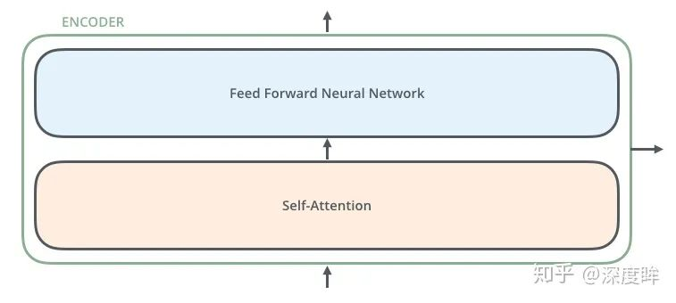

其前向可视化如下：

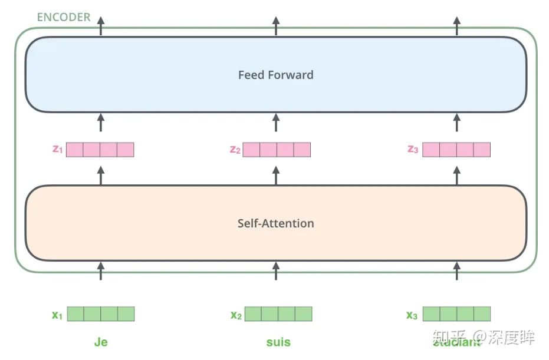

注意上图没有绘制出单词嵌入向量和位置编码向量相加过程，但是是存在的。

(1) 自注意力层

通过前面分析我们知道自注意力层其实就是attention操作，并且**由于其QKV来自同一个输入，故称为自注意力层**。我想大家应该能想到这里attention层作用，在参考资料1博客里面举了个简单例子来说明attention的作用：假设我们想要翻译的输入句子为The animal didn't cross the street because it was too tired，这个“it”在这个句子是指什么呢？它指的是street还是这个animal呢？这对于人类来说是一个简单的问题，但是对于算法则不是。<font color=green>当模型处理这个单词“it”的时候，自注意力机制会允许“it”与“animal”建立联系，即随着模型处理输入序列的每个单词，自注意力会关注整个输入序列的所有单词，帮助模型对本单词更好地进行编码</font>。实际上训练完成后确实如此，google提供了可视化工具，如下所示：

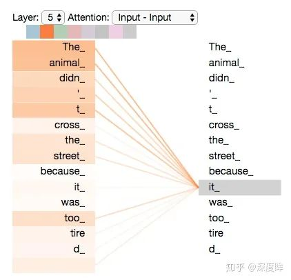

上述是从宏观角度思考，如果从输入输出流角度思考，也比较容易：


假设我们现在要翻译上述两个单词，首先将单词进行编码，和位置编码向量相加，得到自注意力层输入X,其shape为(b,N,512)；然后定义三个可学习矩阵 Image (通过nn.Linear实现)，其shape为(512,M)，一般M等于前面维度512，从而计算后维度不变；将X和矩阵Image 相乘，得到QKV输出，shape为(b,N,M)；然后将Q和K进行点乘计算向量相似性；采用softmax转换为概率分布；将概率分布和V进行加权求和即可。其可视化如下：

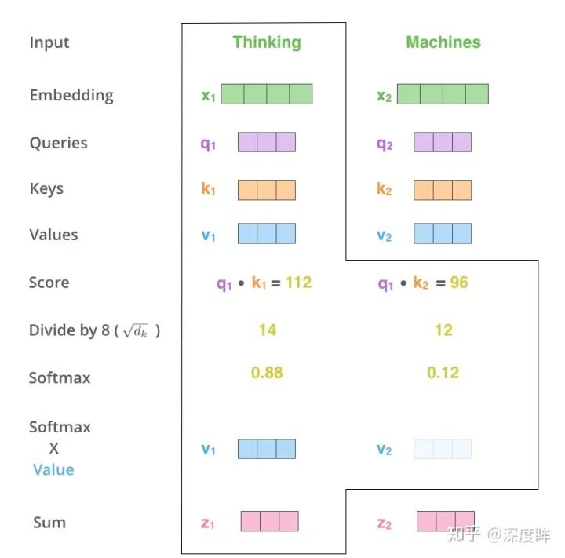

上述绘制的不是矩阵形式，更好理解而已。对于第一个单词的编码过程是：将q1和所有的k进行相似性计算，然后除以维度的平方根(论文中是64，本文可以认为是512)使得梯度更加稳定，然后通过softmax传递结果，这个softmax分数决定了每个单词对编码当下位置(“Thinking”)的贡献，最后对加权值向量求和得到z1。

这个计算很明显就是前面说的注意力机制计算过程，**每个输入单词的编码输出都会通过注意力机制引入其余单词的编码信息**。

上述为了方便理解才拆分这么细致，实际上代码层面采用矩阵实现非常简单：


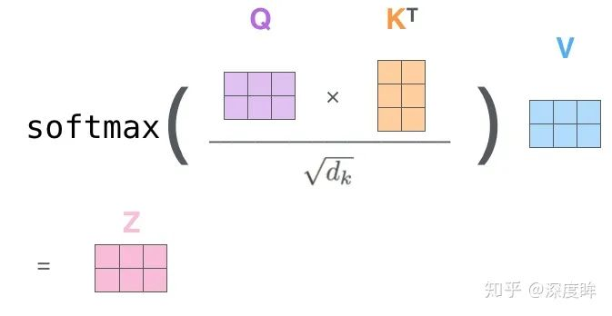

上面的操作很不错，但是还有改进空间，论文中又增加一种叫做<font color=red>“多头”注意力(“multi-headed” attention)</font>的机制进一步完善了自注意力层，并在两方面提高了注意力层的性能：

- **<font color=red>它扩展了模型专注于不同位置的能力</font>**。在上面的例子中，虽然每个编码都在z1中有或多或少的体现，但是它可能被实际的单词本身所支配。如果我们翻译一个句子，比如“The animal didn’t cross the street because it was too tired”，我们会想知道“it”指的是哪个词，这时模型的“多头”注意机制会起到作用。
- 它**<font color=red>给出了注意力层的多个"表示子空间"</font>**,对于“多头”注意机制，有多个查询/键/值权重矩阵集(Transformer使用8个注意力头，因此我们对于每个编码器/解码器有8个矩阵集合)。

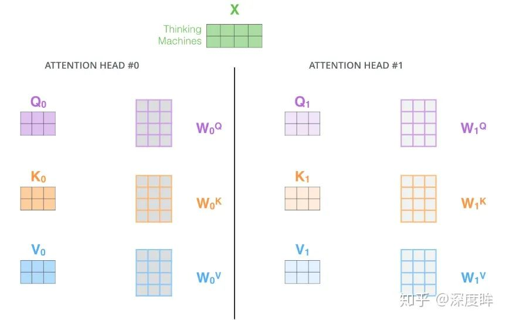


简单来说就是类似于分组操作，将输入X分别输入到8个attention层中，得到8个Z矩阵输出，最后对结果concat即可。论文图示如下：

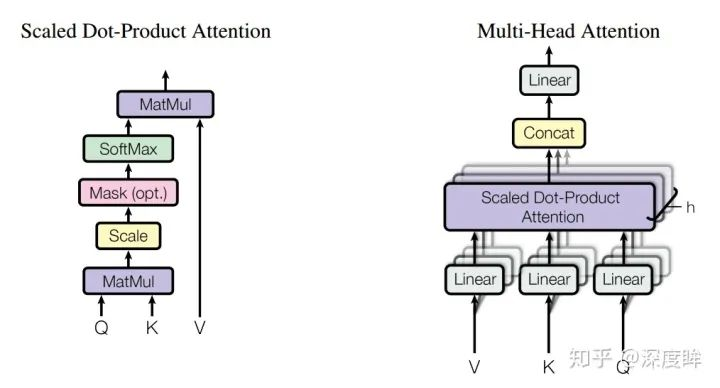

先忽略Mask的作用，左边是单头attention操作，右边是n个单头attention构成的多头自注意力层。

代码层面非常简单，单头attention操作如下：
```python
class ScaledDotProductAttention(nn.Module):
    ''' Scaled Dot-Product Attention '''

    def __init__(self, temperature, attn_dropout=0.1):
        super().__init__()
        self.temperature = temperature
        self.dropout = nn.Dropout(attn_dropout)

    def forward(self, q, k, v, mask=None):
        # self.temperature是论文中的d_k ** 0.5，防止梯度过大
        # QxK/sqrt(dk)
        attn = torch.matmul(q / self.temperature, k.transpose(2, 3))

        if mask is not None:
            # 屏蔽不想要的输出
            attn = attn.masked_fill(mask == 0, -1e9)
        # softmax+dropout
        attn = self.dropout(F.softmax(attn, dim=-1))
        # 概率分布xV
        output = torch.matmul(attn, v)

        return output, attn
```
再次复习下Multi-Head Attention层的图示，可以发现在前面讲的内容基础上还加入了残差设计和层归一化操作，目的是为了防止梯度消失，加快收敛。

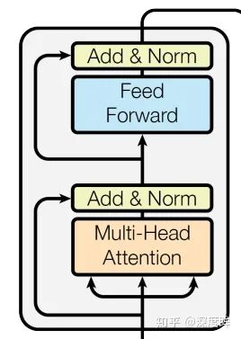

Multi-Head Attention实现在ScaledDotProductAttention基础上构建：

```python
class MultiHeadAttention(nn.Module):
    ''' Multi-Head Attention module '''

    # n_head头的个数，默认是8
    # d_model编码向量长度，例如本文说的512
    # d_k, d_v的值一般会设置为 n_head * d_k=d_model，
    # 此时concat后正好和原始输入一样，当然不相同也可以，因为后面有fc层
    # 相当于将可学习矩阵分成独立的n_head份
    def __init__(self, n_head, d_model, d_k, d_v, dropout=0.1):
        super().__init__()
        # 假设n_head=8，d_k=64
        self.n_head = n_head
        self.d_k = d_k
        self.d_v = d_v
        # d_model输入向量，n_head * d_k输出向量
        # 可学习W^Q，W^K,W^V矩阵参数初始化
        self.w_qs = nn.Linear(d_model, n_head * d_k, bias=False)
        self.w_ks = nn.Linear(d_model, n_head * d_k, bias=False)
        self.w_vs = nn.Linear(d_model, n_head * d_v, bias=False)
        # 最后的输出维度变换操作
        self.fc = nn.Linear(n_head * d_v, d_model, bias=False)
        # 单头自注意力
        self.attention = ScaledDotProductAttention(temperature=d_k ** 0.5)
        self.dropout = nn.Dropout(dropout)
        # 层归一化
        self.layer_norm = nn.LayerNorm(d_model, eps=1e-6)

    def forward(self, q, k, v, mask=None):
        # 假设qkv输入是(b,100,512),100是训练每个样本最大单词个数
        # 一般qkv相等，即自注意力
        residual = q
        # 将输入x和可学习矩阵相乘，得到(b,100,512)输出
        # 其中512的含义其实是8x64，8个head，每个head的可学习矩阵为64维度
        # q的输出是(b,100,8,64),kv也是一样
        q = self.w_qs(q).view(sz_b, len_q, n_head, d_k)
        k = self.w_ks(k).view(sz_b, len_k, n_head, d_k)
        v = self.w_vs(v).view(sz_b, len_v, n_head, d_v)

        # 变成(b,8,100,64)，方便后面计算，也就是8个头单独计算
        q, k, v = q.transpose(1, 2), k.transpose(1, 2), v.transpose(1, 2)

        if mask is not None:
            mask = mask.unsqueeze(1)   # For head axis broadcasting.
        # 输出q是(b,8,100,64),维持不变,内部计算流程是：
        # q*k转置，除以d_k ** 0.5，输出维度是b,8,100,100即单词和单词直接的相似性
        # 对最后一个维度进行softmax操作得到b,8,100,100
        # 最后乘上V，得到b,8,100,64输出
        q, attn = self.attention(q, k, v, mask=mask)

        # b,100,8,64-->b,100,512
        q = q.transpose(1, 2).contiguous().view(sz_b, len_q, -1)
        q = self.dropout(self.fc(q))
        # 残差计算
        q += residual
        # 层归一化，在512维度计算均值和方差，进行层归一化
        q = self.layer_norm(q)

        return q, attn
```

现在pytorch新版本已经把MultiHeadAttention当做nn中的一个类了，可以直接调用。

(2) 前馈神经网络层

这个层就没啥说的了，非常简单：

```python
class PositionwiseFeedForward(nn.Module):
    ''' A two-feed-forward-layer module '''

    def __init__(self, d_in, d_hid, dropout=0.1):
        super().__init__()
        # 两个fc层，对最后的512维度进行变换
        self.w_1 = nn.Linear(d_in, d_hid) # position-wise
        self.w_2 = nn.Linear(d_hid, d_in) # position-wise
        self.layer_norm = nn.LayerNorm(d_in, eps=1e-6)
        self.dropout = nn.Dropout(dropout)

    def forward(self, x):
        residual = x

        x = self.w_2(F.relu(self.w_1(x)))
        x = self.dropout(x)
        x += residual

        x = self.layer_norm(x)

        return x
```

(3) 编码层操作整体流程

可视化如下所示：


单个编码层代码如下所示：

```python
class EncoderLayer(nn.Module):
    def __init__(self, d_model, d_inner, n_head, d_k, d_v, dropout=0.1):
        super(EncoderLayer, self).__init__()
        self.slf_attn = MultiHeadAttention(n_head, d_model, d_k, d_v, dropout=dropout)
        self.pos_ffn = PositionwiseFeedForward(d_model, d_inner, dropout=dropout)

    def forward(self, enc_input, slf_attn_mask=None):
        # Q K V是同一个，自注意力
        # enc_input来自源单词嵌入向量或者前一个编码器输出
        enc_output, enc_slf_attn = self.slf_attn(
            enc_input, enc_input, enc_input, mask=slf_attn_mask)
        enc_output = self.pos_ffn(enc_output)
        return enc_output, enc_slf_attn
```

将上述编码过程重复n遍即可，除了第一个模块输入是单词嵌入向量与位置编码的和外，其余编码层输入是上一个编码器输出，即后面的编码器输入**不需要位置编码向量**。如果考虑n个编码器的运行过程，如下所示：

```python

class Encoder(nn.Module):
    def __init__(
            self, n_src_vocab, d_word_vec, n_layers, n_head, d_k, d_v,
            d_model, d_inner, pad_idx, dropout=0.1, n_position=200):
        # nlp领域的词嵌入向量生成过程(单词在词表里面的索引idx-->d_word_vec长度的向量)
        self.src_word_emb = nn.Embedding(n_src_vocab, d_word_vec, padding_idx=pad_idx)
        # 位置编码
        self.position_enc = PositionalEncoding(d_word_vec, n_position=n_position)
        self.dropout = nn.Dropout(p=dropout)
        # n个编码器层
        self.layer_stack = nn.ModuleList([
            EncoderLayer(d_model, d_inner, n_head, d_k, d_v, dropout=dropout)
            for _ in range(n_layers)])
        # 层归一化
        self.layer_norm = nn.LayerNorm(d_model, eps=1e-6)

    def forward(self, src_seq, src_mask, return_attns=False):
        # 对输入序列进行词嵌入，加上位置编码
        enc_output = self.dropout(self.position_enc(self.src_word_emb(src_seq)))
        enc_output = self.layer_norm(enc_output)
        # 作为编码器层输入
        for enc_layer in self.layer_stack:
            enc_output, _ = enc_layer(enc_output, slf_attn_mask=src_mask)
        return enc_output
```

到目前为止我们就讲完了编码部分的全部流程和代码细节。现在再来看整个transformer算法就会感觉亲切很多了：


##### 1.4.3 解码器输入数据处理

在分析解码器结构前先看下解码器整体结构，方便理解：

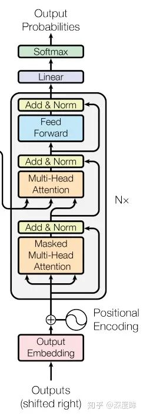

其输入数据处理也要区分第一个解码器和后续解码器，和编码器类似，**第一个解码器输入不仅包括最后一个编码器输出，还需要额外的输出嵌入向量，而后续解码器输入是来自最后一个编码器输出和前面解码器输出。**

(1) 目标单词嵌入

这个操作和源单词嵌入过程完全相同，维度也是512，假设输出是i am a student，那么需要对这4个单词也利用word2vec算法转化为4x512的矩阵，**作为第一个解码器的单词嵌入输入**。

(2) 位置编码

同样的也需要对解码器输入引入**位置编码**，做法和编码器部分完全相同，且将目标单词嵌入向量和位置编码向量相加，即可作为第一个解码器输入。

<font color=red>和编码器单词嵌入不同的地方</font>是在进行目标单词嵌入前，还需要将目标单词即是i am a student右移动一位，新增加的一个位置采用提前定义好的标志位BOS_WORD代替，现在就变成[BOS_WORD,i,am,a,student]，**为啥要右移？**<mark>因为解码过程和seq2seq一样是顺序解码的，需要提供一个开始解码标志</mark >。不然第一个时间步的解码单词i是如何输出的呢？具体解码过程其实是：输入BOS_WORD，解码器输出i；输入前面已经解码的BOS_WORD和i，解码器输出am...，输入已经解码的BOS_WORD、i、am、a和student，解码器输出解码结束标志位EOS_WORD,每次解码都会利用前面已经解码输出的所有单词嵌入信息

下面有个非常清晰的gif图，一目了然：


上图没有绘制BOS_WORD嵌入向量输入，然后解码出i单词的过程。

##### 1.4.4 解码器前向过程

仔细观察解码器结构，其包括：**带有mask的MultiHeadAttention**、**MultiHeadAttention**和**前馈神经网络层**三个组件，带有mask的MultiHeadAttention和MultiHeadAttention结构和代码写法是完全相同，唯一区别是是否输入了mask。

为啥要mask？原因依然是顺序解码导致的。试想模型训练好了，开始进行翻译(测试)，其流程就是上面写的：**输入BOS_WORD，解码器输出i；输入前面已经解码的BOS_WORD和i，解码器输出am...，输入已经解码的BOS_WORD、i、am、a和student，解码器输出解码结束标志位EOS_WORD,每次解码都会利用前面已经解码输出的所有单词嵌入信息**，这个测试过程是没有问题，但是训练时候我肯定不想采用上述顺序解码类似rnn, 即一个一个目标单词嵌入向量顺序输入训练，**肯定想采用类似编码器中的矩阵并行算法，一步就把所有目标单词预测出来**。要实现这个功能就可以参考编码器的操作，把<mark>目标单词嵌入向量组成矩阵一次输入即可</mark>，但是在解码am时候，不能利用到后面单词a和student的目标单词嵌入向量信息，否则这就是作弊(测试时候不可能能未卜先知)。为此引入mask，目的是构成下三角矩阵，右上角全部设置为负无穷(相当于忽略)，从而实现**当解码第一个字的时候，第一个字只能与第一个字计算相关性，当解出第二个字的时候，只能计算出第二个字与第一个字和第二个字的相关性**。具体是：<u>在解码器中，自注意力层只被允许处理输出序列中更靠前的那些位置，在softmax步骤前，它会把后面的位置给隐去（把它们设为-inf）</u>。

还有个非常重要点需要知道(看图示可以发现)：**解码器内部的带有mask的MultiHeadAttention的qkv向量输入来自目标单词嵌入或者前一个解码器输出，三者是相同的，但是后面的MultiHeadAttention的qkv向量中的kv来自最后一层编码器的输入，而q来自带有mask的MultiHeadAttention模块的输出**。

关于带mask的注意力层写法其实就是前面提到的代码：

```python

class ScaledDotProductAttention(nn.Module):
    ''' Scaled Dot-Product Attention '''

    def __init__(self, temperature, attn_dropout=0.1):
        super().__init__()
        self.temperature = temperature
        self.dropout = nn.Dropout(attn_dropout)

    def forward(self, q, k, v, mask=None):
        # 假设q是b,8,10,64(b是batch，8是head个数，10是样本最大单词长度，
        # 64是每个单词的编码向量)
        # attn输出维度是b,8,10,10
        attn = torch.matmul(q / self.temperature, k.transpose(2, 3))
        # 故mask维度也是b,8,10,10
        # 忽略b,8，只关注10x10的矩阵，其是下三角矩阵，下三角位置全1，其余位置全0
        if mask is not None:
            # 提前算出mask，将为0的地方变成极小值-1e9，把这些位置的值设置为忽略
            # 目的是避免解码过程中利用到未来信息
            attn = attn.masked_fill(mask == 0, -1e9)
        # softmax+dropout
        attn = self.dropout(F.softmax(attn, dim=-1))
        output = torch.matmul(attn, v)

        return output, attn
```
可视化如下：图片来源https://zhuanlan.zhihu.com/p/44731789


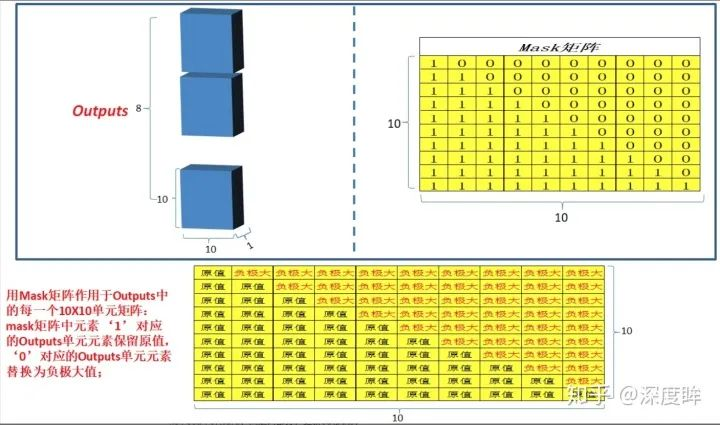

整个解码器代码和编码器非常类似：

```python
class DecoderLayer(nn.Module):
    ''' Compose with three layers '''

    def __init__(self, d_model, d_inner, n_head, d_k, d_v, dropout=0.1):
        super(DecoderLayer, self).__init__()
        self.slf_attn = MultiHeadAttention(n_head, d_model, d_k, d_v, dropout=dropout)
        self.enc_attn = MultiHeadAttention(n_head, d_model, d_k, d_v, dropout=dropout)
        self.pos_ffn = PositionwiseFeedForward(d_model, d_inner, dropout=dropout)

    def forward(
            self, dec_input, enc_output,
            slf_attn_mask=None, dec_enc_attn_mask=None):
        # 标准的自注意力，QKV=dec_input来自目标单词嵌入或者前一个解码器输出
        dec_output, dec_slf_attn = self.slf_attn(
            dec_input, dec_input, dec_input, mask=slf_attn_mask)
        # KV来自最后一个编码层输出enc_output，Q来自带有mask的self.slf_attn输出
        dec_output, dec_enc_attn = self.enc_attn(
            dec_output, enc_output, enc_output, mask=dec_enc_attn_mask)
        dec_output = self.pos_ffn(dec_output)
        return dec_output, dec_slf_attn, dec_enc_attn
```

考虑n个解码器模块，其整体流程为：

```python
class Decoder(nn.Module):
    def __init__(
            self, n_trg_vocab, d_word_vec, n_layers, n_head, d_k, d_v,
            d_model, d_inner, pad_idx, n_position=200, dropout=0.1):
        # 目标单词嵌入
        self.trg_word_emb = nn.Embedding(n_trg_vocab, d_word_vec, padding_idx=pad_idx)
        # 位置嵌入向量
        self.position_enc = PositionalEncoding(d_word_vec, n_position=n_position)
        self.dropout = nn.Dropout(p=dropout)
        # n个解码器
        self.layer_stack = nn.ModuleList([
            DecoderLayer(d_model, d_inner, n_head, d_k, d_v, dropout=dropout)
            for _ in range(n_layers)])
        # 层归一化
        self.layer_norm = nn.LayerNorm(d_model, eps=1e-6)

    def forward(self, trg_seq, trg_mask, enc_output, src_mask, return_attns=False):
        # 目标单词嵌入+位置编码
        dec_output = self.dropout(self.position_enc(self.trg_word_emb(trg_seq)))
        dec_output = self.layer_norm(dec_output)
        # 遍历每个解码器
        for dec_layer in self.layer_stack:
            # 需要输入3个信息：目标单词嵌入+位置编码、最后一个编码器输出enc_output
            # 和dec_enc_attn_mask，解码时候不能看到未来单词信息
            dec_output, dec_slf_attn, dec_enc_attn = dec_layer(
                dec_output, enc_output, slf_attn_mask=trg_mask, dec_enc_attn_mask=src_mask)
        return dec_output
```

##### 1.4.5 分类层

在进行编码器-解码器后输出依然是向量，需要在后面接fc+softmax层进行分类训练。假设当前训练过程是翻译任务需要输出i am a student EOS_WORD这5个单词。假设我们的模型是从训练集中学习一万个不同的英语单词（我们模型的“输出词表”）。因此softmax后输出为一万个单元格长度的向量，每个单元格对应某一个单词的分数，这其实就是普通多分类问题，只不过维度比较大而已。

依然以前面例子为例，假设编码器输出shape是(b,100,512)，经过fc后变成(b,100,10000)，然后对最后一个维度进行softmax操作，得到bx100个单词的概率分布，在训练过程中bx100个单词是知道label的，故可以直接采用ce loss进行训练。

```python
self.trg_word_prj = nn.Linear(d_model, n_trg_vocab, bias=False)
dec_output, *_ = self.model.decoder(trg_seq, trg_mask, enc_output, src_mask)
return F.softmax(self.model.trg_word_prj(dec_output), dim=-1)
```

##### 1.4.6 前向流程

以翻译任务为例：
- 将源单词进行嵌入，组成矩阵(加上位置编码矩阵)输入到n个编码器中，输出编码向量KV
- 第一个解码器先输入一个BOS_WORD单词嵌入向量，后续解码器接受该解码器输出，结合KV进行第一次解码
- 将第一次解码单词进行嵌入，联合BOS_WORD单词嵌入向量构成矩阵再次输入到解码器中进行第二次解码，得到解码单词
- 不断循环，每次的第一个解码器输入都不同，其包含了前面时间步长解码出的所有单词
- 直到输出EOS_WORD表示解码结束或者强制设置最大时间步长即可

这个解码过程其实就是标准的seq2seq流程。到目前为止就描述完了整个标准transformer训练和测试流程。

### 2 视觉领域的transformer

在理解了标准的transformer后，再来看视觉领域transformer就会非常简单，因为在cv领域应用transformer时候大家都有一个共识：尽量不改动transformer结构，这样才能和NLP领域发展对齐，所以大家理解cv里面的transformer操作是非常简单的。

#### 2.1 分类vision transformer

论文题目：An Image is Worth 16x16 Words:Transformers for Image Recognition at Scale
论文地址：https://arxiv.org/abs/2010.11929
github: https://github.com/lucidrains/vit-pytorch

其做法超级简单，只含有编码器模块：


本文出发点是彻底抛弃CNN，以前的cv领域虽然引入transformer，但是或多或少都用到了cnn或者rnn，本文就比较纯粹了，整个算法几句话就说清楚了，下面直接分析。

##### 2.1.1 图片分块和降维

因为transformer的输入需要序列，所以最简单做法就是把图片切分为patch，然后拉成序列即可。假设输入图片大小是256x256，打算分成64个patch，每个patch是32x32像素

```python
x = rearrange(img, 'b c (h p1) (w p2) -> b (h w) (p1 p2 c)', p1=p, p2=p)
```

这个写法是采用了爱因斯坦表达式，具体是采用了einops库实现，内部集成了各种算子，rearrange就是其中一个，非常高效。不懂这种语法的请自行百度。p就是patch大小，假设输入是b,3,256,256，则rearrange操作是先变成(b,3,8x32,8x32)，最后变成(b,8x8,32x32x3)即(b,64,3072)，将每张图片切分成64个小块，每个小块长度是32x32x3=3072，也就是说输入长度为64的图像序列，每个元素采用3072长度进行编码。

考虑到3072有点大，故作者先进行降维：

```python
# 将3072变成dim，假设是1024
self.patch_to_embedding = nn.Linear(patch_dim, dim)
x = self.patch_to_embedding(x)
```

仔细看论文上图，可以发现假设切成9个块，但是最终到transfomer输入是10个向量，额外追加了一个0和_。为啥要追加？原因是**我们现在没有解码器了，而是编码后直接就进行分类预测，那么该解码器就要负责一点点解码器功能，那就是：需要一个类似开启解码标志，非常类似于标准transformer解码器中输入的目标嵌入向量右移一位操作。**试下如果没有额外输入，9个块输入9个编码向量输出，那么对于分类任务而言，我应该取哪个输出向量进行后续分类呢？选择任何一个都说不通，所以作者追加了一个可学习嵌入向量输入。那么额外的可学习嵌入向量为啥要设计为可学习，而不是类似nlp中采用固定的token代替？个人不负责任的猜测这应该就是图片领域和nlp领域的差别，nlp里面每个词其实都有具体含义，是离散的，但是图像领域没有这种真正意义上的离散token，有的只是一堆连续特征或者图像像素，如果不设置为可学习，那还真不知道应该设置为啥内容比较合适，全0和全1也说不通。自此现在就是变成10个向量输出，输出也是10个编码向量，然后取第0个编码输出进行分类预测即可。从这个角度看可以认为编码器多了一点点解码器功能。具体做法超级简单，0就是位置编码向量，_是可学习的patch嵌入向量。

```python
# dim=1024
self.cls_token = nn.Parameter(torch.randn(1, 1, dim))
# 变成(b,64,1024)
cls_tokens = repeat(self.cls_token, '() n d -> b n d', b=b)
# 额外追加token，变成b,65,1024
x = torch.cat((cls_tokens, x), dim=1)
```

##### 2.1.2 位置编码

位置编码也是必不可少的，长度应该是1024，这里做的比较简单，没有采用sincos编码，而是直接设置为可学习，效果差不多

```python
# num_patches=64，dim=1024,+1是因为多了一个cls开启解码标志
self.pos_embedding = nn.Parameter(torch.randn(1, num_patches + 1, dim))
```
对训练好的pos_embedding进行可视化，如下所示：

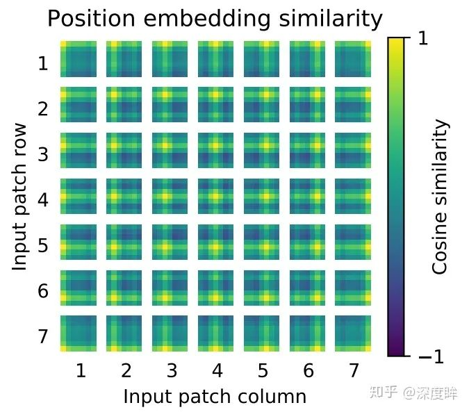

相邻位置有相近的位置编码向量，整体呈现2d空间位置排布一样。
将patch嵌入向量和位置编码向量相加即可作为编码器输入

```python
x += self.pos_embedding[:, :(n + 1)]
x = self.dropout(x)
```

##### 2.1.3 编码器前向过程

作者采用的是没有任何改动的transformer，故没有啥说的。

```python
self.transformer = Transformer(dim, depth, heads, mlp_dim, dropout)
```
##### 2.1.4 分类head

在编码器后接fc分类器head即可

```python
self.mlp_head = nn.Sequential(
            nn.LayerNorm(dim),
            nn.Linear(dim, mlp_dim),
            nn.GELU(),
            nn.Dropout(dropout),
            nn.Linear(mlp_dim, num_classes)
        )

# 65个输出里面只需要第0个输出进行后续分类即可
self.mlp_head(x[:, 0])
```
到目前为止就全部写完了，是不是非常简单，外层整体流程为：
```python

class ViT(nn.Module):
    def __init__(self, *, image_size, patch_size, num_classes, dim, depth, heads, mlp_dim, channels=3, dropout=0.,emb_dropout=0.):
        super().__init__()
        # image_size输入图片大小 256
        # patch_size 每个patch的大小 32
        num_patches = (image_size // patch_size) ** 2  # 一共有多少个patch 8x8=64
        patch_dim = channels * patch_size ** 2  # 3x32x32=3072
        self.patch_size = patch_size  # 32
        # 1,64+1,1024,+1是因为token，可学习变量，不是固定编码
        self.pos_embedding = nn.Parameter(torch.randn(1, num_patches + 1, dim))
        # 图片维度太大了，需要先降维
        self.patch_to_embedding = nn.Linear(patch_dim, dim)
        # 分类输出位置标志，否则分类输出不知道应该取哪个位置
        self.cls_token = nn.Parameter(torch.randn(1, 1, dim))
        self.dropout = nn.Dropout(emb_dropout)
        # 编码器
        self.transformer = Transformer(dim, depth, heads, mlp_dim, dropout)
        # 输出头
        self.mlp_head = nn.Sequential(
            nn.LayerNorm(dim),
            nn.Linear(dim, mlp_dim),
            nn.GELU(),
            nn.Dropout(dropout),
            nn.Linear(mlp_dim, num_classes)
        )

    def forward(self, img, mask=None):
        p = self.patch_size

        # 先把图片变成64个patch,输出shape=b,64,3072
        x = rearrange(img, 'b c (h p1) (w p2) -> b (h w) (p1 p2 c)', p1=p, p2=p)
        # 输出 b,64,1024
        x = self.patch_to_embedding(x)
        b, n, _ = x.shape
        # 输出 b,1,1024
        cls_tokens = repeat(self.cls_token, '() n d -> b n d', b=b)
        # 额外追加token，变成b,65,1024
        x = torch.cat((cls_tokens, x), dim=1)
        # 加上位置编码1,64+1,1024
        x += self.pos_embedding[:, :(n + 1)]
        x = self.dropout(x)

        x = self.transformer(x, mask)
        # 分类head,只需要x[0]即可
        # x = self.to_cls_token(x[:, 0])
        x = x[:, 0]
        return self.mlp_head(x)
```
##### 2.1.5 实验分析

作者得出的结论是：cv领域应用transformer需要大量数据进行预训练，在同等数据量的情况下性能不如cnn。一旦数据量上来了，对应的训练时间也会加长很多，那么就可以轻松超越cnn。

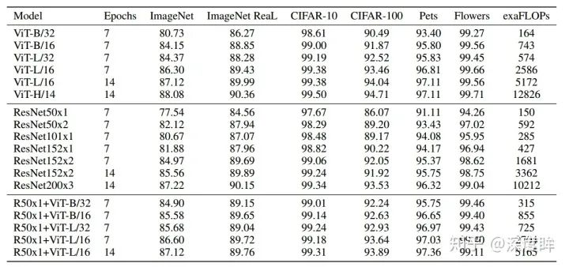

同时应用transformer，一个突出优点是可解释性比较强：


#### 2.2 目标检测detr

论文名称：End-to-End Object Detection with Transformers
论文地址：https://arxiv.org/abs/2005.12872
github：https://github.com/facebookresearch/detr
detr是facebook提出的引入transformer到目标检测领域的算法，效果很好，做法也很简单，符合其一贯的简洁优雅设计做法。


对于目标检测任务，其要求输出给定图片中所有前景物体的类别和bbox坐标，该任务实际上是无序集合预测问题。针对该问题，detr做法非常简单：**给定一张图片，经过CNN进行特征提取，然后变成特征序列输入到transformer的编解码器中，直接输出指定长度为N的无序集合，集合中每个元素包含物体类别和坐标。**其中N表示整个数据集中图片上最多物体的数目，因为整个训练和测试都Batch进行，如果不设置最大输出集合数，无法进行batch训练，如果图片中物体不够N个，那么就采用no object填充，表示该元素是背景。

整个思想看起来非常简单，相比faster rcnn或者yolo算法那就简单太多了，因为其不需要设置先验anchor，超参几乎没有，也不需要nms(因为输出的无序集合没有重复情况)，并且在代码程度相比faster rcnn那就不知道简单多少倍了，通过简单修改就可以应用于全景分割任务。可以推测，如果transformer真正大规模应用于CV领域，那么对初学者来说就是福音了，理解transformer就几乎等于理解了整个cv领域了(当然也可能是坏事)。

##### 2.2.1 detr核心思想分析

相比faster rcnn等做法，detr最大特点是将目标检测问题转化为无序集合预测问题。论文中特意指出faster rcnn这种设置一大堆anchor，然后基于anchor进行分类和回归其实属于代理做法即不是最直接做法，目标检测任务就是输出无序集合，而faster rcnn等算法通过各种操作，并结合复杂后处理最终才得到无序集合属于绕路了，而detr就比较纯粹了。

尽管将transformer引入目标检测领域可以避免上述各种问题，但是其依然存在两个核心操作：

- **无序集合输出的loss计算**
- **针对目标检测的transformer改进**

##### 2.2.2 detr算法实现细节

下面结合代码和原理对其核心环节进行深入分析.

###### 2.2.2.1 无序集合输出的loss计算

在分析loss计算前，需要先明确N个无序集合的target构建方式。作者在coco数据集上统计，一张图片最多标注了63个物体，所以N应该要不小于63，作者设置的是100。为啥要设置为100？有人猜测是和coco评估指标只取前100个预测结果算法指标有关系。

detr输出是包括batchx100个无序集合，每个集合包括类别和坐标信息。对于coco数据而言，作者设置类别为91(coco类别标注索引是1-91,但是实际就标注了80个类别)，加上背景一共92个类别，对于坐标分支采用4个归一化值表征即cxcywh中心点、wh坐标，然后除以图片宽高进行归一化(没有采用复杂变换策略)，故每个集合是 Image ，c是长度为92的分类向量，b是长度为4的bbox坐标向量。总之detr输出集合包括两个分支：分类分支shape=(b,100,92)，bbox坐标分支shape=(b,100,4)，对应的target也是包括分类target和bbox坐标target，如果不够100，则采用背景填充，计算loss时候bbox分支仅仅计算有物体位置，背景集合忽略。

现在核心问题来了：输出的bx100个检测结果是无序的，如何和gt bbox计算loss？这就需要用到经典的双边匹配算法了，也就是常说的匈牙利算法，该算法广泛应用于最优分配问题，在bottom-up人体姿态估计算法中进行分组操作时候也经常使用。detr中利用匈牙利算法先进行最优一对一匹配得到匹配索引，然后对bx100个结果进行重排就和gt bbox对应上了(对gt bbox进行重排也可以，没啥区别)，就可以算loss了。

匈牙利算法是一个标准优化算法，具体是组合优化算法，在scipy.optimize.linear_sum_assignmen函数中有实现，一行代码就可以得到最优匹配，网上解读也非常多，这里就不写细节了，该函数核心是需要输入A集合和B集合两两元素之间的连接权重，基于该重要性进行内部最优匹配，连接权重大的优先匹配。

上述描述优化过程可以采用如下公式表达：

$$\hat{\sigma} = \mathop{\arg\min}\limits_{\sigma \in \partial_{N}} {\sum^{N}_{i}} L_{match} (y_i, \hat{y}_{\sigma(i)})$$

优化对象是$\sigma$ ，其是长度为N的list， $\sigma(i) = i$ ， $\sigma(i)$  表示无序gt bbox集合的哪个元素和输出预测集合中的第i个匹配。其实简单来说就是找到最优匹配，因为在最佳匹配情况下l_match和最小即loss最小。

前面说过匈牙利算法核心是需要提供输入A集合和B集合两两元素之间的连接权重，这里就是要输入N个输出集合和M个gt bbox之间的关联程度，如下所示

$$L_{Hungarian} (y, \hat{y}) = \sum^{N}_{i=1}[-\log\hat{p}_{\hat{\sigma}(i)} + \mathbb{1} L_{box}(b_i, \hat{b}_{\hat{\sigma}(i)})]$$

而Lbox具体是：

$$\lambda_{iou}L_{iou}(b_i, \hat{b}_{\sigma(i)}) + \lambda_{L_1}||b_i - \hat{b}_{\sigma(i)}||_1$$

Hungarian意思就是匈牙利，也就是前面的L_match，上述意思是需要计算M个gt bbox和N个输出集合两两之间的广义距离，距离越近表示越可能是最优匹配关系，也就是两者最密切。广义距离的计算考虑了分类分支和bbox分支，下面结合代码直接说明，比较简单。

```python
# detr分类输出，num_queries=100，shape是(b,100,92)
bs, num_queries = outputs["pred_logits"].shape[:2]
# 得到概率输出(bx100,92)
out_prob = outputs["pred_logits"].flatten(0, 1).softmax(-1)
# 得到bbox分支输出(bx100,4)
out_bbox = outputs["pred_boxes"].flatten(0, 1)

# 准备分类target shape=(m,)里面存储的是类别索引，m包括了整个batch内部的所有gt bbox
tgt_ids = torch.cat([v["labels"] for v in targets])
# 准备bbox target shape=(m,4)，已经归一化了
tgt_bbox = torch.cat([v["boxes"] for v in targets])

#核心
#bx100,92->bx100,m，对于每个预测结果，把目前gt里面有的所有类别值提取出来，其余值不需要参与匹配
#对应上述公式，类似于nll loss，但是更加简单
cost_class = -out_prob[:, tgt_ids]　　
#计算out_bbox和tgt_bbox两两之间的l1距离 bx100,m
cost_bbox = torch.cdist(out_bbox, tgt_bbox, p=1)
#额外多计算一个giou loss bx100,m
cost_giou = -generalized_box_iou(box_cxcywh_to_xyxy(out_bbox), box_cxcywh_to_xyxy(tgt_bbox))

#得到最终的广义距离bx100,m，距离越小越可能是最优匹配
C = self.cost_bbox * cost_bbox + self.cost_class * cost_class + self.cost_giou * cost_giou
# bx100,m--> batch,100,m
C = C.view(bs, num_queries, -1).cpu()

#计算每个batch内部有多少物体，后续计算时候按照单张图片进行匹配，没必要batch级别匹配,徒增计算
sizes = [len(v["boxes"]) for v in targets]
#匈牙利最优匹配，返回匹配索引
indices = [linear_sum_assignment(c[i]) for i, c in enumerate(C.split(sizes, -1))]

return [(torch.as_tensor(i, dtype=torch.int64), torch.as_tensor(j, dtype=torch.int64)) for i, j in indices]
```

在得到匹配关系后算loss就水到渠成了。分类分支计算ce loss，bbox分支计算l1 loss+giou loss
```python
def loss_labels(self, outputs, targets, indices, num_boxes, log=True):
    #shape是(b,100,92)
    src_logits = outputs['pred_logits']
　　#得到匹配后索引，作用在label上
    idx = self._get_src_permutation_idx(indices)
    #得到匹配后的分类target
    target_classes_o = torch.cat([t["labels"][J] for t, (_, J) in zip(targets, indices)])
    #加入背景(self.num_classes)，补齐bx100个
    target_classes = torch.full(src_logits.shape[:2], self.num_classes,
                                dtype=torch.int64, device=src_logits.device)
    #shape是(b,100,),存储的是索引，不是one-hot
    target_classes[idx] = target_classes_o
    #计算ce loss,self.empty_weight前景和背景权重是1和0.1,克服类别不平衡
    loss_ce = F.cross_entropy(src_logits.transpose(1, 2), target_classes, self.empty_weight)
    losses = {'loss_ce': loss_ce}
    return losses
def loss_boxes(self, outputs, targets, indices, num_boxes):
    idx = self._get_src_permutation_idx(indices)
    src_boxes = outputs['pred_boxes'][idx]
    target_boxes = torch.cat([t['boxes'][i] for t, (_, i) in zip(targets, indices)], dim=0)
    #l1 loss
    loss_bbox = F.l1_loss(src_boxes, target_boxes, reduction='none')

    losses = {}
    losses['loss_bbox'] = loss_bbox.sum() / num_boxes
    #giou loss
    loss_giou = 1 - torch.diag(box_ops.generalized_box_iou(
        box_ops.box_cxcywh_to_xyxy(src_boxes),
        box_ops.box_cxcywh_to_xyxy(target_boxes)))
    losses['loss_giou'] = loss_giou.sum() / num_boxes
    return losses
```
###### 2.2.2.2 针对目标检测的transformer改进

分析完训练最关键的：双边匹配+loss计算部分，现在需要考虑在目标检测算法中transformer如何设计？下面按照算法的4个步骤讲解。


transformer细节如下：
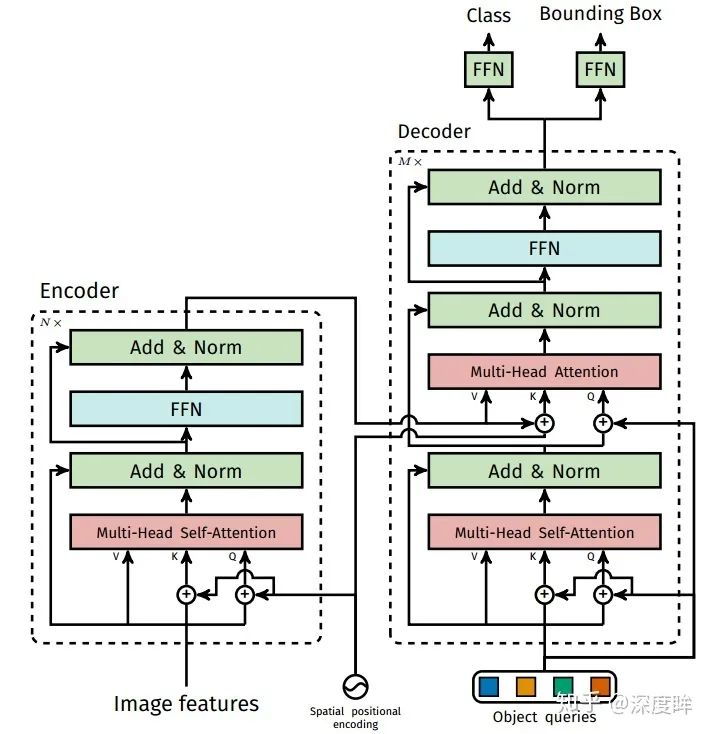

(1) cnn骨架特征提取

骨架网络可以是任何一种，作者选择resnet50，将最后一个stage即stride=32的特征图作为编码器输入。由于resnet仅仅作为一个小部分且已经经过了imagenet预训练，故和常规操作一样，会进行如下操作：

- resnet中所有BN都固定，即采用全局均值和方差
- resnet的stem和第一个stage不进行参数更新，即parameter.requires_grad_(False)
- backbone的学习率小于transformer,lr_backbone=1e-05,其余为0.0001

假设输入是(b,c,h,w)，则resnet50输出是(b,1024,h//32,w//32)，1024比较大，为了节省计算量，先采用1x1卷积降维为256,最后转化为序列格式输入到transformer中，输入shape=(h'xw',b,256)，h'=h//32

```python
self.input_proj = nn.Conv2d(backbone.num_channels, hidden_dim, kernel_size=1)
# 输出是(b,256,h//32,w//32)
src=self.input_proj(src)
# 变成序列模式，(h'xw',b,256),256是每个词的编码长度
src = src.flatten(2).permute(2, 0, 1)
```

(2) 编码器设计和输入

编码器结构设计没有任何改变，但是输入改变了。

(a) 位置编码需要考虑2d空间

由于图像特征是2d特征，故位置嵌入向量也需要考虑xy方向。前面说过编码方式可以采用sincos，也可以设置为可学习，本文采用的依然是sincos模式，和前面说的一样，但是需要考虑xy两个方向(前面说的序列只有x方向)。

```python
#输入是b,c,h,w
#tensor_list的类型是NestedTensor，内部自动附加了mask，
#用于表示动态shape，是pytorch中tensor新特性https://github.com/pytorch/nestedtensor
x = tensor_list.tensors # 原始tensor数据
# 附加的mask，shape是b,h,w 全是false
mask = tensor_list.mask
not_mask = ~mask
# 因为图像是2d的，所以位置编码也分为x,y方向
# 1 1 1 1 ..  2 2 2 2... 3 3 3...
y_embed = not_mask.cumsum(1, dtype=torch.float32)
# 1 2 3 4 ... 1 2 3 4...
x_embed = not_mask.cumsum(2, dtype=torch.float32)
if self.normalize:
    eps = 1e-6
    y_embed = y_embed / (y_embed[:, -1:, :] + eps) * self.scale
    x_embed = x_embed / (x_embed[:, :, -1:] + eps) * self.scale

# 0~127 self.num_pos_feats=128,因为前面输入向量是256，编码是一半sin，一半cos
dim_t = torch.arange(self.num_pos_feats, dtype=torch.float32, device=x.device)
# 归一化
dim_t = self.temperature ** (2 * (dim_t // 2) / self.num_pos_feats)

pos_x = x_embed[:, :, :, None] / dim_t
pos_y = y_embed[:, :, :, None] / dim_t
# 输出shape=b,h,w,128
pos_x = torch.stack((pos_x[:, :, :, 0::2].sin(), pos_x[:, :, :, 1::2].cos()), dim=4).flatten(3)
pos_y = torch.stack((pos_y[:, :, :, 0::2].sin(), pos_y[:, :, :, 1::2].cos()), dim=4).flatten(3)
pos = torch.cat((pos_y, pos_x), dim=3).permute(0, 3, 1, 2)
# 每个特征图的xy位置都编码成256的向量，其中前128是y方向编码，而128是x方向编码
return pos  # b,n=256,h,w
```

可以看出对于h//32,w//32的2d图像特征，不是类似vision transoformer做法简单的将其拉伸为h//32 x w//32，然后从0-n进行长度为256的位置编码，而是考虑了xy方向同时编码，每个方向各编码128维向量，这种编码方式更符合图像特定。

还有一个细节需要注意：原始transformer的n个编码器输入中，只有第一个编码器需要输入位置编码向量，但是detr里面对每个编码器都输入了同一个位置编码向量，论文中没有写为啥要如此修改。

(b) QKV处理逻辑不同

作者设置编码器一共6个，并且位置编码向量仅仅加到QK中，V中没有加入位置信息，这个和原始做法不一样，原始做法是QKV都加上了位置编码，论文中也没有写为啥要如此修改。

其余地方就完全相同了，故代码就没必要贴了。总结下和原始transformer编码器不同的地方：

- 输入编码器的位置编码需要考虑2d空间位置
- 位置编码向量需要加入到每个编码器中
- 在编码器内部位置编码仅仅和QK相加，V不做任何处理

经过6个编码器forward后，输出shape为(h//32xw//32,b,256)。

(c) 编码器部分整体运行流程

6个编码器整体forward流程如下：
```python
class TransformerEncoder(nn.Module):
    def __init__(self, encoder_layer, num_layers, norm=None):
        super().__init__()
        # 编码器copy6份
        self.layers = _get_clones(encoder_layer, num_layers)
        self.num_layers = num_layers
        self.norm = norm

    def forward(self, src,
                mask: Optional[Tensor] = None,
                src_key_padding_mask: Optional[Tensor] = None,
                pos: Optional[Tensor] = None):
        # 内部包括6个编码器，顺序运行
        # src是图像特征输入，shape=hxw,b,256
        output = src
        for layer in self.layers:
            # 每个编码器都需要加入pos位置编码
            # 第一个编码器输入来自图像特征，后面的编码器输入来自前一个编码器输出
            output = layer(output, src_mask=mask,
                           src_key_padding_mask=src_key_padding_mask, pos=pos)
        return output
```

每个编码器内部运行流程如下:
```python
def forward_post(self,
                src,
                src_mask: Optional[Tensor] = None,
                src_key_padding_mask: Optional[Tensor] = None,
               pos: Optional[Tensor] = None):
    # 和标准做法有点不一样，src加上位置编码得到q和k，但是v依然还是src，
    # 也就是v和qk不一样
    q = k = src+pos
    src2 = self.self_attn(q, k, value=src, attn_mask=src_mask,
                              key_padding_mask=src_key_padding_mask)[0]
    src = src + self.dropout1(src2)
    src = self.norm1(src)
    src2 = self.linear2(self.dropout(self.activation(self.linear1(src))))
    src = src + self.dropout2(src2)
    src = self.norm2(src)
    return src
```

(3) 解码器设计和输入

解码器结构设计没有任何改变，但是输入也改变了。

(a) 新引入Object queries

object queries(shape是(100,256))可以简单认为是输出位置编码,其作用主要是在学习过程中提供目标对象和全局图像之间的关系,相当于全局注意力，必不可少, 非常关键。代码形式上是可学习位置编码矩阵。和编码器一样，该可学习位置编码向量也会输入到每一个解码器中。我们可以尝试通俗理解：object queries矩阵内部通过学习建模了100个物体之间的全局关系，例如房间里面的桌子旁边(A类)一般是放椅子(B类)，而不会是放一头大象(C类)，那么在推理时候就可以利用该全局注意力更好的进行解码预测输出。


```python
# num_queries=100,hidden_dim=256
self.query_embed = nn.Embedding(num_queries, hidden_dim)
```

论文中指出object queries作用非常类似faster rcnn中的anchor，只不过这里是可学习的，不是提前设置好的。

(b) 位置编码也需要

编码器环节采用的sincos位置编码向量也可以考虑引入，且该位置编码向量输入到每个解码器的第二个Multi-Head Attention中，后面有是否需要该位置编码的对比实验。

(c) QKV处理逻辑不同

解码器一共包括6个，和编码器中QKV一样，V不会加入位置编码。上述说的三个操作，只要看下网络结构图就一目了然了。

(d) 一次解码输出全部无序集合

和原始transformer顺序解码操作不同的是，detr一次就把N个无序框并行输出了(因为任务是无序集合，做成顺序推理有序输出没有很大必要)。为了说明如何实现该功能，我们需要先回忆下原始transformer的顺序解码过程：输入BOS_WORD，解码器输出i；输入前面已经解码的BOS_WORD和i，解码器输出am...，输入已经解码的BOS_WORD、i、am、a和student，解码器输出解码结束标志位EOS_WORD,每次解码都会利用前面已经解码输出的所有单词嵌入信息。现在就是一次解码，故只需要初始化时候输入一个全0的查询向量A，类似于BOS_WORD作用，然后第一个解码器接受该输入A，解码输出向量作为下一个解码器输入，不断推理即可，最后一层解码输出即为我们需要的输出，不需要在第二个解码器输入时候考虑BOS_WORD和第一个解码器输出。

总结下和原始transformer解码器不同的地方：

- 额外引入可学习的Object queries，相当于可学习anchor，提供全局注意力
- 编码器采用的sincos位置编码向量也需要输入解码器中，并且每个解码器都输入
- QKV处理逻辑不同
- 不需要顺序解码，一次即可输出N个无序集合

e) 解码器整体运行流程

n个解码器整体流程如下：

```python

class TransformerDecoder(nn.Module):
    def forward(self, tgt, memory,
                tgt_mask: Optional[Tensor] = None,
                memory_mask: Optional[Tensor] = None,
                tgt_key_padding_mask: Optional[Tensor] = None,
                memory_key_padding_mask: Optional[Tensor] = None,
                pos: Optional[Tensor] = None,
                query_pos: Optional[Tensor] = None):
        # 首先query_pos是query_embed，可学习输出位置向量shape=100,b,256
        # tgt = torch.zeros_like(query_embed),用于进行一次性解码输出
        output = tgt
        # 存储每个解码器输出，后面中继监督需要
        intermediate = []
        # 编码每个解码器
        for layer in self.layers:
            # 每个解码器都需要输入query_pos和pos
            # memory是最后一个编码器输出
            # 每个解码器都接受output作为输入，然后输出新的output
            output = layer(output, memory, tgt_mask=tgt_mask,
                           memory_mask=memory_mask,
                           tgt_key_padding_mask=tgt_key_padding_mask,
                           memory_key_padding_mask=memory_key_padding_mask,
                           pos=pos, query_pos=query_pos)
            if self.return_intermediate:
                intermediate.append(self.norm(output))
        if self.return_intermediate:
            return torch.stack(intermediate)  # 6个输出都返回
        return output.unsqueeze(0)
```

内部每个解码器运行流程为：

```python

def forward_post(self, tgt, memory,
                tgt_mask: Optional[Tensor] = None,
                memory_mask: Optional[Tensor] = None,
                tgt_key_padding_mask: Optional[Tensor] = None,
                memory_key_padding_mask: Optional[Tensor] = None,
                pos: Optional[Tensor] = None,
                query_pos: Optional[Tensor] = None):
    # query_pos首先是可学习的，其作用主要是在学习过程中提供目标对象和全局图像之间的关系
    # 这个相当于全局注意力输入，是非常关键的
    # query_pos是解码器特有
    q = k = tgt+query_pos
    # 第一个自注意力模块
    tgt2 = self.self_attn(q, k, value=tgt, attn_mask=tgt_mask,
                        key_padding_mask=tgt_key_padding_mask)[0]
    tgt = tgt + self.dropout1(tgt2)
    tgt = self.norm1(tgt)
    # memory是最后一个编码器输出，pos是和编码器输入中完全相同的sincos位置嵌入向量
    # 输入参数是最核心细节，query是tgt+query_pos，而key是memory+pos
    # v直接用memory
    tgt2 = self.multihead_attn(query=tgt+query_pos,
                            key=memory+pos,
                            value=memory, attn_mask=memory_mask,
                            key_padding_mask=memory_key_padding_mask)[0]
    tgt = tgt + self.dropout2(tgt2)
    tgt = self.norm2(tgt)
    tgt2 = self.linear2(self.dropout(self.activation(self.linear1(tgt))))
    tgt = tgt + self.dropout3(tgt2)
    tgt = self.norm3(tgt)
    return tgt
```

解码器最终输出shape是(6,b,100,256)，6是指6个解码器的输出。


(4) 分类和回归head

在解码器输出基础上构建分类和bbox回归head即可输出检测结果，比较简单：

```python

self.class_embed = nn.Linear(256, 92)
self.bbox_embed = MLP(256, 256, 4, 3)

# hs是(6,b,100,256)，outputs_class输出(6,b,100,92)，表示6个分类分支
outputs_class = self.class_embed(hs)
# 输出(6,b,100,4)，表示6个bbox坐标回归分支
outputs_coord = self.bbox_embed(hs).sigmoid()
# 取最后一个解码器输出即可，分类输出(b,100,92)，bbox回归输出(b,100,4)
out = {'pred_logits': outputs_class[-1], 'pred_boxes': outputs_coord[-1]}
if self.aux_loss:
    # 除了最后一个输出外，其余编码器输出都算辅助loss
    out['aux_outputs'] = self._set_aux_loss(outputs_class, outputs_coord)
```

作者实验发现，如果对解码器的每个输出都加入辅助的分类和回归loss，可以提升性能，故作者除了对最后一个编码层的输出进行Loss监督外，还对其余5个编码器采用了同样的loss监督，只不过权重设置低一点而已。

(5) 整体推理流程

基于transformer的detr算法，作者特意强调其突出优点是部署代码不超过50行，简单至极。

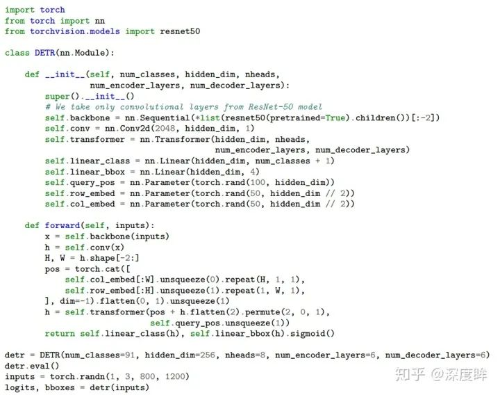

当然上面是简化代码，和实际代码不一样。具体流程是：

- 将(b,3,800,1200)图片输入到resnet50中进行特征提取,输出shape=(b,1024,25,38)
- 通过1x1卷积降维，变成(b,256,25,38)
- 利用sincos函数计算位置编码
- 将图像特征和位置编码向量相加，作为编码器输入，输出编码后的向量，shape不变
- 初始化全0的(100,b,256)的输出嵌入向量，结合位置编码向量和query_embed，进行解码输出，解码器输出shape为(6,b,100,256)
- 将最后一个解码器输出输入到分类和回归head中，得到100个无序集合
- 对100个无序集合进行后处理，主要是提取前景类别和对应的bbox坐标，乘上(800,1200)即可得到最终坐标,后处理代码如下：
```python
prob = F.softmax(out_logits, -1)
scores, labels = prob[..., :-1].max(-1)
# convert to [x0, y0, x1, y1] format
boxes = box_ops.box_cxcywh_to_xyxy(out_bbox)
# and from relative [0, 1] to absolute [0, height] coordinates
img_h, img_w = target_sizes.unbind(1)
scale_fct = torch.stack([img_w, img_h, img_w, img_h], dim=1)
boxes = boxes * scale_fct[:, None, :]
results = [{'scores': s, 'labels': l, 'boxes': b} for s, l, b in zip(scores, labels, boxes)]
```

既然训练时候对6个解码器输出都进行了loss监督，那么在测试时候也可以考虑将6个解码器的分类和回归分支输出结果进行nms合并，稍微有点性能提升。

##### 2.2.3 实验分析

(1) 性能对比

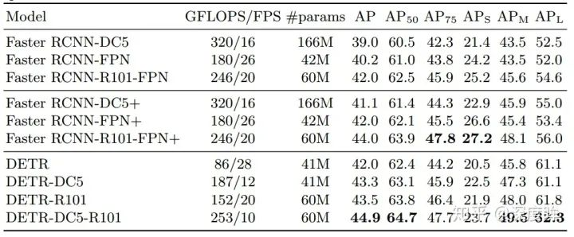

Faster RCNN-DC5是指的resnet的最后一个stage采用空洞率=stride设置代替stride，目的是在不进行下采样基础上扩大感受野，输出特征图分辨率保持不变。+号代表采用了额外的技巧提升性能例如giou、多尺度训练和9xepoch训练策略。可以发现detr效果稍微好于faster rcnn各种版本，证明了视觉transformer的潜力。但是可以发现其小物体检测能力远远低于faster rcnn，这是一个比较大的弊端。

(2) 各个模块分析


编码器数目越多效果越好，但是计算量也会增加很多，作者最终选择的是6。

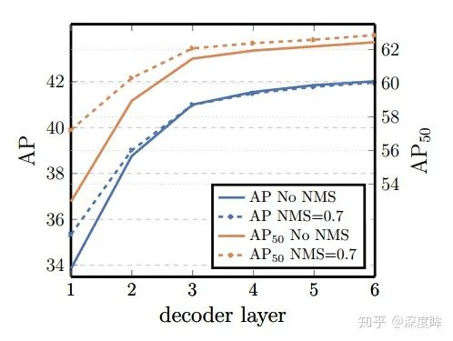

可以发现解码器也是越多越好，还可以观察到第一个解码器输出预测效果比较差，增加第二个解码器后性能提升非常多。上图中的NMS操作是指既然我们每个解码层都可以输入无序集合，那么将所有解码器无序集合全部保留，然后进行nms得到最终输出，可以发现性能稍微有提升，特别是AP50。


作者对比了不同类型的位置编码效果，因为query_embed(output pos)是必不可少的，所以该列没有进行对比实验，始终都有，最后一行效果最好，所以作者采用的就是该方案，sine at attn表示每个注意力层都加入了sine位置编码，相比仅仅在input增加位置编码效果更好。

(3) 注意力可视化

前面说过transformer具有很好的可解释性，故在训练完成后最终提出了几种可视化形式

(a) bbox输出可视化


这个就比较简单了，直接对预测进行后处理即可
```python
probas = outputs['pred_logits'].softmax(-1)[0, :, :-1]
# 只保留概率大于0.9的bbox
keep = probas.max(-1).values > 0.9
# 还原到原图，然后绘制即可
bboxes_scaled = rescale_bboxes(outputs['pred_boxes'][0, keep], im.size)
plot_results(im, probas[keep], bboxes_scaled)
```

(b) 解码器自注意力层权重可视化

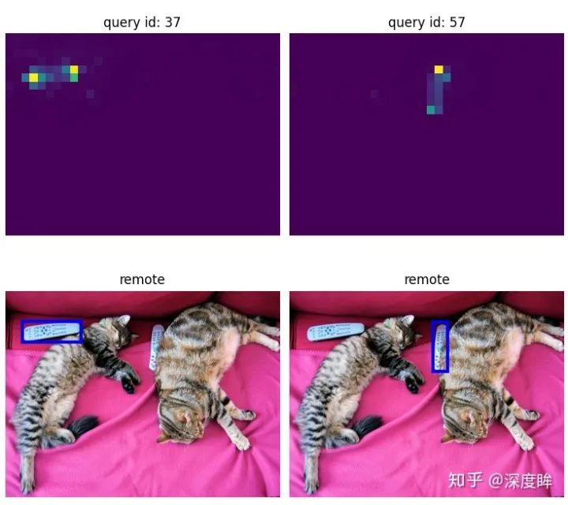

这里指的是最后一个解码器内部的第一个MultiheadAttention的自注意力权重，其实就是QK相似性计算后然后softmax后的输出可视化，具体是：

```python
# multihead_attn注册前向hook，output[1]指的就是softmax后输出
model.transformer.decoder.layers[-1].multihead_attn.register_forward_hook(
    lambda self, input, output: dec_attn_weights.append(output[1])
)
# 假设输入是(1,3,800,1066)
outputs = model(img)
# 那么dec_attn_weights是(1,100,850=800//32x1066//32)
# 这个就是QK相似性计算后然后softmax后的输出，即自注意力权重
dec_attn_weights = dec_attn_weights[0]

# 如果想看哪个bbox的权重，则输入idx即可
dec_attn_weights[0, idx].view(800//32, 1066//32)

```
c) 编码器自注意力层权重可视化

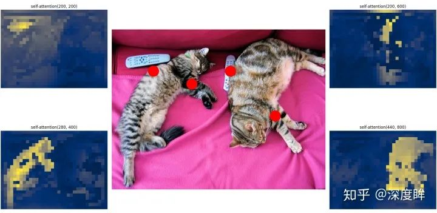

这个和解码器操作完全相同。

```python
model.transformer.encoder.layers[-1].self_attn.register_forward_hook(
    lambda self, input, output: enc_attn_weights.append(output[1])
)
outputs = model(img)
# 最后一个编码器中的自注意力模块权重输出(b,h//32xw//32,h//32xw//32)，其实就是qk计算然后softmax后的值即(1,25x34=850,850)
enc_attn_weights = enc_attn_weights[0]

# 变成(25, 34, 25, 34)
sattn = enc_attn_weights[0].reshape(shape + shape)

# 想看哪个特征点位置的注意力
idxs = [(200, 200), (280, 400), (200, 600), (440, 800), ]

for idx_o, ax in zip(idxs, axs):
    # 转化到特征图尺度
    idx = (idx_o[0] // fact, idx_o[1] // fact)
    # 直接sattn[..., idx[0], idx[1]]即可
    ax.imshow(sattn[..., idx[0], idx[1]], cmap='cividis', interpolation='nearest')
```

##### 2.2.4 小结
detr整体做法非常简单，基本上没有改动原始transformer结构，其显著优点是：不需要设置啥先验，超参也比较少，训练和部署代码相比faster rcnn算法简单很多，理解上也比较简单。但是其缺点是：改了编解码器的输入，在论文中也没有解释为啥要如此设计，而且很多操作都是实验对比才确定的，比较迷。算法层面训练epoch次数远远大于faster rcnn(300epoch)，在同等epoch下明显性能不如faster rcnn，而且训练占用内存也大于faster rcnn。

整体而言，虽然效果不错，但是整个做法还是显得比较原始，很多地方感觉是尝试后得到的做法，没有很好的解释性，而且最大问题是训练epoch非常大和内存占用比较多，对应的就是收敛慢，期待后续作品。

### 3 总结
本文从transformer发展历程入手，并且深入介绍了transformer思想和实现细节；最后结合计算机视觉领域的几篇有典型代表文章进行深入分析，希望能够给cv领域想快速理解transformer的初学者一点点帮助。

### 4 参考资料
[1] http://jalammar.github.io/illustrated-transformer/
[2] https://zhuanlan.zhihu.com/p/54356280
[3] https://zhuanlan.zhihu.com/p/44731789
[4] https://looperxx.github.io/CS224n-2019-08-Machine%20Translation,%20Sequence-to-sequence%20and%20Attention/
[5] https://github.com/lucidrains/vit-pytorch
[6] https://github.com/jadore801120/  attention-is-all-you-need-pytorch
[7] https://github.com/facebookresearch/detr

ref:
[1]. https://mp.weixin.qq.com/s/Tb0Zh5n_3dEYwInU6sJUhA


## 基于Transformer的多模态轨迹预测

### 0 引言

轨迹预测是自动驾驶领域关注的热点。对周围车辆轨迹的精确预测可以辅助自动驾驶车辆做出合理的决策规划，进而实现车辆在异构高动态复杂多变环境中安全驾驶。在车辆交互场景中，**由于驾驶员意图与环境的不确定性，车辆轨迹将呈现多模态属性，即在相同历史轨迹条件下，车辆的未来轨迹具有多种可能性**。对车辆的多模态轨迹预测并保证预测的准确性与多样性是当前自动驾驶领域研究的重点与难点。

近年来，Transformer在多模态预测领域取得突破性进展，其特有的完全基于注意力机制模块能够充分挖掘高动态场景下车辆之间的交互关系并有效建模轨迹的多模态分布。在近年来的一些研究中，基于Transformer的多模态轨迹预测显示出比CNN，RNN等多模态预测模型更优的准确性与多样性。本文以基于Transformer的多模态车辆轨迹预测为主线，回顾近年来代表性的基于Transformer的多模态轨迹预测的算法，最后对基于Transformer的多模态轨迹预测做出总结与展望。

### 1 Transformer框架

2017年，Waswani等人提出Transformer[1]，这是一种完全基于注意力机制的模型。注意力机制是一种捕捉向量之间相关性的方法，既可以考虑全局又可以聚焦重点，其在捕获车辆之间交互信息有非常好的性能。

基于注意力机制的Transformer比经典的深度学习模型CNN[12]和RNN[2]具备如下优势。<font color=red>注意力机制可以解决基于CNN方法中可解释性差以及无法建模智能体间交互关系的问题。注意力机制可以解决基于RNN[2]方法中长距离依赖问题，可以有更好的记忆力，可以获取更长距离的信息。</font>相较于基于 RNN的方法在第t时间步的隐藏状态Ht需要前一个时间步t-1的隐藏状态输出后才能处理，难以并行，Transformer模型可以实现并行计算, Transformer可以同时提取上下文信息，并且在信息传递过程中**规避梯度爆炸或梯度遗忘问题**。

Transformer框架主要包含编码器、解码器、注意力机制三个重要部分，以下具体介绍。


#### 1.1 编码器-解码器

<font color=red>**编码器**</font>用于将历史轨迹和环境信息嵌入到上下文信息中并输入到Transformer中，其输入为车道信息，历史轨迹，车辆交互信息等，输出为具有这些信息的特征。编码器由N=6个独立层组成，每层有两个子层，分别是多头注意力和全连接前馈网络，子层通过残差结构连接后进行归一化输出，每层维度d_model=512确保输入输出维度不变。

<font color=red>**解码器**</font>用于生成预测轨迹，其输入为编码器的输出，输出为预测轨迹。解码器由N=6个独立层组成，每层有三个子层，除了多头注意力和全连接前馈网络，还插入第三个子层，掩码多头注意力(Masked Multi-head attention)，用于对编码器堆栈的输出执行多头注意，掩码用于未来时刻进行掩码处理，确保当前位置的预测不会依赖于未来位置。

#### 1.2 注意力机制

<font color=red>**注意力机制用于建模车辆间交互关系。**</font>注意力机制将查询向量Q和一组键值对向量K-V映射到输出，输出值的加权和，权重则是通过Q和K相似度计算。Transformer框架主要由<font color=green>**缩放点积注意力机制**</font>和<font color=green>**多头注意力机制**</font>组成，缩放点积注意力机制中输入由向量query(dk)，key(dk)以及value(dv)组成，如图2，QK向量通过点积处理计算相似度，通过比例因子$\sqrt{d_k}$(用来求dk的平方根)处理避免QK内积方差太大导致难以学习的情况，应用softmax函数获取权重来获得value的权重。掩码(Mask)处理避免解码器在训练是获取未来的信息影响预测。

$$Attention(Q, K, V) = softmax(\frac{QK^{T}}{\sqrt{d_k}}) V$$

多头注意机制通过将Q,K,V分别线性投影到缩放点积注意机制中，投影h次后做h次注意力函数运算，通过并行计算，生成dv维输出value，将每一个输出值链接后再做一次投影得到最终value。通过多头注意机制，Transformer模型可以联合注意来自不同位置的不同子空间信息。

#### 1.3 小结

在这一节中主要介绍了Transformer框架中三个主要部分，编码器，解码器，注意力机制的输入输出及其在轨迹预测中的用途。下一节中将对基于Transformer的多模态轨迹方法介绍。

### 2 基于Transformer的多模态轨迹预测方法

上一部分介绍了Transformer中编码器解码器结构，缩放点积注意机制，多头注意机制。这一部分中，将介绍近年来基于Transformer框架的可随场景变化的自适应调整的多模态方法。<u>多模态轨迹预测旨在为处于异构复杂高动态环境中的目标车辆生成多条可能的且具有安全性的轨迹，由于不确定性的存在，目标车辆即使在相同场景下也有可能表现不同，因此这也是多模态轨迹预测面临的挑战。</u>实现多模态预测的另一个挑战在于如何用有限的训练样本覆盖给定场景中所有可能的结果。多智能体轨迹预测需要在两个关键维度建模：<font color=red>(1)时间维度：将历史信息对智能体未来状态的影响建模 (2)社会维度：对每个智能体之间的交互关系建模。</font>在时间维度层面，现有基于经典深度学习的模型CNN，RNN无法建模长时间序列，会导致时间信息丢失问题，基于Transformer可以通过将位置编码通过时间编码的形式保存长历史轨迹的信息。在社会维度层面，Transformer模型可以通过注意力机制建模人-车，车-车，车-环境之间的交互关系，可以通过分配权重的方式选择影响力最大的交互，以此为基础，Transformer可扩展到多智能体交互环境中。

现有基于概率的方法[3]和基于建议的启发式[4]的方法虽然可以通过添加规则的方式输出概率分布或通过添加具有强约束的锚点实现多模态轨迹预测，但是基于概率的方法过度依赖于先验分布和损失函数，容易出现优化不稳定或模式崩溃现象，基于建议的启发式方法过度依赖于锚点质量，不能保证生成多模态情况。基于Transformer的方法可以避免在设计先验分布和损失函数过程中大量的人工工作，同时可以更好的捕捉到轨迹预测的多模态性质，实现多模态轨迹预测。

Liu[5]等针对如何实现多模态轨迹预测，提出mmTransformer框架，该方法在Argoverse基准排行榜排名第一名，框架由三个独立的堆叠式的Transformer模型组成，分别聚合历史轨迹，道路信息以及交互信息。如图2所示，mmTransformer整体框架可由两部分组成，第一部分仅由运动提取器和地图聚合器分别对车辆的信息及环境信息进行编码，不考虑交互信息，第二部分通过社会构造函数对临近信息进行聚合，并对车辆之间的依赖关系进行建模，整个过程是依照逻辑顺序，即社会关系是基于每个车辆特征构建的。该方法还提出基于区域的训练策略(RTS)，在初始化建议后，将建议路径分为空间群组，通过路径分配计算路径回归损失和分类损失，以确保生成预测轨迹的多样性。


Yuan等针对时间和社会维度上独立特征编码信息丢失问题，提出AgentFormer[6]允许一个智能体在某个时间的状态直接影响另一个智能体未来的状态，而不是通过在一个维度上编码的中间特征，AgentFormer(图3)可以同时学习时序信息和交互关系，智能体当前时刻的关系可以通过不同时刻关系体现，解决了传统Transformer注意力中各个输入元素权重平等造成的时间和智能体信息损失，该模型采用时间编码减少时间信息损失，通过独特的Agent-aware注意力机制编码智能体和时间的关系，采用CVAE形式，以概率形式描述，确保了生成轨迹的多模态性。


Huang[10]等针对如何编码多智能体交互问题，使用TF编码器(图4)建模智能体与周围车辆的交互关系，多头注意机制可以帮助提取智能体交互的不同信息。通过矢量地图表示和基于地车道集的地图结构提取地图和目标智能体之间的关系。


Zhao等针对传统注意力机制无法捕获多智能体之间交互的问题，提出Spatial-Channel Transformer[9]在基于Transformer框架的基础上，插入了一个通道注意力(Channel-wise attention)模块(图5)，即挤压激励网络（SE）[8]，并将SE网络用于轨迹前途，以捕获相邻通道之间的相互作用。Zhang等针对多智能体轨迹预测问题，提出的Gatformer[11]相较于GNN，采用灵活的图结构，相比基于图神经网络的方法，降低了全连通图造成的计算复杂性。基于稀疏图，Gatformer可以预测多智能体未来的轨迹，同时考虑智能体之间相互作用。目前基于GAN和CVAE方法导致模型存在可解释性差的问题，Gatformer注意机制通过对交互权重分配可以提高性能并提高模型的可解释性，该模型对模型在多环境下验证了模型的鲁棒性。


复杂的驾驶环境通常是静态动态混合形式作为输入信息，针对如何表示融合有关道路几何形状，车道连通性，时变交通信号灯状态，其他交通参与者状态以及交互的历史信息，并将其编码，现有方法为了对多样特征建模而设计的具有不同特定模块集的复杂TF模型，由于注意对输入序列长度是二次方，且位置前馈网络是昂贵的自网络因此导致TF难以规模化，质量和效率无法同时保证。针对此问题，Waymo提出WayFormer[7](图6) 在Transformer框架的基础上，研究了三种输入模式：<font color=green>前融合</font>，<font color=green>后融合</font>和<font color=green>分层融合</font>的利弊，对于每种融合类型，探索通过分解注意或潜在query注意来权衡效率和质量的策略。后融合中每种特征都有与之相对应的编码器，前融合不是将注意编码器专用于每个模态，而是减少特定模态的参数到投影层，分层融合是前融合，后融合折中的模型，将场景信息分别通过注意编码器编码后聚合，将聚合特征输入到最终的注意机制交叉模型中，有效的将场景编码器的深度在模态特定编码器和跨模态编码器之间平均。本文还对如何将Transformer扩展到大型多维序列中提供了解决方案，减少了每个块的注意分量和位置前馈网络的计算成本。


### 3 总结与展望

综上所述，现阶段在多模态轨迹预测领域的整体框架已经成型，都是由编码器+交互+解码器组成，针对多模态轨迹预测目前具有的挑战性问题，基于Transformer轨迹预测在Argoverse数据集的平均位移误差(ADE)和最终位移误差(FDE)性能指标上取得了最优水平。Transformer框架在交互部分，特别是对障碍物周围信息交互效果相比CNN与RNN方法有明显的提升，Transformer可以解决长历史轨迹信息丢失问题，同时依靠注意力机制捕获车辆之间交互信息。


然而Transformer模型虽然在自然语言处理及视觉领域均取得了非常显著的成果，但是在自动驾驶轨迹预测方向的研究还是较少。目前还无法确Transformer算法可以应用到更为复杂多变的环境中，因为在现实环境中，由于传感器限制，如果有其他交通参与者遮挡，或者出现缺失/过时/不准确的道路基础设施信息，以及感知范围有限，无法获得实验阶段的理想数据，会导致预测轨迹出现偏差。同时可解释性低也是基于Transformer模型面临的主要问题之一，现有方法中对于预测轨迹的置信度难以解释，因此导致模型解释性低。这些问题也将是未来使用Transformer做多模态轨迹预测的可继续深入的方向。其次现有方法对于多模态的研究还不充分，相信在未来的发展中，基于Transformer的多模态轨迹预测方法会更加完善，轨迹预测技术走进现实生活一定可以实现。

参考文献：

[1]A. Vaswani, N. Shazeer, N. Parmar, J. Uszkoreit, L. Jones, A. N. Gomez, L. Kaiser, and I. Polosukhin, “Attention is all you need,” CoRR, vol. abs/1706.03762, 2017.arXiv: 1706.03762. [Online]. Available: http://arxiv.org/abs/1706.03762.

[2]A. Graves, “Generating sequences with recurrent neural networks,” CoRR, vol. abs/1308.0850, 2013. arXiv: 1308 . 0850. [Online]. Available: http : / /arxiv.org/abs/1308.0850.

[3]N. Lee, W. Choi, P. Vernaza, C. B. Choy, P. H. S. Torr, and M. K. Chandraker, “DESIRE: distant future prediction in dynamic scenes with interacting agents,” CoRR, vol. abs/1704.04394, 2017. arXiv: 1704 . 04394. [Online]. Available: http://arxiv.org/abs/1704.04394.

[4]H. Zhao, J. Gao, T. Lan, C. Sun, B. Sapp, B. Varadarajan, Y. Shen, Y. Shen, Y. Chai, C. Schmid, C. Li, and D. Anguelov, “TNT: target-driven trajectory prediction,”CoRR, vol. abs/2008.08294, 2020. arXiv: 2008 . 08294. [Online]. Available:https://arxiv.org/abs/2008.08294.

[5]Y. Liu, J. Zhang, L. Fang, Q. Jiang, and B. Zhou, “Multimodal motion prediction with stacked transformers,” in 2021 IEEE/CVF Conference on Computer Vision and Pattern Recognition (CVPR), 2021, pp. 7573–7582. DOI: 10.1109/CVPR46437.2021.00749.

[6]Y. Yuan, X. Weng, Y. Ou, and K. Kitani, “Agentformer: Agent-aware transformers for socio-temporal multi-agent forecasting,” in 2021 IEEE/CVF International Conference on Computer Vision (ICCV), 2021, pp. 9793–9803. DOI: 10.1109/ICCV48922.2021.00967.

[7]Nayakanti, N., Al-Rfou, R., Zhou, A., Goel, K., Refaat, K. S., and Sapp, B., “Wayformer: Motion Forecasting via Simple & Efficient Attention Networks”, arXiv e-prints, 2022.

[8]J. Hu, L. Shen, S. Albanie, G. Sun, and E. Wu, “Squeeze-and-excitation networks,” IEEE Transactions on Pattern Analysis and Machine Intelligence, vol. 42,no. 8, pp. 2011–2023, 2020. DOI: 10.1109/TPAMI.2019.2913372.

[9]J. Zhao, X. Li, Q. Xue, and W. Zhang, “Spatial-channel transformer network for trajectory prediction on the traffic scenes,” CoRR, vol. abs/2101.11472,2021. arXiv: 2101.11472. [Online]. Available: https://arxiv.org/abs/2101.11472.

[10]Z. Huang, X. Mo and C. Lv, "Multi-modal Motion Prediction with Transformer-based Neural Network for Autonomous Driving," 2022 International Conference on Robotics and Automation (ICRA), 2022, pp. 2605-2611, doi: 10.1109/ICRA46639.2022.9812060.

[11]K. Zhang, X. Feng, L. Wu, and Z. He, “Trajectory prediction for autonomous driving using spatial-temporal graph attention transformer,” IEEE Transac tions on Intelligent Transportation Systems, pp. 1–11, 2022. DOI: 10.1109/TITS.2022.3164450.

[12]G. Xie, A. Shangguan, F. Rong, W. Ji, M. Weigang, and X. Hei, “Motion trajectory prediction based on a cnn-lstm sequential model,” Science China Information Sciences, 2020.


ref:
[1]. https://mp.weixin.qq.com/s/yCcsHNXeIBdCVuUwpUVy3w


## Transformer 详解
[B站讲解视频](https://www.bilibili.com/video/BV1mk4y1q7eK?p=1)
参考连接: https://wmathor.com/index.php/archives/1438/

Transformer 是谷歌大脑在 2017 年底发表的论文 [attention is all you need](https://arxiv.org/pdf/1706.03762.pdf) 中所提出的 seq2seq 模型。现在已经取得了大范围的应用和扩展，而 BERT 就是从 Transformer 中衍生出来的预训练语言模型

这篇文章分为以下几个部分
    - Transformer 直观认识
    - Positional Encoding
    - Self Attention Mechanism
    - 残差连接和 Layer Normalization
    - Transformer Encoder 整体结构
    - Transformer Decoder 整体结构
    - 总结
    - 参考文章


### 0. Transformer 直观认识

Transformer 和 LSTM 的最大区别，就是 LSTM 的训练是迭代的、串行的，必须要等当前字处理完，才可以处理下一个字。而 Transformer 的训练时并行的，即所有字是同时训练的，这样就大大增加了计算效率。Transformer 使用了位置嵌入 (Positional Encoding) 来理解语言的顺序，使用自注意力机制（Self Attention Mechanism）和全连接层进行计算，这些后面会讲到

Transformer 模型主要分为两大部分，分别是 Encoder 和 Decoder。Encoder 负责把输入（语言序列）隐射成隐藏层（下图中第 2 步用九宫格代表的部分），然后解码器再把隐藏层映射为自然语言序列。例如下图机器翻译的例子（Decoder 输出的时候，是通过 N 层 Decoder Layer 才输出一个 token，并不是通过一层 Decoder Layer 就输出一个 token）


本篇文章大部分内容在于解释 Encoder 部分，即把自然语言序列映射为隐藏层的数学表达的过程。理解了 Encoder 的结构，再理解 Decoder 就很简单了


上图为 Transformer Encoder Block 结构图，注意：下面的内容标题编号分别对应着图中 1,2,3,4 个方框的序号

### 1. Positional Encoding

由于 Transformer 模型没有循环神经网络的迭代操作，所以我们必须提供每个字的位置信息给 Transformer，这样它才能识别出语言中的顺序关系

现在定义一个**位置嵌入**的概念，也就是 Positional Encoding，位置嵌入的维度为 [max_sequence_length, embedding_dimension], 位置嵌入的维度与词向量的维度是相同的，都是 embedding_dimension。max_sequence_length 属于超参数，指的是限定每个句子最长由多少个词构成

注意，我们一般以字为单位训练 Transformer 模型。首先初始化字编码的大小为 [vocab_size, embedding_dimension]，vocab_size 为字库中所有字的数量，embedding_dimension 为字向量的维度，对应到 PyTorch 中，其实就是 nn.Embedding(vocab_size, embedding_dimension)

论文中使用了 sin 和 cos 函数的线性变换来提供给模型位置信息:

$$\left\{\begin{aligned}
PE(pos, 2i) = \sin (pos/10000^{2i/d_{model}}) \\
PE(pos, 2i + 1) = \cos (pos/10000^{2i/d_{model}}) \\
\end{aligned}\right.$$

上式中 $pos$ 指的是一句话中某个字的位置，取值范围是 $[0, \text{max\_sequence\_length}]$ ， $i$ 指的是字向量的维度序号，取值范围是 $[0, \text{embedding\_dimension} / 2]$ ， $d_{model}$ 指的是 embedding_dimension​的值

上面有 sin 和 cos 一组公式，也就是对应着 embedding_dimension 维度的一组奇数和偶数的序号的维度，例如 0,1 一组，2,3 一组，分别用上面的 sin 和 cos 函数做处理，从而产生不同的周期性变化，而位置嵌入在 embedding_dimension​维度上随着维度序号增大，周期变化会越来越慢，最终产生一种包含位置信息的纹理，就像论文原文中第六页讲的，位置嵌入函数的周期从 $ 2\pi $ 到 $10000 * 2 \pi$ 变化，而每一个位置在 embedding_dimension ​维度上都会得到不同周期的 $ \sin $ 和 $ \cos $ 函数的取值组合，从而产生独一的纹理位置信息，最终使得模型学到位置之间的依赖关系和自然语言的时序特性。

如果不理解这里为何这么设计，可以看这篇文章 [Transformer 中的 Positional Encoding](https://wmathor.com/index.php/archives/1453/)


下面画一下位置嵌入，纵向观察，可见随着 embedding_dimension​序号增大，位置嵌入函数的周期变化越来越平缓

```python
    import numpy as np
    import matplotlib.pyplot as plt
    import seaborn as sns
    import math

    def get_positional_encoding(max_seq_len, embed_dim):
        # 初始化一个positional encoding
        # embed_dim: 字嵌入的维度
        # max_seq_len: 最大的序列长度
        positional_encoding = np.array([
            [pos / np.power(10000, 2 * i / embed_dim) for i in range(embed_dim)]
            if pos != 0 else np.zeros(embed_dim) for pos in range(max_seq_len)])

        positional_encoding[1:, 0::2] = np.sin(positional_encoding[1:, 0::2])  # dim 2i 偶数
        positional_encoding[1:, 1::2] = np.cos(positional_encoding[1:, 1::2])  # dim 2i+1 奇数
        return positional_encoding

    positional_encoding = get_positional_encoding(max_seq_len=100, embed_dim=16)
    plt.figure(figsize=(10,10))
    sns.heatmap(positional_encoding)
    plt.title("Sinusoidal Function")
    plt.xlabel("hidden dimension")
    plt.ylabel("sequence length")
```


```python
    plt.figure(figsize=(8, 5))
    plt.plot(positional_encoding[1:, 1], label="dimension 1")
    plt.plot(positional_encoding[1:, 2], label="dimension 2")
    plt.plot(positional_encoding[1:, 3], label="dimension 3")
    plt.legend()
    plt.xlabel("Sequence length")
    plt.ylabel("Period of Positional Encoding")
```


### 2. Self Attention Mechanism

对于输入的句子 $ X $，通过 WordEmbedding 得到该句子中每个字的字向量，同时通过 Positional Encoding 得到所有字的位置向量，将其相加（维度相同，可以直接相加），得到该字真正的向量表示。第 $ t $ 个字的向量记作 $ x_t $。

接着我们定义三个矩阵 $ W_Q $, $ W_K $, $ W_V $，使用这三个矩阵分别对所有的字向量进行三次线性变换，于是所有的字向量又衍生出三个新的向量 $ q_t $, $ k_t $, $ v_t $。我们将所有的 $ q_t $ 向量拼成一个大矩阵，记作查询矩阵 $ Q $ ，将所有的 $ k_t $ 向量拼成一个大矩阵，记作键矩阵 $ K $  ，将所有的 $ v_t $ 向量拼成一个大矩阵，记作值矩阵 $ V $ （见下图）


为了获得第一个字的注意力权重，我们需要用第一个字的查询向量 $ q_1 $ 乘以键矩阵 $ K $（见下图）

```
                [0, 4, 2]
    [1, 0, 2] x [1, 4, 3] = [2, 4, 4]
                [1, 0, 1]
```


之后还需要将得到的值经过 softmax，使得它们的和为 1（见下图）

```
 softmax([2, 4, 4]) = [0.0, 0.5, 0.5]
```


有了权重之后，将权重其分别乘以对应字的值向量 $ v_t $（见下图）

```
    0.0 * [1, 2, 3] = [0.0, 0.0, 0.0]
    0.5 * [2, 8, 0] = [1.0, 4.0, 0.0]
    0.5 * [2, 6, 3] = [1.0, 3.0, 1.5]
```


最后将这些**权重化后的值向量求和**，得到第一个字的输出（见下图）

```
      [0.0, 0.0, 0.0]
    + [1.0, 4.0, 0.0]
    + [1.0, 3.0, 1.5]
    -----------------
    = [2.0, 7.0, 1.5]
```


对其它的输入向量也执行相同的操作，即可得到通过 self-attention 后的所有输出


**矩阵计算**

上面介绍的方法需要一个循环遍历所有的字$ x_t $，我们可以把上面的向量计算变成矩阵的形式，从而一次计算出所有时刻的输出

第一步就不是计算某个时刻的$ q_t $, $ k_t $, $ v_t $了，而是一次计算所有时刻的 $
Q $, $ K $, $ V $。计算过程如下图所示，这里的输入是一个矩阵 $ X $，矩阵第 $ t $ 行为第 $ t $ 个词的向量表示 $x_t$


接下来将 $ Q $ 和 $K_T$ 相乘，然后除以 $ \sqrt{d_k} $（这是论文中提到的一个 trick），经过 softmax 以后再乘以 $ V $ 得到输出


**Multi-Head Attention**

这篇论文还提出了 Multi-Head Attention 的概念。其实很简单，前面定义的一组 $Q $, $ K $, $ V $, 可以让一个词 attend to 相关的词，我们可以定义多组 $Q $, $ K $, $ V $，让它们分别关注不同的上下文。计算 $Q $, $ K $, $ V $ 的过程还是一样，只不过线性变换的矩阵从一组 $ W^Q $, $ W^K $, $ W^V $ 变成了多组$ W^Q_0 $, $ W^K_0 $, $ W^V_0 $  ，$ W^Q_1 $, $ W^K_1 $, $ W^V_1 $ ，… 如下图所示:


对于输入矩阵 $ X $ ，每一组 $ Q $ 、$ K $ 和 $ V $ 都可以得到一个输出矩阵 $ Z $ 。如下图所示


**Padding Mask**


上面 Self Attention 的计算过程中，我们通常使用 mini-batch 来计算，也就是一次计算多句话，即 $ X $ 的维度是 `[batch_size, sequence_length]`，sequence_length​是句长，而一个 mini-batch 是由多个不等长的句子组成的，我们需要按照这个 mini-batch 中最大的句长对剩余的句子进行补齐，一般用 0 进行填充，这个过程叫做 padding

但这时在进行 softmax 就会产生问题。回顾 softmax 函数 $\sigma(z_i) = \frac{e^{z_i}}{\sum_K^{j=i} e^{z_j}}$，$e^0$ 是 1，是有值的，这样的话 softmax 中被 padding 的部分就参与了运算，相当于让无效的部分参与了运算，这可能会产生很大的隐患。因此需要做一个 mask 操作，让这些无效的区域不参与运算，一般是给无效区域加一个很大的负数偏置，即

$$\left\{\begin{aligned}
Z_{illegal} = Z_{illegal} + bias_{illegal} \\
bias_{illegal}-> -\infin \\
\end{aligned}\right.$$


### 3. 残差连接和 Layer Normalization

**残差连接**

### 4. Transformer Encoder 整体结构
### 5. Transformer Decoder 整体结构
### 6. 总结
### 7. 参考文章

