## 1. 2017年深度学习领域的重大突破是什么？

Transformer。有两方面的原因:

1.1 一方面，Transformer是深度学习领域继MLP、RNN、CNN之后的第4大特征提取器(也被称为基础模型)。 
**什么是特征提取器？** 
特征提取器是计算机模仿大脑，与外部世界(图像、文字、语音等)交互的方式，如图1所示。举例而言: Imagenet数据集中包含1000类图像，人们已经根据自己的经验把这一百万张图像分好1000类，每一类图像(如美洲豹)都有独特的特征。这时，神经网络(如ResNet18)也是想通过这种分类的方式，把每一类图像的特征尽可能提取或识别出来。分类不是最终目的，而是一种提取图像特征的手段，掩码补全图像也是一种提取特征的方式，图像块顺序打乱也是一种提取特征的方式。

1.2 另一方面，Transformer在深度学习领域扮演的角色: 第3次和第4次热潮的基石，如下图2所示。

## 2. Transformer的提出背景是什么？

**2.1 在领域发展背景层面**: 当时时处2017年，深度学习在计算机视觉领域已经火了几年。从Alexnet、VGG、GoogleNet、ResNet、DenseNet;从图像分类、目标检测再到语义分割;但在自然语言处理领域并没有引起很大反响。

**2.2 技术背景层面**:
(1)当时主流的序列转录任务(如机器翻译)的解决方案如下图3所示，在Sequence to Sequence架构下(Encoder-Decoder的一种)，RNN来提取特征，Attention机制将Encoder提取到的特征高效传递给Decoder。
(2)这种做法有两个不足之处，一方面是在提取特征时的RNN天生**从前向后时序传递**的结构决定了其无法并行运算，其次是当序列长度过长时，最前面序列的信息有可能被遗忘掉。因此可以看到，在这个框架下，RNN是相对薄弱急需改进的地方。

## 3. Transformer到底是什么？

3.1 Transformer是一种由Encoder和Decoder组成的架构。那么什么是架构呢？最简单的架构就是A + B + C。

3.2 Transformer也可以理解为一个函数，输入是“我爱学习”，输出是“I love study”。

3.3 如果把Transformer的架构进行分拆，如图4所示。

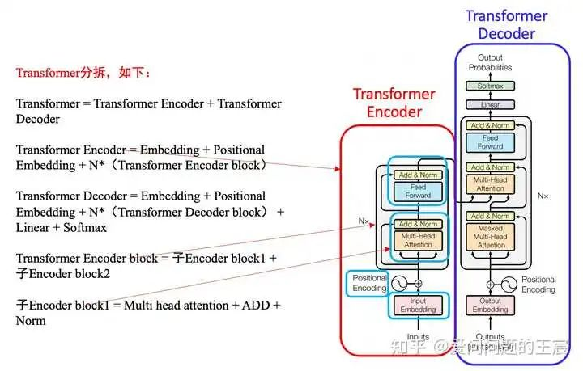

## 4. 什么是Transformer Encoder？

4.1 从功能角度，Transformer Encoder的核心作用是**提取特征**，也有使用Transformer Decoder来提取特征。例如，一个人学习跳舞，Encoder是看别人是如何跳舞的，Decoder是将学习到的经验和记忆(key和value的匹配程度)，展现出来

4.2 从结构角度，如图5所示，Transformer Encoder = Embedding + Positional Embedding + N * (子Encoder block1 + 子Encoder block2);

子Encoder block1 = Multi head attention + ADD + Norm;

子Encoder block2 = Feed Forward + ADD + Norm;

4.3 从输入输出角度，N个Transformer Encoder block中的第一个Encoder block的输入为一组向量 X = (Embedding + Positional Embedding)，向量维度通常为512*512，其他N个TransformerEncoder block的输入为上一个 Transformer Encoder block的输出，输出向量的维度也为`512*512`(输入输出大小相同)。

4.4 为什么是`512*512`？前者是指token的个数，如“我爱学习”是4个token，这里设置为512是为了囊括不同的序列长度，不够时padding。后者是指每一个token生成的向量维度，也就是每一个token使用一个序列长度为512的向量表示。人们常说，Transformer不能超过512，否则硬件很难支撑;其实512是指前者，也就是token的个数，因为每一个token要做self attention操作;但是后者的512不宜过大，否则计算起来也很慢。

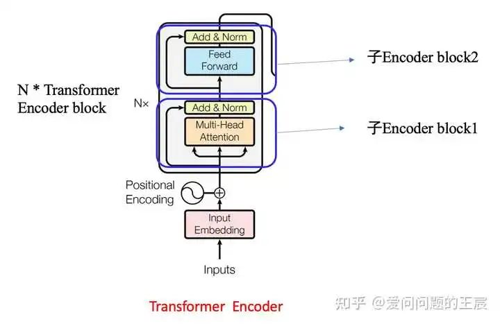

## 5. 什么是Transformer Decoder？

5.1 从功能角度，相比于Transformer Encoder，Transformer Decoder更擅长做**生成式任务**，尤其对于自然语言处理问题。

5.2 从结构角度，如图6所示，Transformer Decoder = Embedding + Positional Embedding + N*(子Decoder block1 + 子Decoder block2 + 子Decoder block3)+ Linear + Softmax;

子Decoder block1 = Mask Multi head attention + ADD + Norm;

子Decoder block2 = Multi head attention + ADD + Norm;

子Decoder block3 = Feed Forward + ADD + Norm;

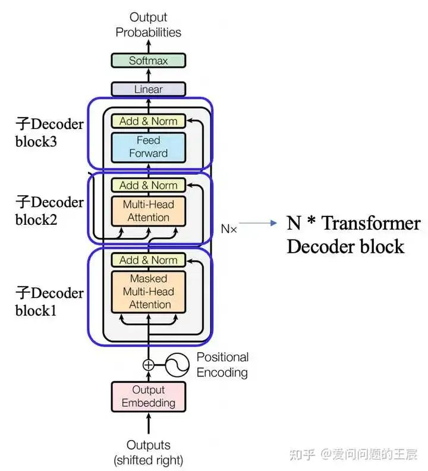

5.3 从(Embedding+Positional Embedding)(N个Decoder block)(Linear + softmax) 这三个每一个单独作用角度:

Embedding + Positional Embedding: 以机器翻译为例，输入“Machine Learning”，输出“机器学习”; 这里的Embedding是把“机器学习”也转化成向量的形式。

N个Decoder block: 特征处理和传递过程。

Linear + softmax: softmax是预测下一个词出现的概率，如图7所示，前面的Linear层类似于分类网络(ResNet18)最后分类层前接的MLP层。

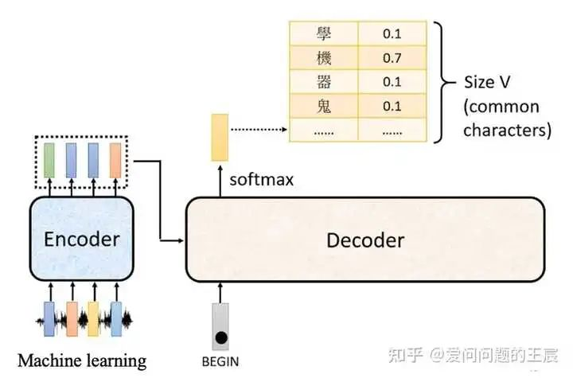

5.4 Transformer Decoder的输入、输出是什么？在Train和Test时是不同的。

在Train阶段，如图8所示。这时是知道label的，decoder的第一个输入是begin字符，输出第一个向量与label中第一个字符使用cross entropy loss。Decoder的第二个输入是第一个向量的label，Decoder的第N个输入对应的输出是End字符，到此结束。这里也可以看到，在Train阶段是可以进行**并行训练**的。

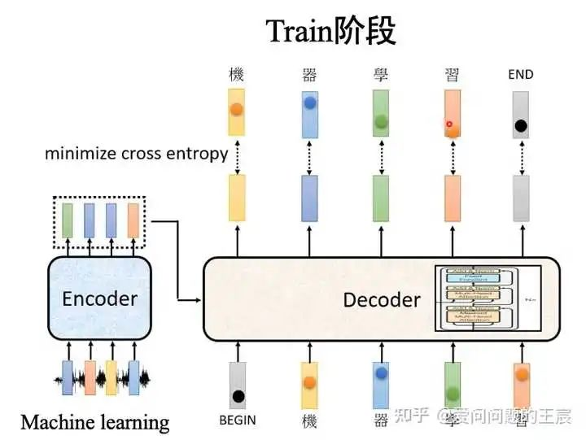

在Test阶段，下一个时刻的输入是前一个时刻的输出，如图9所示。因此，Train和Test时候，Decoder的输入会出现Mismatch，在Test时候确实有可能会出现一步错，步步错的情况。有两种解决方案: 一种是train时偶尔给一些错误，另一种是Scheduled sampling。

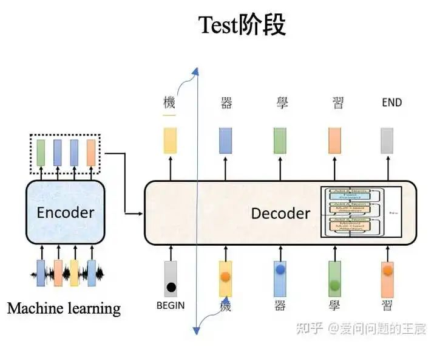

5.5 Transformer Decoder block内部的输入和输出是什么？

前面提到的是在整体train和test阶段，Decoder的输入和输出，那么Transformer Decoder内部的Transformer Decoder block，如图10所示，的输入输出又是什么呢？

对于N=6中的第1次循环(N=1时): 子Decoder block1 的输入是 embedding +Positional Embedding，子Decoder block2 的输入的Q来自子Decoder block1的输出，KV来自Transformer Encoder最后一层的输出。

对于N=6的第2次循环: 子Decoder block1的输入是N=1时，子Decoder block3的输出，KV同样来自Transformer Encoder的最后一层的输出。

总的来说，可以看到，无论在Train还是Test时，Transformer Decoder的输入不仅来自(ground truth或者上一个时刻Decoder的输出)，还来自Transformer Encoder的最后一层。

训练时: 第i个decoder的输入 = encoder输出 + ground truth embedding。

预测时: 第i个decoder的输入 = encoder输出 + 第(i-1)个decoder输出.

## 6. Transformer Encoder和Transformer Decoder有哪些不同？

6.1 作用上，Transformer Encoder常用来**提取特征**，Transformer Decoder常用于**生成式任务**。Transformer Encoder和Transformer Decoder是两条不同的技术路线，**Bert采用的前者，GPT系列模型采用的是后者**。

6.2 结构上，Transformer Decoder block包括了3个子Decoder block，而Transformer Encoder block 包括2个子Encoder block，且Transformer Decoder中使用了Mask multi-head Attention。

6.3 从二者的输入输出角度，N个Transformer Encoder运算完成之后，它的输出才正式输入进Transformer Decoder，作为QKV中的K和V，给Transformer Decoder使用。那么TransformerEncoder最后层的输出是如何送给Decoder呢？如图11所示。

那么，为什么Encoder和Decoder必须要用这种交互的方式呢？其实也并不一定，后续有不同交互方式的提出，如图12。

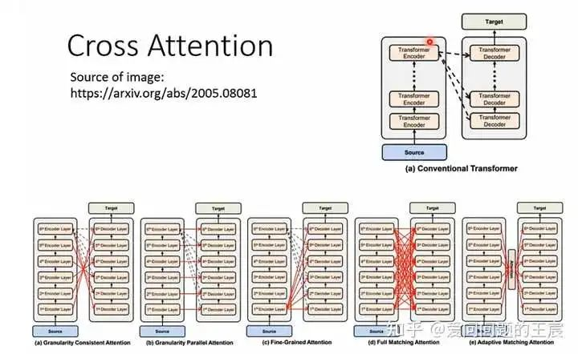

## 7. 什么是Embedding？

7.1 Embedding在Transformer架构中的位置如图13所示。

7.2 提出背景:  计算机无法直接处理一个单词或者一个汉字，需要把一个token转化成计算机可以识别的向量，这也就是embedding过程。

7.3 实现方式:  最简单的embedding操作就是one hot vector，但one hot vector有一个弊端就是没有考虑词语前后之间的关系，后来也就产生了WordEmbedding，如图13。


wordembedding将单词token向量化，并且考虑的单词与单词之间的相关性。


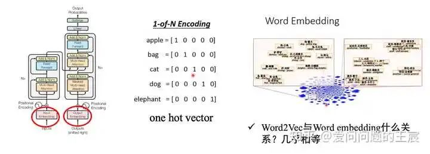

## 8. 什么是Positional Embedding？

8.1 Positional Embedding在Transformer架构中的位置如图14所示。

8.2 提出背景:  RNN作为特征提取器，是自带词的前后顺序信息的;而Attention机制并没有考虑先后顺序信息，但前后顺序信息对语义影响很大，因此需要通过Positional Embedding这种方式把前后位置信息加在输入的Embedding上。

8.3 实现方式:  传统位置编码和神经网络自动训练得到。

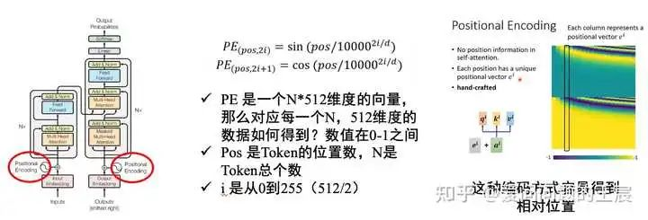

## 9. 什么是Attention？

9.1 介绍Transformer，为什么要介绍Attention呢？因为在Transformer中最多的multi head attention和Mask multi head attention来自Scaled dot product attention，而scaled dot product attention来自self attention，而self attention是attention的一种，因此首先需要了解Attention，如图15所示。

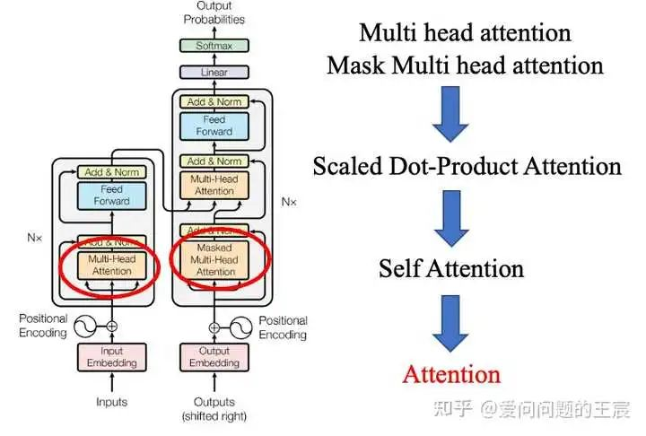

9.2 Attention到底是什么意思呢？

对于图像而言，attention就是人们看到图像中的核心关注的区域，是图像中的重点，如图16所示。对于序列而言，Attention机制本质上是为了找到**输入中不同token之间的相互关系**，通过权重矩阵来自发地找到词与词之间的关系。

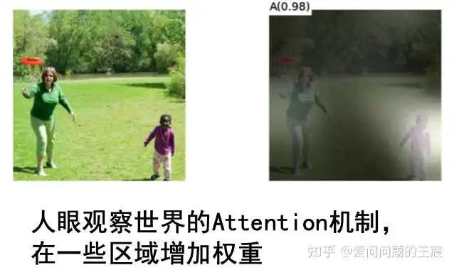

9.3 Attention是如何实现的呢？

是通过QKV实现的。

那么什么是QKV呢？Q是query，K是keys，V是values。如图17所示，举例而言，Q是大脑发出的信号，我口渴了;K是环境信息，眼睛看到的世界;V是对环境中不同的物品赋予不同的比重，水的比重加大。

总之，Attention就是通过计算QK的相似度，与V相乘得到注意力数值。

$$\text{Attention}(\mathrm{Query},\mathrm{Source})=\sum\text{Similarity}(\mathrm{Query},\mathrm{Key}_\mathrm{i})*\mathrm{Value}_\mathrm{i}$$

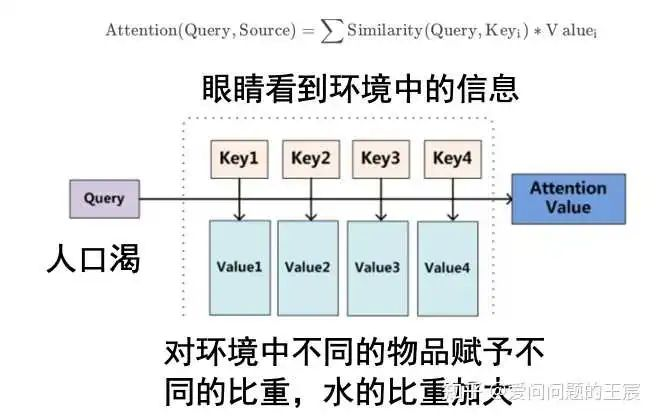

9.4 为什么必须要有QKV三者？

为什么不是只有Q？因为Q1与Q2之间的关系权重，不止需要a12，也需要a21。你可能会问？我们让a12=a21不行吗？也可以尝试，但从原理上讲效果应该没有a12和a21效果好。

为什么不是只有QK？求得的权重系数需要放到输入中，可以乘Q，也可以乘K，为什么要重新乘V呢？我觉得可能是多了一组可训练参数$W_V$，使网络具有更强的学习能力。

## 10. 什么是Self Attention？

10.1 介绍Transformer，为什么要介绍self Attention呢？因为在Transformer中最多的multi head attention和Mask multi head attention来自Scaled dot product attention，而scaled dot product attention来自self attention，如图15所示。

10.2 什么是Self Attention呢？self attention和local attention、stride attention都是attention的一种;self attention是每一个Q与每一个K依次计算注意力系数，如图18所示，而像local attention是Q只与相邻的K计算注意力系数，stride attention是Q通过跳连的方式与K计算注意力系数。

10.3 Self attention为什么可以用于处理像机器翻译这种序列数据?

输入序列中的每一个位置的数据，可以关注其他位置的信息，由此通过Attention score来提取特征或者捕获输入序列每一个token之间的关系。

10.4 Self attention是如何具体实现的? 总共分为4步，如图19所示

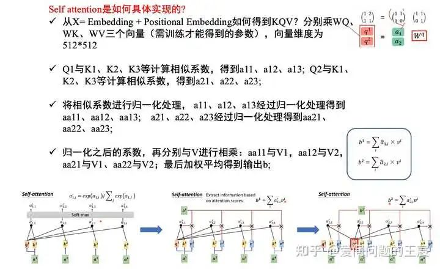

## 11. 什么是Scaled dot product attention？

11.1 self attention最常见的有两种，一种是dot product attention、另一种是additive attention，如图20所示，前者的计算效率更高。

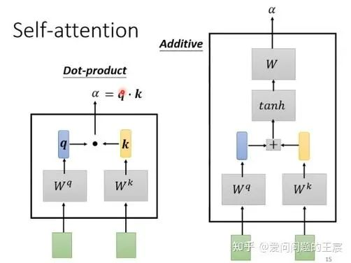

11.2 什么是Scaled ?

scaled的具体实现方式如图21所示，这一操作的目的是为了防止内积过大，从梯度角度考虑，避免靠近1，易训练;与batch normalization有一些相似的功能。

$$\text{Attention}(Q,K,V)=\text{softmax}(\frac{QK^T}{\sqrt{d_k}})V$$

## 12. 什么是Multi head attention？

12.1 Multi head attention在Transformer架构中的位置如图15所示。

12.2 提出背景: CNN具有多个channel，可以提取图像不同维度的特征信息，那么Self attention是否可以有类似操作，可以提取不同距离token的多个维度信息呢？

12.3 什么是group 卷积？如图22所示，将输入的特征多个channel分成几个group单独做卷积，最后再进行con c操作。

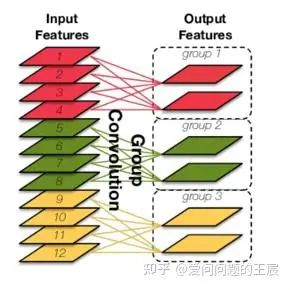

12.4 Multi head attention的实现方式？与self attention根本不同是什么？

如图23所示，以2个head的为例，将输入的Q、K、V分成两份，每一小份的Q与对应的K、V分别操作，最后计算得到的向量再进行conc操作，由此可以看出，Multi head attention与group卷积有着相似的实现方式。

12.5 如何从输入输出的维度来理解Multi head attention？如图24所示。

## 13. 什么是Mask Multi head attention？

13.1 Mask Multi head attention在transformer架构中的位置如图15所示。

13.2 为什么要有Mask这种操作？

Transformer预测第T个时刻的输出，不能看到T时刻之后的那些输入，从而保证训练和预测一致。

通过 Masked 操作可以防止第 i 个单词知道 i+1 个单词之后的信息，如图25所示。

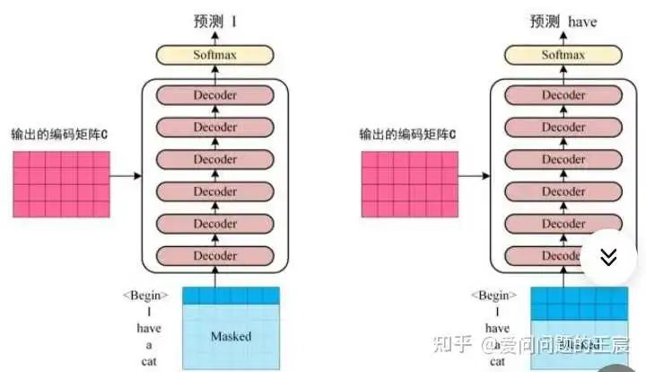

13.3 Mask操作是如何具体实现的呢？

Q1只跟K1计算，Q2只跟K1、K2计算，而对于K3、K4等，在softmax之前给一个非常大的负数，由此经过softmax之后变为0，其在矩阵上的计算原理实现如图26所示。

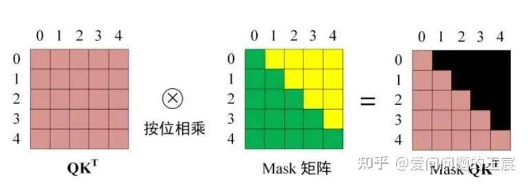

## 14. 什么是ADD？

14.1 Add就是残差连接，由2015年ResNet这篇文章发扬光大(目前引用量已超过16万)，与Skip connection的区别在于需要大小维度全部相同。

14.2 作为大道至简想法的极致，几乎每一个深度学习模型都会用到这个技术，可以**防止网络退化**，常用于解决多层网络难训练的问题。

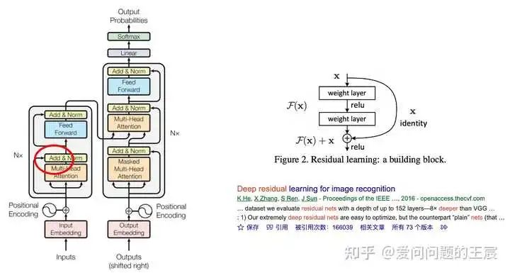

## 15. 什么是Norm？

15.1 Norm就是layer normalization。

15.2 核心作用: 为了训练更加稳定，和batch normalization有相同的作用，都是为了使输入的样本均值为零，方差为1。

15.3 为什么不使用batch normalization，使用的是layer normalization呢？因为一个时序数据，句子输入长度有长有短，如果使用batch normalization，则很容易造成因样本长短不一造成“训练不稳定”。BN是对同一个batch内的所有数据的同一个特征数据进行操作;而LN是对同一个样本进行操作。

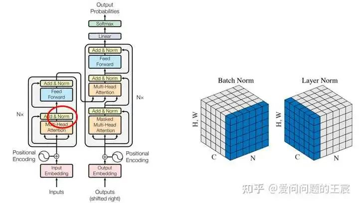

16. 什么是FFN？

16.1 FFN就是feed forward networks。

16.2 为什么有了Self attention层，还要有FFN？Attention已经有了想要的序列信息特征，MLP的作用是把信息投影到特定的空间里，再做一次非线性映射，和Self attention交替使用。

16.3 结构上: 包括两层MLP，第一层的维度为$512*2048$，第二层的维度为$2048*512$，且第二层MLP没有使用激活函数，如图29所示。

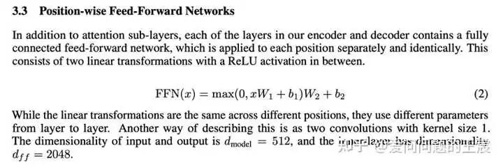

## 17. Transformer是如何训练出来的？

17.1 数据上，在Transformer论文中有提到，用到了4.5M和36M的翻译句子对。

17.2 硬件上，base模型是8个P100 GPU训练了12个小时，大模型是训练了3.5天。

17.3 模型参数和调参层面:

第一，可训练的参数包括$W_Q$、$W_K$、$W_V$、$W_O$，换包括$FFN$层的参数。

第二，可调的参数包括: 每一个token向量表示的维度(d_model)、head的头数、Encoder和Decoder中block重复的次数N、FFN中间层向量的维度、Label smoothing(置信度0.1)和dropout(0.1)。

## 18. Transformer为什么效果好？

18.1 虽然题目是Attention is all you need，但后续一些研究表明，Attention、残差连接、layer normalization、FFN，这些因素共同成就了Transformer。

18.2 Transformer优点包括:

第一，提出深度学习继MLP、CNN、RNN后的第4大特征提取器。

第二，一开始用在机器翻译，随着GPT和Bert彻底出圈;是一个转折点，在这个点之后，NLP领域快速发展，之后多模态、大模型、视觉Transformer等开始兴起。

第三，给人们信心，原来CNN和RNN之后，还可以有效果更好的特征提取器。

18.3 Transformer的不足之处？

第一，计算量大，对硬件要求高。

第二，因为无归纳偏置，需要很多数据才可以取得很好的效果。

Ref: 
[1]. https://mp.weixin.qq.com/s/sNyh3SzhIdsk8feYfQlTSA