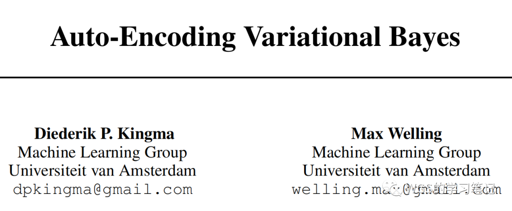
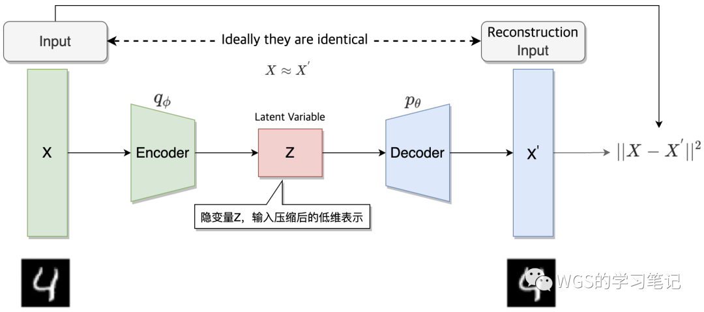
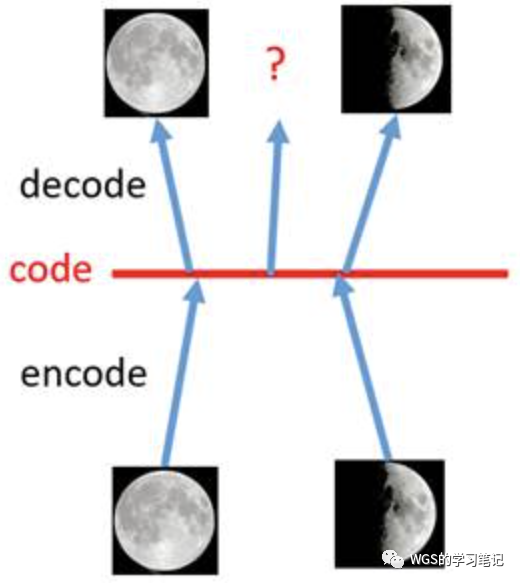
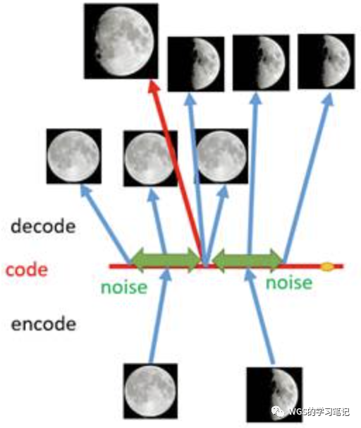
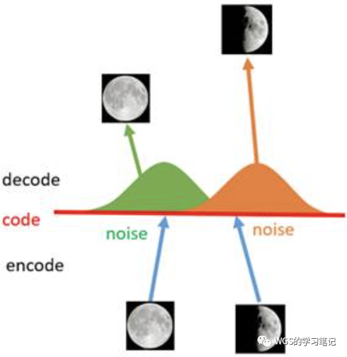
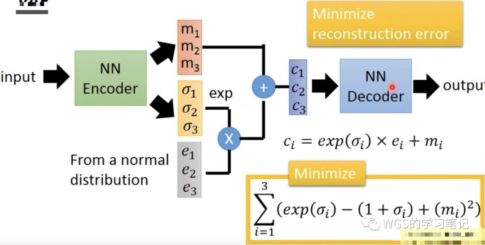
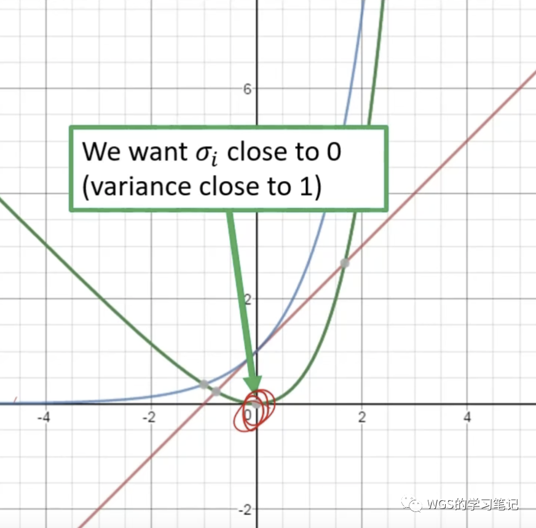
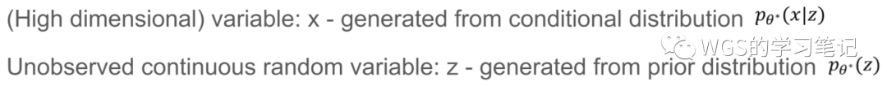
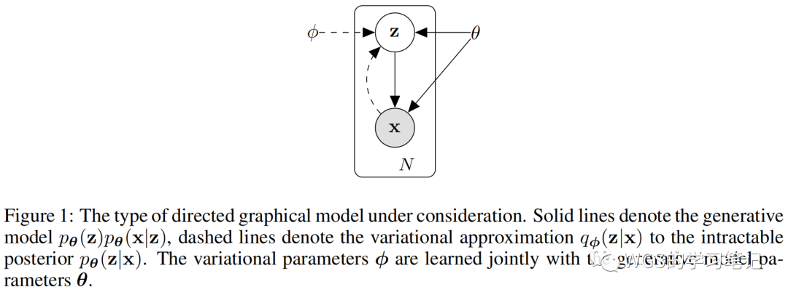
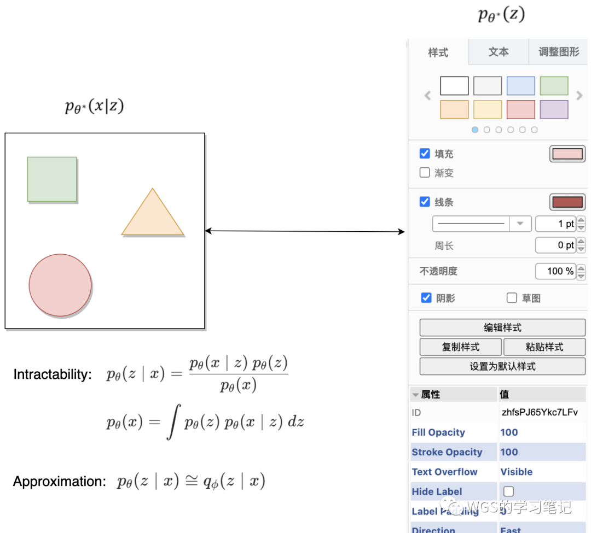

<!-- 
note abstract info tip success question warning failure danger bug example quote
 -->

<!--more-->

## 引入


本文也是为写 Stable Diffusion 相关文章做的铺垫，主要参考了李宏毅老师的视频课以及B站的白板推导系列。有关GMM、蒙特卡洛、ELBO、变分推断、重参数化的细节本文不做详细介绍，主要围绕VAE的结构以及loss优化推导做讲解。


我们先来简单的引入一下：

- V：变分推断，它的意思来自于概率图模型，本文会给出变分下界的详细推导；
- AE：Auto-Encoder，自编码器；
- VAE：Variational Auto-Encoder，变分自编码器，将概率图模型和神经网络相结合的模型；

## 一、AE

先来介绍一下自编码器（Auto-Encoder），它是一种无监督学习方法，如上图所示，原理可概述为：

- 将高维原始数据（如图片）送入 Encoder，利用 Encoder 将高维数据映射到一个低维空间，将n维压缩到m维($m<<n$)，我们用隐变量来表示；
- 然后将低维空间的特征送入 Decoder 进行解码，以此来重建原始输入数据。


Encoder、Decoder网络可以为普通的全连接、也可以为CNN、或者类似于Unet都可以，没有固定的要求。


这里为和后文的推导联系起来，我们将 Encoder 网络的映射函数定义为 $q_{\phi}$ 、Decoder 网络定义为 $p_{\theta}$，$\phi$、$\theta$ 皆为网络参数。 
那么对于输入 $x$，我们可以通过Encoder得到 Latent Variable：$z = q_{\phi}(x)$，然后Decoder可以从隐变量z中对原始数据进行重建：$x' = p_{\theta}(z) = p_{\theta}(q_{\phi}(x))$。

我们希望重建的数据和原来的数据近似一致，即最小化输入和输出之间的重构误差，那么AE的训练损失可以采用简单的MSE：

$$L_{\text{AE}}(\theta, \phi) = \frac{1}{n}\sum_{i=1}^{n} (x^{(i)} - p_{\theta}(q_{\phi}(x^{(i)})))^2$$


可以理解为比较输入和重构输入的像素点的误差。


## 二、AE 存在的问题

上面我们通过AE可以构建一个重构图像的模型，但是这个模型并不能满足要求，或者说它并不是真正意义上的生成模型。对于一个生成模型而言，它满足：

- **Encoder 和 Decoder 可以独立拆分（类比 GAN 的 Generator 和 Discriminator）；**
- **固定维度下任意采样出来的编码，都应该能通过 Decoder 产生一张清晰且逼真的图片。**

当然对于第一点它是满足的，我们主要分析第二点，也就是AE存在的问题，从而引出VAE。

如上图所示，用一张全月图和一张半月图去训练一个AE，经过训练模型是能够很好的还原出这两张图片。

接下来，我们在 latent code 中任取一点，将其交给 Decoder 进行解码，直觉上我们会得到一张介于全月和半月之前的图片（比如阴影面积覆盖的样子）。然而实际上的输出图片不仅模糊而且还是乱码的。

对于这个现象，一个直观的解释就是AE的 Encoder 和 Decoder 都用了DNN，那么NN只会干一件事情：学习、记住、用记住的东西预测，我们从 latent space 中采样的点，编码器都没有学习过，怎么能够指望它生成希望的值呢。

换句话说，NN只记住了左边全月图片的隐向量和右边半月图片的隐向量，并不能泛化到中间就是$\frac{3}{4}$月亮的图片。

为了解决这个问题，一个最直接的思想就是**引入噪声**，扩大图片的编码区域，从而能够覆盖到失真的空白编码区，如下图所示：

其实说白了就是**通过增加输入的多样性从而增强输出的鲁棒性**。

当我们给输入图片进行编码之前引入一点噪声，使得每张图片的编码点出现在绿色箭头范围内，这样一来所得到的 latent space 就能覆盖到更多的编码点。此时我们再从中间点抽取还原便可以得到一个比较希望的输出。

虽然我们给输入的图片增加了一些噪声，使得 latent space 能够覆盖到比较多的区域，但是还有不少地方没有覆盖到，比如上图的黄色点位置。

因此，我们是不是可以尝试利用更多的噪声，使得对于每一个输入样本，它的编码都能够覆盖到整个编码空间？只不过我们这里需要保证的是：对于编码附近的我们应该给定一个高的概率值，对于距离原编码点远的应该给定一个低的概率值。

这样总体来说，我们就是要将原先的一个单点拉伸到整个编码空间，即将离散的编码点拉伸为一条连续的接近正太分布的编码曲线，如下图所示：

这个其实就是VAE的思想，熟悉GMM的同学应该知道，它是K个高斯分布（Gaussian Distribution）的混合，其实**VAE可以说是无限个高斯分布的混合**。

## 三、VAE 结构预览

如上图所示VAE的结构，我们可以看到VAE里的编码器不是输出隐向量$z$，而是一个概率分布，分布的均值为$m$、方差为$\sigma$，$e$ 即为给编码添加的噪声，来自于正态分布。

公式怎么得到的后面会给出推导，我们先来描述一下这个过程：

$$z_{i} = c_{i} = \exp(\sigma_i) * e_i + m_i$$

 - Encoder会计算出两组编码，一组为均值m、一组为控制噪声干扰程度的方差$\sigma$；
 - 方差$\sigma$主要用来为噪声编码 $e$ 分配权重；
 - 取指数主要是为了保证分配到的权重是正值；
 - 也就是说数据分布会在 $\exp(\sigma_i) * e$ 方差范围内采样一个值，得到一个偏移量，就是相当于把原始的样本加上了一个噪声。从结构图中我们可以看到，损失除了AE的 重构损失（reconstruction error）外，还多出了下面这一项：
   $$c = (c_1, c_2, c_3) = \sum_{i=1}^{3} (e^{\sigma_i} - (1 + \sigma_i) + (m_i)^2)$$

这个辅助loss可以认为是一个约束，也就是说生成的 $\sigma$ 要满足这个约束。

**为什么要加这个辅助loss？**

 - 我们最小化了 reconstruction error，如果不加这个辅助loss的话，Encoder肯定希望噪声对自身生成的图片干扰越小越好，为了保证生成图片的质量，于是分配给噪声的权重也就是越低。如果不加这个约束的话，网络只需要将方差设置为接近负无穷大的值 $\exp ^ {-\infty} = 0$，即可消除噪声带来的影响，这样必然会过拟合导致鲁棒性不佳。

**为什么加这个辅助loss有用？**

 - 我们对 $\sigma$ 求导可得 $c = e^{\sigma} - 1$，令其等于0可求出 $\sigma = 0$ 时取得极小值，这样一来便可以约束方差不会一路走向负无穷，从而起到正则化约束的作用；
 - 如下图所示，$e^{\sigma}$ 是蓝色曲线，$1 + \sigma$ 是红色线条，那么 $e^{\sigma} - (1 + \sigma)$就是蓝色曲线减去红色直线，得到绿色曲线，显而易见的可以发现它的最小值为0。

## 四、数学描述

### 4.1、作者的 Intuition

借用作者原文的表述，我们来引入定义。如上图所示，首先我们会有一个高维的随机变量，与之相关联的我们叫它隐变量 $z$，$z$ 的维度一般要比 $x$ 低很多，用来描述 $x$ 中所包含的信息。

我们假设 $z$ 满足分布 $p_{\theta}(z)$，$x$ 也是一个条件概率，也就是说：
 - 在已知 $z$ 的情况下，$p_{\theta}(z)$能生成一个sample $x$ ；
 - 给定一个sample $x$，$q_{\phi}(x)$ 就可以尝试推测出这个来。


因为假设$z$满足一定分布，所以也有从$\theta$到$z$的箭头；

之后提到的$z$都是Decoder里的参数。


这么说可能有点抽象，我们举个例子：

如上图所示，假设有一个图像，里面有3个颜色不一致的形状，这个就是我们的输入$x$。通过右图的参数，可以控制$x$，这就是隐变量$z$。

那么回到实际的应用场景，我们想要通过$x$获得$z$，又想通过$z$得到相应的$x$，也就是图中的双箭头就是我们想要做的事情。

那么对于生成模型而言，VAE的数据产生包括两个过程：
- 从一个先验分布 $p_{\theta}(z)$ 中采样一个 $z^{(i)}$；
- 根据条件分布 $$p_{\theta}(x|z)$，用 $z^{(i)}$ 生成 $x^{(i)}$。

https://mp.weixin.qq.com/s?__biz=Mzk0MzIzODM5MA==&mid=2247486014&idx=1&sn=2ff34f72c869907408ed1b08bec1a238&chksm=c337b7a7f4403eb14a1b5cdc3e1a1b11dca6f957591957cc29a4c270f0ace0a4674a7ae33214&scene=21#wechat_redirect