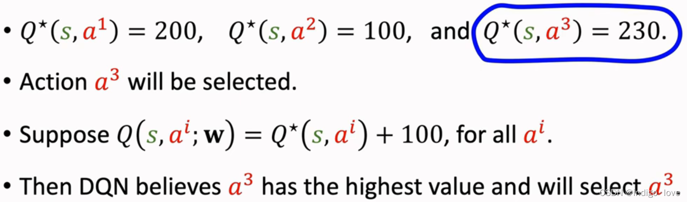
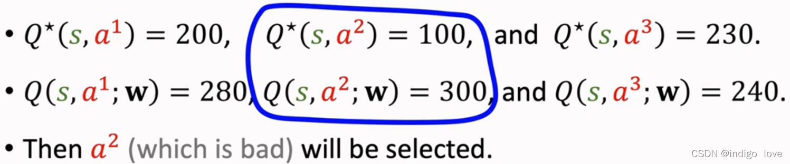
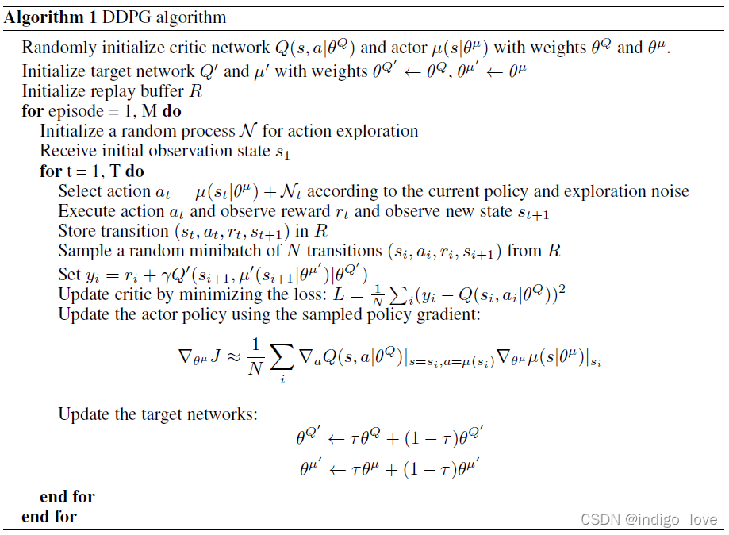
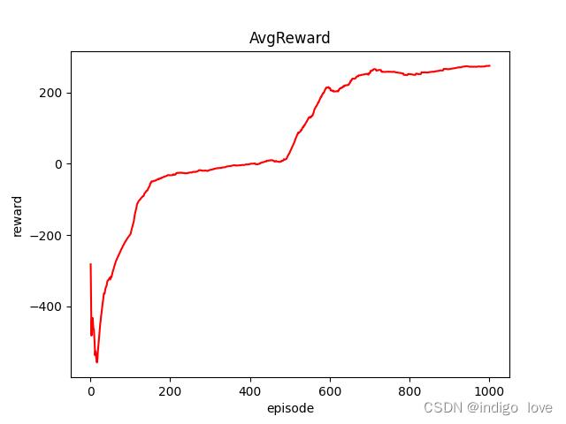
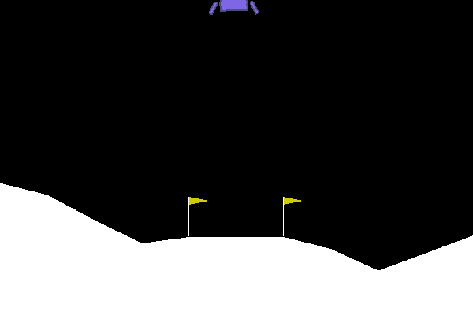

# 深度强化学习-DDPG算法原理与代码

## 0. 引言

Deep Deterministic Policy [Gradient](https://so.csdn.net/so/search?q=Gradient&spm=1001.2101.3001.7020) (DDPG)算法是DeepMind团队提出的一种专门用于解决连续控制问题的在线式(on-line)深度强化学习算法，它其实本质上借鉴了Deep Q-Network (DQN)算法里面的一些思想。本文就带领大家了解一下这个算法，论文和代码的链接见下方。

论文：https://arxiv.org/pdf/1509.02971.pdf

代码：https://github.com/indigoLovee/DDPG

## 1 [DDPG算法](https://so.csdn.net/so/search?q=DDPG算法&spm=1001.2101.3001.7020)简介

在DDPG算法之前，我们在求解连续动作空间问题时，主要有两种方式：一是对连续动作做离散化处理，然后再利用强化学习算法（例如[DQN](https://blog.csdn.net/weixin_46133643/article/details/121845874?spm=1001.2014.3001.5501)）进行求解。二是使用Policy Gradient (PG)算法 (例如[Reinforce](https://blog.csdn.net/weixin_46133643/article/details/122439616?spm=1001.2014.3001.5501)) 直接求解。但是对于方式一，离散化处理在一定程度上脱离了工程实际；对于方式二，PG算法在求解连续控制问题时效果往往不尽人意。为此，DDPG算法横空出世，在许多连续控制问题上取得了非常不错的效果。

DDPG算法是Actor-Critic (AC) 框架下的一种在线式[深度强化学习](https://so.csdn.net/so/search?q=深度强化学习&spm=1001.2101.3001.7020)算法，因此算法内部包括Actor网络和Critic网络，每个网络分别遵从各自的更新法则进行更新，从而使得累计期望回报最大化。

## 2 DDPG算法原理

DDPG算法将**确定性策略梯度算法(DPG)** 和 **DQN算法**中的相关技术结合在一起，之前我们在讲DQN算法时，详细说明了其中的两个重要的技术: 经验回放和目标网络。具体而言，DDPG算法主要包括以下三个关键技术：

（1）经验回放: 智能体将得到的经验数据 $(s,a,r,s',done)$ 放入Replay Buffer中，更新网络参数时按照批量采样。
（2）目标网络: 在Actor网络和Critic网络外再使用一套用于估计目标的Target Actor网络和Target Critic网络。在更新目标网络时，为了避免参数更新过快，采用软更新方式。(什么是软更新?)
（3）噪声探索: 确定性策略输出的动作为确定性动作，缺乏对环境的探索。在训练阶段，给Actor网络输出的动作加入噪声，从而让智能体具备一定的探索能力。

### 2.1 经验回放

> 经验回放就是一种让经验概率分布变得稳定的技术，可以提高训练的稳定性。经验回放主要有“存储”和“回放”两大关键步骤：
>
> **存储：**将经验以 $(s_{t},a_{t},r_{t+1},s_{t+1},done)$ 形式存储在经验池中。
>
> **回放：**按照某种规则从经验池中采样一条或多条经验数据。

**从\**存储\**的角度来看，经验回放可以分为集中式回放和分布式回放：**
**集中式回放：**智能体在一个环境中运行，把经验统一存储在经验池中。

**分布式回放：**多个智能体同时在多个环境中运行，并将经验统一存储在经验池中。由于多个智能体同时生成经验，所以能够使用更多资源的同时更快地收集经验。

**从\**采样\**的角度来看，经验回放可以分为均匀回放和优先回放：**
**均匀回放：**等概率从经验池中采样经验。
**优先回放：**为经验池中每条经验指定一个优先级，在采样经验时更倾向于选择优先级更高的经验。一般的做法是，如果某条经验（例如经验）的优先级为，那么选取该经验的概率为：

> $$p_i=\frac{p_i}{\sum p_k}$$

优先回放可以具体参照这篇论文 :[优先经验回放](https://arxiv.org/pdf/1511.05952.pdf)

> **经验回放的优点：**
>
> 1.在训练Q网络时，可以打破数据之间的相关性，使得数据满足独立同分布，从而减小参数更新的方差，提高收敛速度。
>
> 2.能够重复使用经验，数据利用率高，对于数据获取困难的情况尤其有用。
>
> **经验回放的缺点：**
>
> 无法应用于回合更新和多步学习算法。但是将经验回放应用于Q学习，就规避了这个缺点。

 代码中采用集中式均匀回放，具体如下：

```python
import numpy as np
class ReplayBuffer:
    def __init__(self, max_size, state_dim, action_dim, batch_size):
        self.mem_size = max_size
        self.batch_size = batch_size
        self.mem_cnt = 0

        self.state_memory = np.zeros((self.mem_size, state_dim))
        self.action_memory = np.zeros((self.mem_size, action_dim))
        self.reward_memory = np.zeros((self.mem_size, ))
        self.next_state_memory = np.zeros((self.mem_size, state_dim))
        self.terminal_memory = np.zeros((self.mem_size, ), dtype=np.bool)

    def store_transition(self, state, action, reward, state_, done):
        mem_idx = self.mem_cnt % self.mem_size

        self.state_memory[mem_idx] = state
        self.action_memory[mem_idx] = action
        self.reward_memory[mem_idx] = reward
        self.next_state_memory[mem_idx] = state_
        self.terminal_memory[mem_idx] = done

        self.mem_cnt += 1

    def sample_buffer(self):
        mem_len = min(self.mem_size, self.mem_cnt)
        batch = np.random.choice(mem_len, self.batch_size, replace=False)

        states = self.state_memory[batch]
        actions = self.action_memory[batch]
        rewards = self.reward_memory[batch]
        states_ = self.next_state_memory[batch]
        terminals = self.terminal_memory[batch]

        return states, actions, rewards, states_, terminals

    def ready(self):
        return self.mem_cnt >= self.batch_size
```

### 2.2 目标网络

由于DDPG算法是基于AC框架，因此算法中必然含有Actor和Critic网络。另外每个网络都有其对应的目标网络，所以DDPG算法中包括四个网络，分别是Actor网络 A$\mu(\cdot\mid\theta^{\mu})$ ，Critic网络 $Q(\cdot\mid\theta^Q)$ ，Target Actor网络 $\mu'(\cdot\mid\theta^{\mu'})$ 和 Target Critic网络 $Q^{'}(\cdot\mid\theta^{Q^{'}})$ 。本节主要介绍一下DDPG算法的更新过程，目标网络的更新方式以及引入目标网络的目的

#### 2.2.1 算法更新过程

算法更新主要更新的是Actor和Critic网络的参数，其中Actor网络通过最大化累积期望回报来更新 $θ^μ$，Critic网络通过最小化评估值与目标值之间的误差来更新 $θ^Q$。**在训练阶段，我们从Replay Buffer中采样一个批次的数据，假设采样到的一条数据为 $(s,a,r,s′,done)$，Actor和Critic网络更新过程如下。

**Critic网络更新过程：** 利用Target Actor网络计算出状态 $s'$ 下的动作：

> $$a'=\mu'(s'\mid\theta^{\mu'})$$

 **这里需要注意：计算出动作后不需要加入噪声。** 然后利用Target Critic网络计算出状态动作对 $(s,a)$ 的目标值：

> $$y=r+\gamma(1-done)Q^{\prime}(s^{\prime},a^{\prime}\mid\theta^{Q^{\prime}})$$

接着利用 Critic网络计算出状态动作对 $(s,a)$的评估值：

> $$q=Q(s,a\mid\theta^Q)$$

 最后利用**梯度下降算法最小化评估值和期望值之间的差值 $L_c$，从而对Critic网络中的参数进行更新：

> $$L_c=(y-q)^2$$

 上述过程其实和DQN算法非常类似。

**Actor网络更新过程：**利用Actor网络计算出状态 $s$ 下的动作：

> $$a_{new}=\mu(s\mid\theta^\mu)$$

**这里需要注意：计算出动作后不需要加入噪声。**然后利用Critic网络计算出状态动作对 $(s,a_{new}) $的评估值（即累积期望回报）：

> $$q_{new}=Q(s,a_{new}\mid\theta^Q)$$

最后利用**梯度上升算法**最大化累积期望回报 $q_{new}$ (代码实现是采用梯度下降算法优化-$q_{new}$，其实本质上都是一样的)，从而对Actor网络中的参数进行更新。

至此我们就完成了对Actor和Critic网络的更新。

#### 2.2.2 目标网络的更新

对于目标网络的更新，DDPG算法中采用**软更新方式**，也可以称为**指数平均移动 (Exponential Moving Average, EMA)**。即引入一个学习率（或者成为动量）$\tau$，将旧的目标网络参数和新的对应网络参数做加权平均，然后赋值给目标网络：

**Target Actor网络更新过程：**

> $$\theta^{\mu^{\prime}}=\tau\theta^\mu+(1-\tau)\theta^{\mu^{\prime}}$$

**Target Critic网络更新过程：**

> $$\theta^{Q^{\prime}}=\tau\theta^Q+(1-\tau)\theta^{Q^{\prime}}$$

 学习率（动量）$τ∈(0,1)$，通常取值0.005。

#### **2.2.3 引入目标网络的目的**

我们在前面提到过，引入目标网络的目的其实和DQN算法的想法是一样的。**由于目标网络中的参数是通过软更新的方式来缓慢更新的，因此它的输出会更加稳定，利用目标网络来计算目标值自然也会更加稳定，从而进一步保证Critic网络的学习过程更加平稳。**试想，如果直接使用Critic网络来计算目标值

$$y=r+\gamma(1-done)Q(s^{\prime},a^{\prime}\mid\theta^Q)$$

那么由于Critic网络在不断更新，网络波动剧烈，自然目标值y�的变化也很剧烈。在学习过程中，让Critic网络的评估值追逐一个变化剧烈的目标，很容易出现网络震荡，从而导致整个学习过程坍塌。

上述是一种目的，其实还有另外一个目的。**当使用Critic网络来计算目标值时（如上式所示），它其实本质上是一种自举 (Bootstrapping) 的过程。**然后让 $Q(s,a∣θ^Q)$ 不断逼近 $y$，很容易导致网络过估计。因为当 $Q(s′,a′∣θ^Q)$出现过估计时，会将其回传至$Q(s,a∣θ^Q)$，导致该项也出现了过估计，从而**形成了一种正反馈，最终导致整个网络出现过估计。**

> **自举 (Bootstrapping)**
>
> 表示在当前值函数的计算过程中，会利用到后续的状态值函数或动作值函数，即利用到后续的状态或者状态动作对。

那么过估计会出现什么问题呢？**如果过估计是均匀的，对于最终的决策不会造成影响；但是如果不均匀，对于最终的决策会产生很大影响。**我们举个栗子吧，大家很容易就能明白。

<br>
<center>
  
  <br>
  <div style="color:orange; border-bottom: 1px solid #d9d9d9; display: inline-block; color: #999; padding: 2px;">BP Network</div>
</center>
<br>

 上图中我们假设有三个动作，每个动作的实际动作价值依次是200，100和230，显然动作3的动作价值是最高的，智能体会选择动作3。如果网络出现过估计，并且是均匀的，假设过估计的量是100，那么网络评估出来的动作价值就依次是300，200和330，显然动作3的动作价值依然是最高的，智能体依旧会选择动作3。因此，均匀过估计对于最终的决策并不会产生影响。

<br>
<center>
  
  <br>
  <div style="color:orange; border-bottom: 1px solid #d9d9d9; display: inline-block; color: #999; padding: 2px;">BP Network</div>
</center>
<br>

 同样我们假设有三个动作，每个动作的实际动作价值依次是200，100和230，显然动作3的动作价值是最高的，智能体会选择动作3。如果网络出现不均匀过估计，评估出来的动作价值依次是280，300和240，此时显然动作2的动作价值是最高的，智能体会选择动作2。但是实际上动作2的真实动作价值是最低的，即该动作是最差的。因此，不均匀过估计对于最终的决策会产生很大的影响。

然而**实际上网络的过估计是非均匀的，因此需要避免这个问题，本质上就是要解决Bootstrapping问题。**采用目标网络后就能解决这个问题

$$y=r+\gamma(1-done)Q'(s',a'|\theta^{Q'})$$

此时我们再让 $Q(s,a∣θ^Q)$逼近目标值 $y$时，就已经不再是自举了（大家可以对照自举的含义仔细观察一下）。

### 2.3 噪声探索

 **探索对于智能体来说是至关重要的，而确定性策略“天生”就缺乏探索能力，因此我们需要人为地给输出的动作上加入噪声，从而让智能体具备探索能力。**在DDPG算法中，作者采用Ornstein Uhlenbeck过程作为动作噪声。Ornstein Uhlenbeck过程是用下列随机微分方程定义的 (以一维的情况为例)：

$$dN_t=\theta(\mu-N_t)dt+\sigma dB_t$$

其中$θ$，$μ$，$σ$是参数 $(θ>0,σ>0)$，$B_t$ 是标准Brownain运动。当初始扰动是在原点的单点分布（即限定 $N_0=0$），并且 $μ=0$ 时，上述方程的解为

$$N_t=\sigma\int_0^te^{\theta(\tau-t)}dB_t$$

(证明：将$dN_t=\theta(\mu-N_t)dt+\sigma dB_t$代入$d(N_te^{\theta t})=\theta N_te^{\theta t}dt+e^{\theta t}dN_t$,化简可得$d(N_te^{\theta t})=\mu\theta e^{\theta t}dt+\sigma e^{\theta t}dB_t$。将此式从0积到$t$,得$N_te^{\theta t}-N_0=\mu(e^{\theta t}-1)+\sigma\int_0^te^{\theta t}dB_\tau$。当$N_0=0$且$\mu=0$时化简可得结果。)
这个解得均值为0，方差为$\frac{\sigma^2}{2\theta}(1-e^{-2\theta})$,协方差为:

$$Cov(N_t,N_s)=\frac{\sigma^2}{2\theta}(e^{-\theta|t-s|}-e^{-\theta|t+s|})$$

(证明：由于均值为0，所以 $Cov(N_t,N_s)=E[N_tN_s]=\sigma^2e^{-\theta|t+s|}E\left[\int_0^te^{\theta\tau}dB_t\int_0^se^{\theta\tau}dB_t\right]$。另外，Ito Isometry告诉我们 $E\left[\int_0^te^{\theta\tau}dB_t\int_0^se^{\theta\tau}dB_t\right]=E\left[\int_0^{min(t,s)}e^{2\theta\tau}d\tau\right]$,所以 $Cov(N_t,N_s)=\sigma^2e^{-\theta|t+s|}\int_0^{min(t,s)}e^{2\theta\tau}d\tau$,进一步化简可得结果。) 对于 $t\neq s$ 总有 $|t-s|<t+s$,所以 $Cov(N_t,N_s)>0$ 。据此可知，使用Ornstein Uhlenbeck过程让相邻扰动正相关，进而让动作向相近的方向偏移。

OU噪声的代码实现：
```python
class OUActionNoise:
    def __init__(self, mu, sigma=0.15, theta=0.2, dt=1e-2, x0=None):
        self.theta = theta
        self.mu = mu
        self.sigma = sigma
        self.dt = dt
        self.x0 = x0
        self.reset()

    def __call__(self):
        x = self.x_prev + self.theta * (self.mu - self.x_prev) * self.dt + \
                self.sigma * np.sqrt(self.dt) * np.random.normal(size=self.mu.shape)
        self.x_prev = x

        return x

    def reset(self):
        self.x_prev = self.x0 if self.x0 is not None else np.zeros_like(self.mu)
```

看完OU噪声后，可能很多小伙伴是懵的，这个也太复杂了。不过我会告诉大家，**其实OU噪声是没必要的，因为我们完全可以采用服从正态分布的噪声来取代它，实验结果也证实了这一点。**因此Twin Delayed Deep Deterministic policy gradient (TD3)算法舍弃了OU噪声，而是采用服从正态分布的噪声，实现起来更加简单。

**另外还需要提醒大家一点：噪声只会加在训练阶段Actor网络输出的动作上，推理阶段不要加上噪声，以及在更新网络参数时也不要加上噪声，前面已经提醒过了。**因为我们只需要在训练阶段让智能体具备探索能力，推理时是不需要的。

## 3 DDPG算法伪代码

<br>
<center>
  
  <br>
  <div style="color:orange; border-bottom: 1px solid #d9d9d9; display: inline-block; color: #999; padding: 2px;">BP Network</div>
</center>
<br>

## 4 代码实现

Actor和Critic网络的代码实现（networks.py）:

```python
import torch as T
import torch.nn as nn
import torch.optim as optim

device = T.device("cuda:0" if T.cuda.is_available() else "cpu")


def weight_init(m):
    if isinstance(m, nn.Linear):
        nn.init.xavier_normal_(m.weight)
        if m.bias is not None:
            nn.init.constant_(m.bias, 0.0)
    elif isinstance(m, nn.BatchNorm1d):
        nn.init.constant_(m.weight, 1.0)
        nn.init.constant_(m.bias, 0.0)


class ActorNetwork(nn.Module):
    def __init__(self, alpha, state_dim, action_dim, fc1_dim, fc2_dim):
        super(ActorNetwork, self).__init__()
        self.fc1 = nn.Linear(state_dim, fc1_dim)
        self.ln1 = nn.LayerNorm(fc1_dim)
        self.fc2 = nn.Linear(fc1_dim, fc2_dim)
        self.ln2 = nn.LayerNorm(fc2_dim)
        self.action = nn.Linear(fc2_dim, action_dim)

        self.optimizer = optim.Adam(self.parameters(), lr=alpha)
        self.apply(weight_init)
        self.to(device)

    def forward(self, state):
        x = T.relu(self.ln1(self.fc1(state)))
        x = T.relu(self.ln2(self.fc2(x)))
        action = T.tanh(self.action(x))

        return action

    def save_checkpoint(self, checkpoint_file):
        T.save(self.state_dict(), checkpoint_file)

    def load_checkpoint(self, checkpoint_file):
        self.load_state_dict(T.load(checkpoint_file))


class CriticNetwork(nn.Module):
    def __init__(self, beta, state_dim, action_dim, fc1_dim, fc2_dim):
        super(CriticNetwork, self).__init__()
        self.fc1 = nn.Linear(state_dim, fc1_dim)
        self.ln1 = nn.LayerNorm(fc1_dim)
        self.fc2 = nn.Linear(fc1_dim, fc2_dim)
        self.ln2 = nn.LayerNorm(fc2_dim)
        self.fc3 = nn.Linear(action_dim, fc2_dim)
        self.q = nn.Linear(fc2_dim, 1)

        self.optimizer = optim.Adam(self.parameters(), lr=beta, weight_decay=0.001)
        self.apply(weight_init)
        self.to(device)

    def forward(self, state, action):
        x_s = T.relu(self.ln1(self.fc1(state)))
        x_s = self.ln2(self.fc2(x_s))
        x_a = self.fc3(action)
        x = T.relu(x_s + x_a)
        q = self.q(x)

        return q

    def save_checkpoint(self, checkpoint_file):
        T.save(self.state_dict(), checkpoint_file)

    def load_checkpoint(self, checkpoint_file):
        self.load_state_dict(T.load(checkpoint_file))
```

注：**Actor和Critic网络中前面两个Linear层后面都跟上了Layer Normalization (LN)层。**因为我在实验时发现了一个非常有趣的现象，如果不加LN层，或者加入Batch Normalization (BN)层，整个训练过程很容易坍塌或者训练效果很差，具体原因我也不是特别清楚。感兴趣的小伙伴可以把代码git下来跑一遍，如果知道原因的话不妨一起交流。

DDPG算法的代码实现（DDPG.py）:

```python
import torch as T
import torch.nn.functional as F
import numpy as np
from networks import ActorNetwork, CriticNetwork
from buffer import ReplayBuffer

device = T.device("cuda:0" if T.cuda.is_available() else "cpu")


class DDPG:
    def __init__(self, alpha, beta, state_dim, action_dim, actor_fc1_dim,
                 actor_fc2_dim, critic_fc1_dim, critic_fc2_dim, ckpt_dir,
                 gamma=0.99, tau=0.005, action_noise=0.1, max_size=1000000,
                 batch_size=256):
        self.gamma = gamma
        self.tau = tau
        self.action_noise = action_noise
        self.checkpoint_dir = ckpt_dir

        self.actor = ActorNetwork(alpha=alpha, state_dim=state_dim, action_dim=action_dim,
                                  fc1_dim=actor_fc1_dim, fc2_dim=actor_fc2_dim)
        self.target_actor = ActorNetwork(alpha=alpha, state_dim=state_dim, action_dim=action_dim,
                                         fc1_dim=actor_fc1_dim, fc2_dim=actor_fc2_dim)
        self.critic = CriticNetwork(beta=beta, state_dim=state_dim, action_dim=action_dim,
                                    fc1_dim=critic_fc1_dim, fc2_dim=critic_fc2_dim)
        self.target_critic = CriticNetwork(beta=beta, state_dim=state_dim, action_dim=action_dim,
                                           fc1_dim=critic_fc1_dim, fc2_dim=critic_fc2_dim)

        self.memory = ReplayBuffer(max_size=max_size, state_dim=state_dim, action_dim=action_dim,
                                   batch_size=batch_size)

        self.update_network_parameters(tau=1.0)

    def update_network_parameters(self, tau=None):
        if tau is None:
            tau = self.tau

        for actor_params, target_actor_params in zip(self.actor.parameters(),
                                                     self.target_actor.parameters()):
            target_actor_params.data.copy_(tau * actor_params + (1 - tau) * target_actor_params)

        for critic_params, target_critic_params in zip(self.critic.parameters(),
                                                       self.target_critic.parameters()):
            target_critic_params.data.copy_(tau * critic_params + (1 - tau) * target_critic_params)

    def remember(self, state, action, reward, state_, done):
        self.memory.store_transition(state, action, reward, state_, done)

    def choose_action(self, observation, train=True):
        self.actor.eval()
        state = T.tensor([observation], dtype=T.float).to(device)
        action = self.actor.forward(state).squeeze()

        if train:
            noise = T.tensor(np.random.normal(loc=0.0, scale=self.action_noise),
                             dtype=T.float).to(device)
            action = T.clamp(action+noise, -1, 1)
        self.actor.train()

        return action.detach().cpu().numpy()

    def learn(self):
        if not self.memory.ready():
            return

        states, actions, reward, states_, terminals = self.memory.sample_buffer()
        states_tensor = T.tensor(states, dtype=T.float).to(device)
        actions_tensor = T.tensor(actions, dtype=T.float).to(device)
        rewards_tensor = T.tensor(reward, dtype=T.float).to(device)
        next_states_tensor = T.tensor(states_, dtype=T.float).to(device)
        terminals_tensor = T.tensor(terminals).to(device)

        with T.no_grad():
            next_actions_tensor = self.target_actor.forward(next_states_tensor)
            q_ = self.target_critic.forward(next_states_tensor, next_actions_tensor).view(-1)
            q_[terminals_tensor] = 0.0
            target = rewards_tensor + self.gamma * q_
        q = self.critic.forward(states_tensor, actions_tensor).view(-1)

        critic_loss = F.mse_loss(q, target.detach())
        self.critic.optimizer.zero_grad()
        critic_loss.backward()
        self.critic.optimizer.step()

        new_actions_tensor = self.actor.forward(states_tensor)
        actor_loss = -T.mean(self.critic(states_tensor, new_actions_tensor))
        self.actor.optimizer.zero_grad()
        actor_loss.backward()
        self.actor.optimizer.step()

        self.update_network_parameters()

    def save_models(self, episode):
        self.actor.save_checkpoint(self.checkpoint_dir + 'Actor/DDPG_actor_{}.pth'.format(episode))
        print('Saving actor network successfully!')
        self.target_actor.save_checkpoint(self.checkpoint_dir +
                                          'Target_actor/DDPG_target_actor_{}.pth'.format(episode))
        print('Saving target_actor network successfully!')
        self.critic.save_checkpoint(self.checkpoint_dir + 'Critic/DDPG_critic_{}'.format(episode))
        print('Saving critic network successfully!')
        self.target_critic.save_checkpoint(self.checkpoint_dir +
                                           'Target_critic/DDPG_target_critic_{}'.format(episode))
        print('Saving target critic network successfully!')

    def load_models(self, episode):
        self.actor.load_checkpoint(self.checkpoint_dir + 'Actor/DDPG_actor_{}.pth'.format(episode))
        print('Loading actor network successfully!')
        self.target_actor.load_checkpoint(self.checkpoint_dir +
                                          'Target_actor/DDPG_target_actor_{}.pth'.format(episode))
        print('Loading target_actor network successfully!')
        self.critic.load_checkpoint(self.checkpoint_dir + 'Critic/DDPG_critic_{}'.format(episode))
        print('Loading critic network successfully!')
        self.target_critic.load_checkpoint(self.checkpoint_dir +
                                           'Target_critic/DDPG_target_critic_{}'.format(episode))
        print('Loading target critic network successfully!')
```

算法仿真环境是gym库中的LunarLanderContinuous-v2环境，因此需要先配置好gym库。进入Aanconda中对应的Python环境中，执行下面的指令

```python
pip install gym
```

但是，这样安装的gym库只包括少量的内置环境，如算法环境、简单文字游戏环境和经典控制环境，无法使用LunarLanderContinuous-v2。因此还要安装一些其他依赖项，具体可以参照这篇blog: [AttributeError: module ‘gym.envs.box2d‘ has no attribute ‘LunarLander‘ 解决办法](https://blog.csdn.net/weixin_46133643/article/details/121842866?spm=1001.2014.3001.5501)。如果已经配置好环境，那请忽略这一段。

训练脚本（train.py）:

```Python
import gym
import numpy as np
import argparse
from DDPG import DDPG
from utils import create_directory, plot_learning_curve, scale_action

parser = argparse.ArgumentParser("DDPG parameters")
parser.add_argument('--max_episodes', type=int, default=1000)
parser.add_argument('--checkpoint_dir', type=str, default='./checkpoints/DDPG/')
parser.add_argument('--figure_file', type=str, default='./output_images/reward.png')

args = parser.parse_args()


def main():
    env = gym.make('LunarLanderContinuous-v2')
    agent = DDPG(alpha=0.0003, beta=0.0003, state_dim=env.observation_space.shape[0],
                 action_dim=env.action_space.shape[0], actor_fc1_dim=400, actor_fc2_dim=300,
                 critic_fc1_dim=400, critic_fc2_dim=300, ckpt_dir=args.checkpoint_dir,
                 batch_size=256)
    create_directory(args.checkpoint_dir,
                     sub_paths=['Actor', 'Target_actor', 'Critic', 'Target_critic'])

    reward_history = []
    avg_reward_history = []
    for episode in range(args.max_episodes):
        done = False
        total_reward = 0
        observation = env.reset()
        while not done:
            action = agent.choose_action(observation, train=True)
            action_ = scale_action(action.copy(), env.action_space.high, env.action_space.low)
            observation_, reward, done, info = env.step(action_)
            agent.remember(observation, action, reward, observation_, done)
            agent.learn()
            total_reward += reward
            observation = observation_

        reward_history.append(total_reward)
        avg_reward = np.mean(reward_history[-100:])
        avg_reward_history.append(avg_reward)
        print('Ep: {} Reward: {:.1f} AvgReward: {:.1f}'.format(episode+1, total_reward, avg_reward))

        if (episode + 1) % 200 == 0:
            agent.save_models(episode+1)

    episodes = [i+1 for i in range(args.max_episodes)]
    plot_learning_curve(episodes, avg_reward_history, title='AvgReward',
                        ylabel='reward', figure_file=args.figure_file)


if __name__ == '__main__':
    main()
```

训练脚本中有三个参数，max_episodes表示训练幕数，checkpoint_dir表示训练权重保存路径，figure_file表示训练结果的保存路径（其实是一张累积奖励曲线图），按照默认设置即可。

训练时还会用到画图函数和创建文件夹函数，它们都被放在utils.py脚本中：

```python
import os
import numpy as np
import matplotlib.pyplot as plt


class OUActionNoise:
    def __init__(self, mu, sigma=0.15, theta=0.2, dt=1e-2, x0=None):
        self.theta = theta
        self.mu = mu
        self.sigma = sigma
        self.dt = dt
        self.x0 = x0
        self.reset()

    def __call__(self):
        x = self.x_prev + self.theta * (self.mu - self.x_prev) * self.dt + \
                self.sigma * np.sqrt(self.dt) * np.random.normal(size=self.mu.shape)
        self.x_prev = x

        return x

    def reset(self):
        self.x_prev = self.x0 if self.x0 is not None else np.zeros_like(self.mu)


def create_directory(path: str, sub_paths: list):
    for sub_path in sub_paths:
        if not os.path.exists(path + sub_path):
            os.makedirs(path + sub_path, exist_ok=True)
            print('Create path: {} successfully'.format(path+sub_path))
        else:
            print('Path: {} is already existence'.format(path+sub_path))


def plot_learning_curve(episodes, records, title, ylabel, figure_file):
    plt.figure()
    plt.plot(episodes, records, color='r', linestyle='-')
    plt.title(title)
    plt.xlabel('episode')
    plt.ylabel(ylabel)

    plt.show()
    plt.savefig(figure_file)


def scale_action(action, high, low):
    action = np.clip(action, -1, 1)
    weight = (high - low) / 2
    bias = (high + low) / 2
    action_ = action * weight + bias

    return action_
```

另外我们还提供了测试代码，主要用于测试训练效果以及观察环境的动态渲染 (test.py)：

```python
import gym
import imageio
import argparse
from DDPG import DDPG
from utils import scale_action

parser = argparse.ArgumentParser()
parser.add_argument('--filename', type=str, default='./output_images/LunarLander.gif')
parser.add_argument('--checkpoint_dir', type=str, default='./checkpoints/DDPG/')
parser.add_argument('--save_video', type=bool, default=True)
parser.add_argument('--fps', type=int, default=30)
parser.add_argument('--render', type=bool, default=True)

args = parser.parse_args()


def main():
    env = gym.make('LunarLanderContinuous-v2')
    agent = DDPG(alpha=0.0003, beta=0.0003, state_dim=env.observation_space.shape[0],
                 action_dim=env.action_space.shape[0], actor_fc1_dim=400, actor_fc2_dim=300,
                 critic_fc1_dim=400, critic_fc2_dim=300, ckpt_dir=args.checkpoint_dir,
                 batch_size=256)
    agent.load_models(1000)
    video = imageio.get_writer(args.filename, fps=args.fps)

    done = False
    observation = env.reset()
    while not done:
        if args.render:
            env.render()
        action = agent.choose_action(observation, train=True)
        action_ = scale_action(action.copy(), env.action_space.high, env.action_space.low)
        observation_, reward, done, info = env.step(action_)
        observation = observation_
        if args.save_video:
            video.append_data(env.render(mode='rgb_array'))


if __name__ == '__main__':
    main()
```

测试脚本中包括五个参数，filename表示环境动态图的保存路径，checkpoint_dir表示加载的权重路径，save_video表示是否要保存动态图，fps表示动态图的帧率，rander表示是否开启环境渲染。大家只需要调整save_video和rander这两个参数，其余保持默认即可。

## 5 实验结果

<br>
<center>
  
  <br>
  <div style="color:orange; border-bottom: 1px solid #d9d9d9; display: inline-block; color: #999; padding: 2px;">BP Network</div>
</center>
<br>

通过平均奖励曲线可以看出，大概迭代到700步左右时算法趋于收敛。

<br>
<center>
  
  <br>
  <div style="color:orange; border-bottom: 1px solid #d9d9d9; display: inline-block; color: #999; padding: 2px;">BP Network</div>
</center>
<br>

这是测试效果图，智能体能够很好地完成降落任务！

## 6 结论

本文主要讲解了DDPG算法的原理以及代码实现。尽管它是一个非常优秀的算法，但是仍然存在一些问题需要改进，例如过估计。后面我们会讲解一下TD3算法，它其实就是在DDPG算法的基础做了一些改进工作，克服了DDPG算法中的一些问题，从而让算法的性能得到显著提升。

ref:
[1]. https://blog.csdn.net/weixin_46133643/article/details/124356983<br>
[2]. https://zhuanlan.zhihu.com/p/421555370