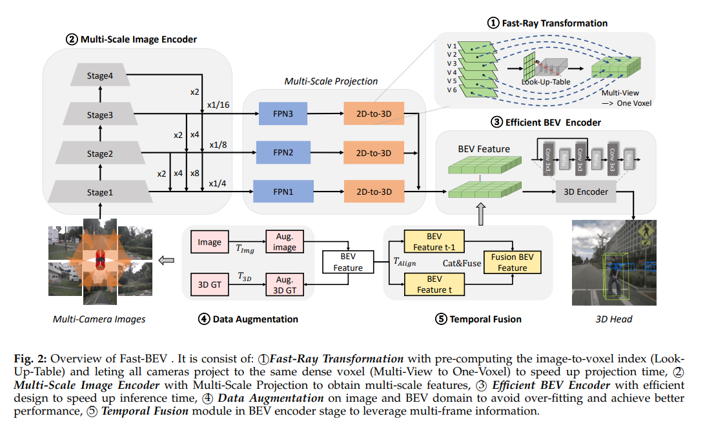
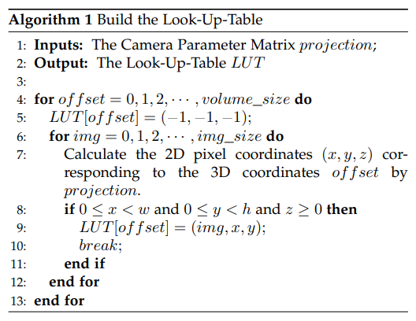
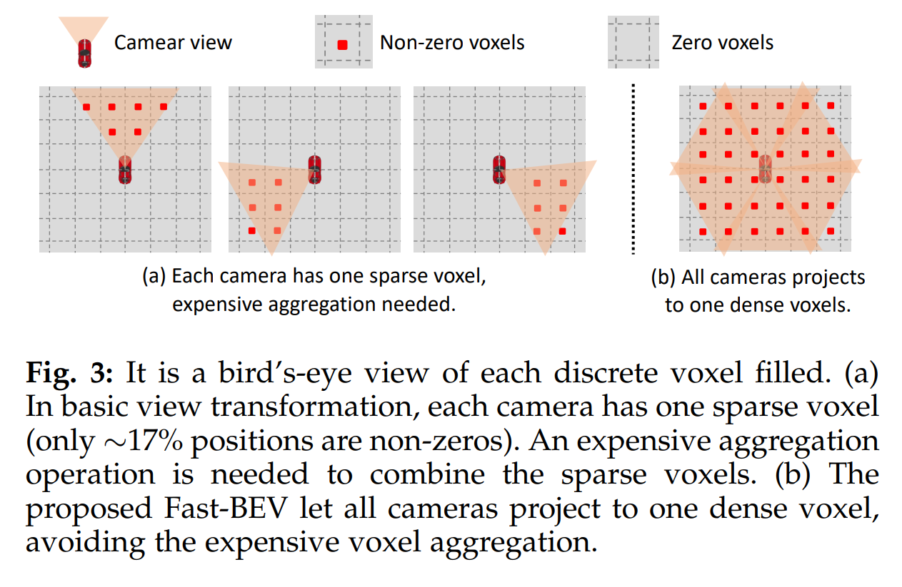
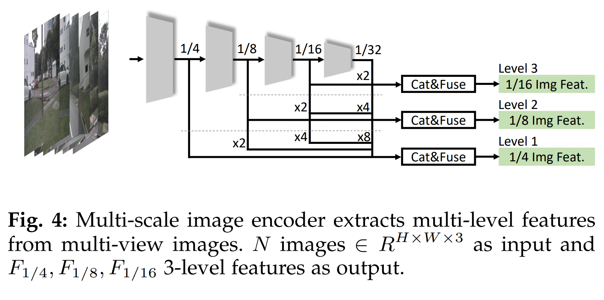
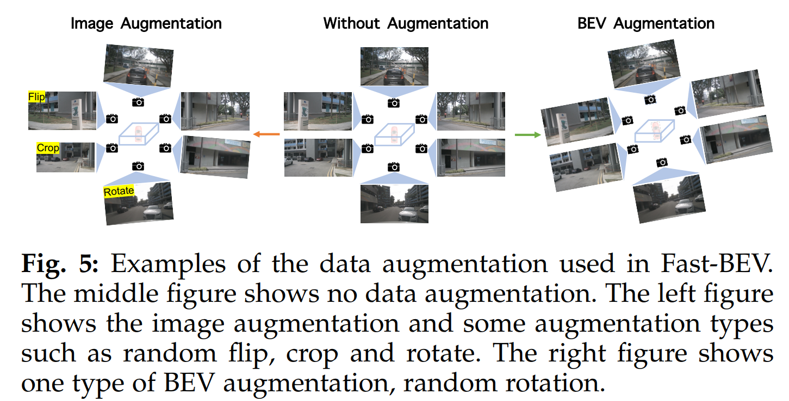
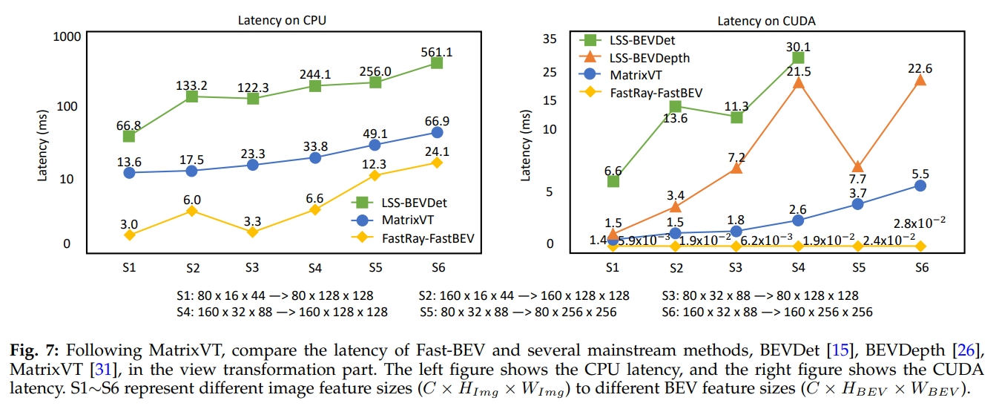
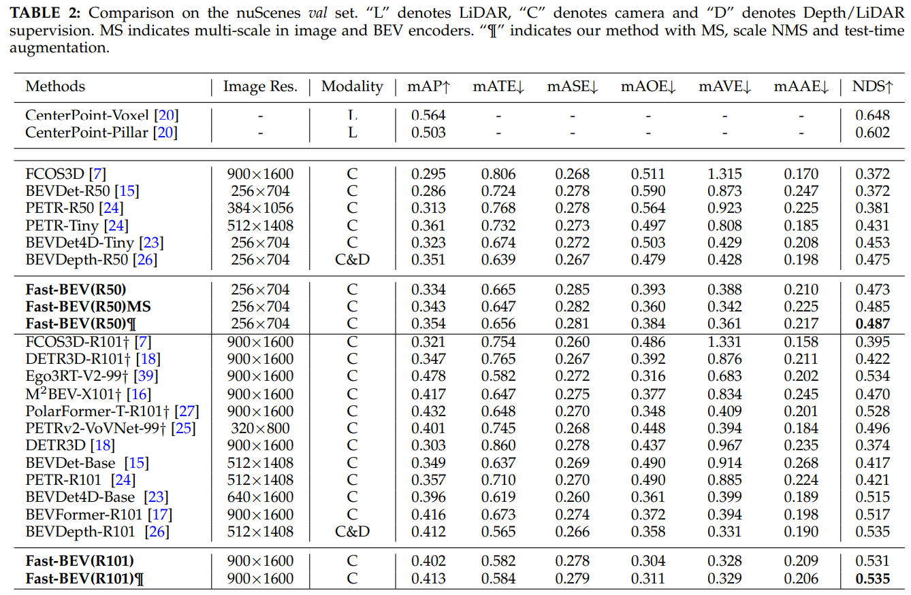
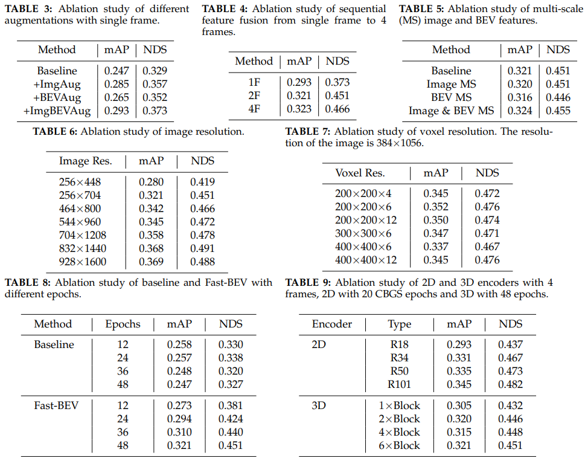
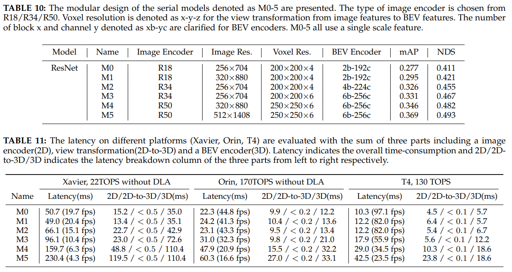

近年来，基于鸟瞰图（BEV）表示的感知任务越来越受到关注，BEV表示有望成为下一代自动驾驶车辆（AV）感知的基础。现有大多数的BEV解决方案要么需要大量资源来执行车载推理，要么性能不佳。本文提出了一种简单而有效的框架，称为Fast BEV，它能够在车载芯片上执行更快的BEV感知。为了实现这一目标，作者首先从经验上发现，BEV表示可以足够强大，而无需昂贵的基于transformer的变换或深度表示。Fast BEV由五个部分组成，论文新颖地提出：

（1）一种轻量级的、易于部署的视图转换，它将**2D图像特征快速传输到3D体素空**间；
（2）一种利用**多尺度信息**获得更好性能的**多尺度图像编码器**；
（3）一种高效的**BEV编码器**，它专门设计用于加快车载推理；
（4）针对图像和BEV空间的强大**数据增强策略**以避免过度拟合，
（5）利用时间信息的**多帧特征融合**机制。

其中，（1）和（3）使Fast BEV能够在车载芯片上快速推理和部署，（2）、（4）和（5）确保Fast BEV具有竞争性能。所有这些都使Fast BEV成为一种具有高性能、快速推理速度和在自动驾驶车载芯片上部署友好的解决方案。通过实验，在2080Ti平台上，R50模型可以在nuScenes验证集上以47.3%的NDS运行52.6 FPS，超过了BEVDepth-R50模型的41.3 FPS和47.5%的NDS，以及BEVDet4DR50模型的30.2 FPS和45.7%的NDS。最大的型号(R101@900x1600)在nuScenes验证集上建立了具有竞争力的53.5%NDS，论文在当前主流的车载芯片上进一步开发了具有相当高精度和效率的基准！

## 领域现状

快速准确的3D感知系统对于自动驾驶至关重要。经典方法依赖于激光雷达点云提供的精确3D信息。然而，激光雷达传感器通常要花费数千美元，阻碍了它们在经济型车辆上的应用。基于纯相机的鸟瞰图（BEV）方法最近显示出其强大的3D感知能力和低成本的巨大潜力。它们基本上遵循这样的范式：将多摄像机2D图像特征转换为自我汽车坐标中的3D BEV特征，然后将特定头部应用于统一BEV表示以执行特定的3D任务，例如，3D检测、分割等。统一BEV表达可以单独处理单个任务或同时处理多个任务，这是高效和灵活的。

为了从2D图像特征执行3D感知，nuScenes上的现有BEV方法使用基于查询的transformation [17]，[18]或基于隐式/显式深度的transformation [13]，[15]，[26]。然而，它们很难部署在车载芯片上，并且推理速度慢：

 - （1） 基于基于查询的transformation 方法如图1（a）所示，由于解码器需要transformer内的注意机制，这些方法通常需要专用芯片来支持。
 - （2） 基于深度变换的方法如图1（b）所示。

这些方法通常需要加速不友好的体素池操作，甚至多线程CUDA内核也可能不是最佳解决方案。此外，这对于在资源受限或CUDA加速推理库不支持的芯片上运行是不方便的。此外，它们在推理上很耗时，这妨碍了它们的实际部署。本文旨在为车载芯片设计一种具有友好部署、高推理速度和竞争性能的BEV感知框架，例如Xavier、Orin、Tesla T4等。

基于这些观察结果，遵循M2BEV[16]的原理，该原理假设在图像到BEV（2D到3D）视图转换期间沿相机光线的深度分布均匀，我们提出Fast-Ray转换，如图1（c）所示，借助于“查找表”和“多视图到一个体素”操作，将BEV转换加速到一个新的水平。基于Fast Ray变换，论文进一步提出了Fast BEV，这是一种更快、更强的全卷积BEV感知框架，无需昂贵的视图transformer[17]、[18]或深度表示[15]、[23]、[26]。所提出的快速BEV包括五个部分，Fast-Ray变换、多尺度图像编码器、高效BEV编码器、数据增强和时间融合，这些共同构成了一个框架，赋予Fast BEV快速推理速度和有竞争力的性能。

详细展开说，本文提出了Fast Ray变换，这是一种用于快速推理的轻量级和部署友好的视图变换，通过将多视图2D图像特征沿着相机射线的体素投影到3D来获得BEV表示。此外，还提出了两种操作，即“查找表”和“多视图到一个体素”，以优化车载平台的流程。现有工作的视图转换耗时，多尺度投影操作将具有较大的时间开销，因此难以在实践中使用。基于Fast Ray变换，本文的2D到3D投影具有极快的速度，使具有多尺度投影操作的多尺度图像编码器成为可能。具体而言，与大多数使用单尺度特征作为图像编码器输出的现有工作不同，论文在图像编码器输出部分使用了3层多尺度特征金字塔网络（FPN）结构。随后是相应的3级多尺度投影操作。对于BEV编码器，作者使用很少的原始残差网络作为基本BEV编码器。在此基础上，使用三维缩减操作来加速编码器，分别是“空间到信道”（S2C）算子、多尺度级联融合（MSCF）算子和多帧级联融合（MFCF）算子。论文还进一步为图像和BEV空间引入了强大的数据增强策略，如翻转、旋转、调整大小等。分别在图像空间和BEV中执行的数据增强不仅避免了过度拟合，而且实现了更好的性能。最后引入了时间融合[17]，[23]，它通过引入时间特征融合模块将Fast BEV从纯空间扩展到时空空间，使当前关键帧能够利用来自历史帧的信息。

BEV感知在学术界经常更新性能基准，如NuScenes基准，但很少在工业应用方面进行研究。本文首次在当前流行的车载芯片上开发了一个具有相当准确度和效率的基准，从延迟到不同计算能力的车载芯片之间的性能，这为BEV解决方案的实际部署提供了参考。凭借其高效率和具有竞争力的性能，Fast BEV打破了现有BEV解决方案难以在低计算芯片上部署的信念，简单和高效是其主要优势。所提出的Fast BEV表现出了出色的性能，可以轻松部署在车载平台上。在nuScenes数据集上，在2080Ti平台上，R50模型可以在nuScene验证集上运行52.6 FPS和47.3%的NDS，超过了BEVDepth-R50模型的41.3 FPS和47.5%的NDS以及BEVDet4D-R50模型的30.2 FPS和45.7%的NDS。最大的型号(R101@900x1600)在nuScenes验证集上建立了具有竞争力的53.5%NDS。

## 领域的主流方案梳理

**1）基于camera的单目3D目标检测**

3D目标检测中的检测器旨在预测物体在3D空间中的位置和类别，给定由激光雷达或相机传感器生成的输入。基于LiDAR的方法，例如CenterPoint，倾向于使用3D CNN从LiDAR点提取空间特征，并进一步回归到3D属性，如目标的3D中心。与LiDAR传感器相比，仅将相机图像作为输入不仅成本更低，而且图像包含更丰富的语义信息。单目3D目标检测的一种实用方法是基于3D图像特征学习3D边界框，M3DRPN提出了3D区域建议网络和深度卷积层，以提高3D场景理解。在FCOS之后，FCOS3D[7]通过将3D目标转换为图像域，直接预测每个对象的3D边界框。PGD[9]使用对象之间的关系和概率表示来捕获深度不确定性，以便于3D对象检测的深度估计，DD3D[10]受益于深度预训练，并显著改善端到端3D检测！

**2）基于camera的环视3D目标检测**

一些大型基准的最新进展，特别是使用更多的周围视图，进一步推动了3D感知领域。在基于camera的3D目标检测中，新提出的多视图transformation 技术[11]、[12]、[13]、[14]将任务重新表述为立体匹配问题，其中周围的图像特征转换成立体表示，如BEV或3D体素。例如，LSS在预测的深度分布上投影逐像素特征，以生成相机截头体，然后转换截头体进入BEV grid。OFT[14]提出通过将预定义的体素投影到图像特征上来生成体素表示，BEVDet将LSS应用于全卷积方法，并首先验证了显式BEV的性能。M2BEV首先跟随OFT探索BEV多任务感知，BEVDepth进一步扩展了LSS[13]，具有强大的深度监督和高效的池化操作。视图转换的另一个路线图是网格状的BEV查询，DETR3D和Graph-DETR3D将每个BEV查询解码为3D参考点，以从图像中采样相关的2D特征进行细化。BEVFormer在二维到三维转换中引入了空间交叉关注，允许每个查询可以跨相机视图聚合其相关的二维特征。PETR提出3D坐标生成来感知3D位置感知特征，避免生成3D参考点。这些工作的成功激励我们有效和高效地扩展周围的多摄像机检测pipeline。作者发现在类似LSS的方法中，使用深度分布是不必要的，并且可以删除它以进一步加快整个pipeline的速度！

**3）基于camera的多视图时间融合**

最近，一些基于相机的方法试图在检测过程中引入多帧融合，这已被证明对基于LiDAR的检测器中的速度估计和box定位有效[20]，[21]，[22]。而BEV作为一种同时组合来自多个相机的视觉信息的中间特征，适合于时间对齐。[40]提出了一种动态模块，该模块使用过去的空间BEV特征来学习时空BEV表示，BEVDet4D通过对齐多帧特征并利用自我运动中的空间相关性来扩展BEVDet[15]。PETRv2基于3D位置嵌入的视角，直接实现3D空间中的时间对齐。BEVFormer设计了一种时间自关注，以递归地融合历史BEV信息，类似于RNN模型中的隐藏状态。本文的工作也受到时间对齐的启发，具体来说，我们应用该技术来进一步提高性能，同时保持高效率。

## 本文的方法

BEV感知中最重要的是如何将2D特征转移到3D空间。如图1所示，基于查询的方法通过变换器中的注意力机制获得3D BEV特征，这个过程可以表示为以下公式1，基于深度的方法通过计算2D特征和预测深度的外积来获得3D BEV特征，具体过程如公式2所示:

$$F_{bev}(x,y,z)=Attn(q,k,v)\quad(1)$$

$$F_{bev}(x,y,z)=Pool\{F_{2D}(u,v)\otimes D(u,v)\}_{x,y,z}\quad(2)$$

其中F2D(u,v)表示从图像中提取的2D特征，D(u,v)表示来自2D特征的深度预测。⊗表示out producter，Pool表示体素池操作。x、 y，z是三维空间中的平均坐标，u，v在二维空间中的坐标。在CUDA多线程的支持下，这些方法大大提高了GPU平台上的推理速度，但在更大的分辨率和特征维度上会遇到计算速度瓶颈，并且在没有推理库支持的情况下转移到非GPU平台不是很友好。

作者提出了基于光线投影的Fast-Ray transformation方法，借助于查找表和多视图到一个体素操作，以在GPU平台上实现极高的2D到3D推理速度。此外，由于其标量索引的高效性，当在CPU平台上运行时，它仍然具有优于现有解决方案的速度性能，这使得转移到更多平台成为可能。

M2BEV[16]是解决具有统一BEV表示的多摄像机多任务感知的第一个工作之一，因为它没有昂贵的视图转换器或深度表示，因此在车载平台上具有巨大的应用潜力。受其简单性的启发，本文提出了具有卓越速度和性能的Fast BEV，如图2所示，Fast BEV将多摄像机图像作为输入，并预测3D边界框（包括速度）作为输出。其主要框架可分为五个关键模块：Fast-Ray Transformation、Multi-Scale Image Encoder、Efficient BEV Encoder、Data Augmentation、Temporal Fusion！

**1）Fast-Ray Transformation**

视图转换是将特征从2D图像空间转换到3D BEV空间的关键组件，这通常在整个pipelines中花费大量时间。论文按照[16]，[34]假设沿射线的深度分布是均匀的，这种方式优点是，一旦获得了相机的内在/外在参数，就可以很容易地知道2D到3D的投影。由于这里没有使用可学习的参数，可以很容易地计算图像特征图和BEV特征图中的点之间的对应矩阵。基于这一假设，本文从两个角度进一步加速该过程：预计算投影索引（查找表）和密集体素特征生成（多视图到一个体素）。

查找表。投影索引是从2D图像空间到3D体素空间的映射索引，考虑到在构建感知系统时相机位置及其内在/外在参数是固定的，并且本文的方法既不依赖于数据相关的深度预测，也不依赖于transformer，因此每个输入的投影指数都是相同的。所以不需要为每次迭代计算相同的索引，只需预先计算固定投影索引并将其存储。在推断过程中，可以通过查询查找表来获得投影索引，这是边缘设备上的一个超级便宜的操作。此外，如果我们从单个帧扩展到多个帧，还可以很容易地预先计算内部和外部参数，并将它们与当前帧预对齐。如算法1所示，通过相机参数矩阵投影构建了具有与输出三维体素空间相同维度的查找表LUT。迭代每个体素单元，并通过投影计算对应于3D坐标的2D像素坐标。如果获得的2D像素坐标地址是合法的，可以将其填充到LUT中以建立与数据无关的索引映射！

多视图到一个体素。基本视图变换使用原始体素聚合操作，该操作为每个相机视图存储离散体素特征，然后聚合它们以生成最终体素特征。如图3（a）所示，这是填充的每个离散体素的鸟瞰图。因为每个相机只有有限的视角，所以每个体素特征非常稀疏，例如，只有大约17%的位置是非零的。我们发现这些体素特征的聚集是非常昂贵的，因为它们的巨大尺寸。本文建议生成密集体素特征以避免昂贵的体素聚集，具体来说，让所有相机视图中的图像特征投影到同一个体素特征，从而在最后生成一个密集体素，名为“多视图到一个体元”。如图3（b）所示，这是填充了密集体素的鸟瞰图。如算法2所示的快速射线变换算法，其将输入的多视图2D图像特征转移到一个体素3d空间中，其中每个体素单元由预先计算的LUT填充相应的2D图像特征。对于具有重叠区域的多个视图的情况，直接采用第一个遇到的视图来提高表构建的速度。结合“查找表”和“多视图到一个体素”加速设计，视图转换操作具有极快的投影速度！

**2）多尺度Image Encoder**

多尺度图像编码器从多视图图像中提取多层次特征，N个图像∈$R^{H×W×3}$作为输入，F1/4、F1/8、F1/16三级特征作为输出。

**3）高效BEV编码器**

BEV特征是4D张量，时间融合将叠加特征，这将使BEV编码器具有大量计算量。三维缩减操作用于加快编码器的速度，即“空间到信道”（S2C）算子、多尺度，其中所述多帧融合（MFCF）算子分别是级联融合（MSCF）算子和多帧凹融合（MFF）算子。S2C算子将4D体素张量V∈RX×Y×Z×C转换为3D BEV张量V∈R X×Y×（ZC），从而避免使用内存昂贵的3D卷积。在MFCF算子之前，值得注意的是，通过多尺度投影获得的BEV特征是不同的尺度。论文将首先对X和Y维度上的多尺度BEV特征进行上采样，使其大小相同，例如200×200。MSCF和MFCF运营商在信道维度中合并多尺度多帧特征，并将它们从较高的参数量融合到较低的参数量。此外，通过实验发现，BEV编码器和3D体素分辨率的大小对性能的影响相对较小，但占用了较大的速度消耗，因此更少的block和更小的体素分辨率也更为关键！

**4）数据增强**

数据扩充的好处已在学术界形成共识。此外，3D数据集（如NuScenes、KITTI）很难标记，且成本高昂，这导致数据集中样本数量较少，因此数据增强可以带来更显著的性能提升。本文在图像空间和BEV空间中添加了数据增强，主要遵循BEVDet。

图像增强：由于3D场景中的图像与3D相机坐标有直接关系，因此3D目标检测中的数据增强比2D检测更具挑战性。因此，如果对图像应用数据增强，还需要改变相机固有矩阵。对于增强操作，基本上遵循常见的操作，例如翻转、裁剪和旋转，在图5的左侧部分，展示了一些图像增强的示例。

BEV增强：类似于图像增强，类似的操作可以应用于BEV空间，例如翻转、缩放和旋转。注意，增强变换应应用于BEV特征图和3D GT框，以保持一致性。BEV增强变换可以通过相应地修改相机外部矩阵来控制，在图5的右侧部分，展示了随机旋转增强，一种BEV增强！

**5）时间融合**

受BEVDet4D和BEVFormer的启发，作者还将历史帧引入到当前帧中以进行时间特征融合。通过空间对齐操作和级联操作，将历史帧的特征与当前帧的对应特征融合。时间融合可以被认为是帧级的特征增强，在一定范围内较长的时间序列可以带来更多的性能增益。具体来说，用三个历史关键帧对当前帧进行采样；每个关键帧具有0.5s间隔，本文采用了BEVDet4D中的多帧特征对齐方法。如图6所示，在获得四个对齐的BEV特征后，直接将它们连接起来，并将它们馈送到BEV编码器。在训练阶段，使用图像编码器在线提取历史帧特征，在测试阶段，历史帧功能可以离线保存，并直接取出用于加速。与BEVDet4D和BEVFormer进行比较，BEVDet4D只引入了一个历史框架，我们认为这不足以利用历史信息。Fast BEV使用三个历史帧，从而显著提高了性能，通过使用两个历史帧，BEVFormer略优于BEVDet4D。然而，由于记忆问题，在训练阶段，历史特征在没有梯度的情况下被分离，这不是最佳的。此外，BEVFormer使用RNN样式来顺序融合特征，这是低效的。相比之下，Fast BEV中的所有帧都以端到端的方式进行训练，这与普通GPU相比更易于训练！

## 实验

数据集描述：评估了nuScenes数据集上的 Fast BEV，该数据集包含1000个自动驾驶场景，每个场景20秒。数据集被分成850个场景用于训练/验证，其余150个场景用于测试。虽然nuScenes数据集提供来自不同传感器的数据，但我们只使用相机数据。相机有六个视图：左前、前、右前、左后、后、右后。

评估指标。为了全面评估检测任务，使用平均精度（mAP）和nuScenes检测分数（NDS）的标准评估指标进行3D目标检测评估。此外，为了计算相应方面的精度（例如，平移、缩放、方向、速度和属性），使用平均平移误差（mATE）、平均缩放误差（mASE）、平均方向误差（mAOE）、平均速度误差（mAVE），以及平均属性误差（mAAE）作为度量。

和主流方法的Latency进行比较：

在可比性能下，Fast BEV、BEVDet4D和BEVDepth方案的端到端延迟比较。表的上部是三种方案的详细设置，包括每个组件的具体配置。表的下半部分是在可比性能下三种方案的每个部分的延迟和总延迟的比较。2D到3D部分包括CPU和CUDA两个平台的延迟，MSO表示多尺度输出。

nuScenes集的比较。“L”表示激光雷达，“C”表示摄像机，“D”表示深度/激光雷达监控。MS表示图像和BEV编码器中的多尺度。“¶”表示我们使用MS、scale NMS和测试时间数据增强的方法。

更多消融实验对比：

高效型号系列：为了满足不同计算能力平台的部署需求，本文设计了一系列从M0到M5的高效模型，如表10所示。设置了不同的图像编码器（从ResNet18到ResNet50），图像分辨率（从256×704到900×1600）、体素分辨率（从200×200×4到250×250×6）和BEV编码器（从2b-192c到6b-256c）来设计模型尺寸。从表10可以看出，从M0到M5，随着图像编码器、图像分辨率、体素分辨率和BEV编码器逐渐变大，模型性能逐渐提高。

在流行设备上部署：除了注重性能，还将M系列车型部署在不同的车载平台（Xavier、Orin、T4）上，并使用CUDA-TensorRT-INT8加速。具体而言，AGX Xavier在没有使用CUDA11.4-TRTT8.4.0-INT8部署DLA加速的情况下的计算能力为22TOPS，AGX Orin 64G在没有使用CUDA11.4-TTRT8.4.0-INT8部署DLB加速的情况下的计算能力是170TOPS，T4在使用CUDA11.1-TRT7.2.1-INT8部署时的计算能力则是130TOPS。如表11所示，评估了这些车载设备上M系列模型的延迟，并将延迟分解为2D/2D到3D/3D三个部分。

从表11中可以看出：（1）随着M系列型号逐渐变大，性能逐渐提高，同一计算平台上的延迟也基本上逐渐增加，2D和3D部分的延迟也分别增加。（2） 从左到右，随着这三个设备的实际计算能力1逐渐增加，M系列的每个模型的延迟逐渐减少，2D和3D部分的延迟分别减少。（3） 结合表11中M系列的性能，可以发现，仅考虑延迟时，M0模型在Xavier等低计算平台上可以达到19.7FPS，这可以实现实时推理速度。考虑到性能，M2模型在性能和延迟之间具有最合理的权衡。在与表2中R50系列模型的性能相当的前提下，它在Orin平台上可以达到43.3 FPS，这可以实现实际的实时推理要求。

目前，BEV感知解决方案越来越多，但它们主要追求学术领域的性能，很少考虑如何更好地将其部署在车载芯片上，尤其是低计算芯片上。不能否认，BEVDet和BEVDepth等工作是当前考虑的首批可能解决方案，因为它们在部署车载芯片时非常方便。但Fast BEV在以下情况下提供了应用的可能性：

低计算能力芯片：尽管自动驾驶芯片的计算能力在逐渐增加，但一些计算能力较低的芯片，如英伟达Xavier，仍被用于经济型车辆。Fast BEV可以以更快的速度在低计算能力芯片上表现得更好。

非GPU部署：DEVEDepth和BEVDet的成功部署和应用主要依赖于CUDA多线程支持的高效体素池操作。然而，没有CUDA库的非GPU芯片，例如以DSP为计算单元的德州仪器芯片，很难开发DSP多线程处理器，CPU速度不够快，这使得它们的解决方案在此类芯片上失去了优势。Fast BEV以其快速的CPU速度提供了在非GPU芯片上部署的便利。

实践中可扩展：随着技术的发展，许多自动驾驶制造商已经开始放弃激光雷达，只使用纯摄像头进行感知。结果，在真实车辆收集的大量数据中没有深度信息。在实际开发中，模型放大或数据放大通常基于从真实车辆收集的数据，以利用数据潜力提高性能。在这种情况下，基于深度监控的解决方案遇到瓶颈，而Fast BEV不引入任何深度信息，可以更好地应用！

ref:
[1]. 论文：https://arxiv.org/abs/2301.12511
[2]. 代码：https://github.com/Sense-GVT/Fast-BEV
[3]. https://mp.weixin.qq.com/s/aVbaw2qYc6-i21zbCNhfOg